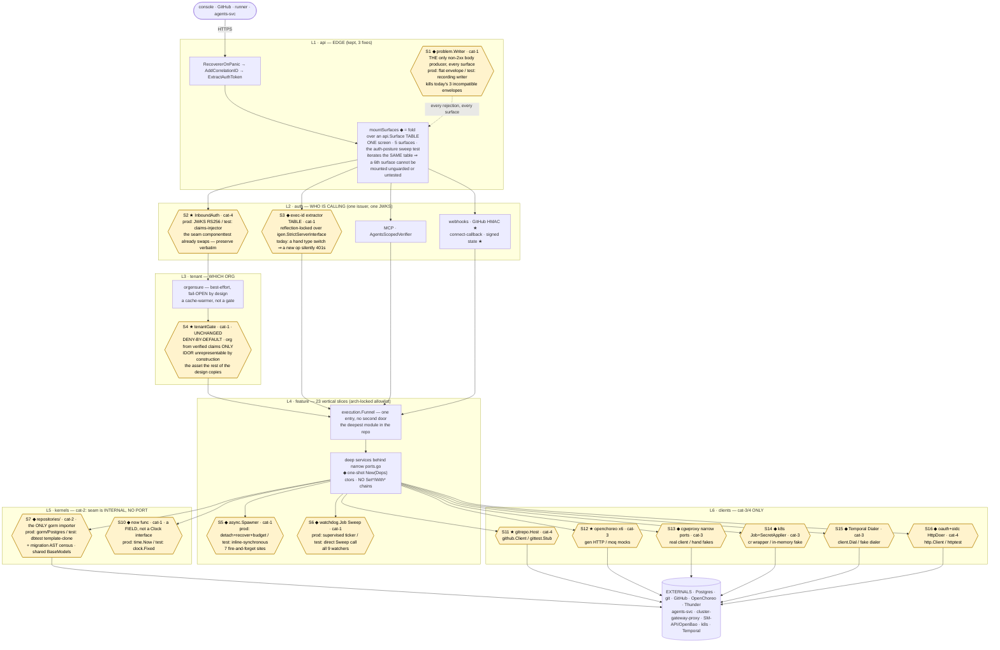
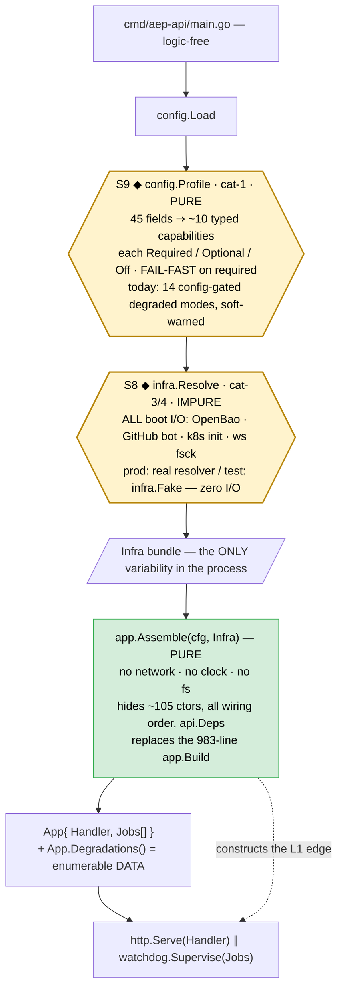

# aep-api — target architecture (testability-first)

**Status: proposal. Not built.** This describes the TARGET state, not today's code.
Measured against `services/aep-api` @ branch `contract-frist-backend`, 2026-07-15.

Vocabulary is deliberate and used precisely throughout: **module** (anything with an
interface + implementation), **interface** (everything a caller must know — signature
*and* invariants, ordering, error modes, required config), **seam** (a place where
behaviour can be altered without editing in that place — the *location* of an
interface), **adapter** (a concrete thing satisfying an interface at a seam),
**depth** (leverage at the interface: behaviour per unit of interface learned).

Dependency categories drive every seam decision:
**1** in-process · **2** local-substitutable · **3** remote-but-owned · **4** true-external.

---

## 1. Thesis

> **aep-api's outside is already excellent and its wiring is dark. The target keeps the
> edge verbatim and applies the edge's own two tricks — make the wrong thing
> *unrepresentable*, then *pin the invariant with an arch-lock* — inward to assembly,
> downward to time and data.**

Concretely: split the untestable 983-line `app.Build` into an **impure `infra.Resolve`**
(all boot I/O, all optionality) and a **pure `app.Assemble`** that the test harness
actually calls — making the claim already written at `app.go:17-22` ("the harness IS
Build") true for the first time.

---

## 2. What is already right — preserve, do not re-litigate

This is not a rewrite. These are load-bearing and stay:

| Asset | Evidence |
|---|---|
| Contract-first public edge (oapi-codegen strict server, 58 ops) | `internal/api/gen` from `packages/contracts/api/v1`; Huma is fully gone |
| **Deny-by-default tenant gate**; org derived *solely* from verified claims. No `{orgHandle}` input exists anywhere ⇒ **cross-org request unrepresentable by construction** | `api/tenant_gate.go:58` |
| Carve-out list = 1 entry, **reflection-pinned** to the contract | `api/tenant_gate_test.go:35` |
| Gate mode rides the **request context**, fail-secure ENFORCE default (not a global) | `platform/tenant/gate.go:48-68` |
| One screen listing all 5 surfaces + who guards each | `api/surfaces.go:61-191` |
| One issuer of org-bearing RS256 tokens; org always a verified claim, never a header | `platform/auth.TaskTokenManager` |
| `InboundAuth` — a **real two-adapter seam** (prod JWKS \| test claims-injector) | `api/app.go:80`, `componenttest/auth.go:44` |
| Arch-lock: feature→feature allowlist, disk-discovered, stale entries also fail | `internal/arch/arch_test.go` (419 LOC) |
| `dbtest`: real Postgres 17 + `pgtestdb` template-clone + **the real migrator**, single-digit ms/test | `platform/dbtest` |
| `gittest`/`workspacetest`: real git subprocess vs `file://` origin, hermetic | `platform/gitfs/workspacetest` |
| `execution.Funnel` — one entry, port-driven, no second door. **The deepest module here** | `feature/execution/funnel.go` |
| Zero package-level mutable state, zero `init()` in `internal/` | verified repo-wide |

**The edge is the model.** Everything below generalises it.

---

## 3. The target architecture

Two diagrams, deliberately split: the **request spine** (one request, L1→L6) and the
**assembly axis** (one process boot). They meet at `app.Assemble` — and that meeting point is
the whole design: today the request spine is well-tested and the boot axis has **zero** tests.

Legend: `★` exists today, keep · `◆` new or changed · `cat-N` = dependency category.
Each seam node carries `prod / test` adapters; §4 is the full seam inventory.

### 3.1 The request spine — api → auth → tenant → feature → kernels → clients

### 3.2 The assembly axis — boot-time, and the seam this whole design turns on

**Why this split is the design.** `app.Assemble` is pure, so a test can call **the real
composition root** in milliseconds with `infra.Fake()` — making the claim already written at
`app.go:17-22` ("the harness IS Build") true for the first time. Today `componenttest` bypasses
`Build` entirely and hand-wires `api.Deps` per test, and `grep -rl 'app.Build('` returns
`cmd/aep-api/main.go` alone.

---

## 4. Seam inventory — justified against "one adapter = hypothetical, two = real"

| # | Seam | Cat | Prod adapter | Test adapter | Why it is a REAL seam |
|---|---|---|---|---|---|
| S1 | `problem.Writer` | 1 | flat JSON envelope | recording writer | The recording adapter enables the currently-impossible "bad bearer through the full stack" body assertion. 3 dialects → 1. |
| S2 | `InboundAuth` | 4 | JWKS RS256 middleware | claims-injector | **Already real** — 12 features depend on it. Preserve verbatim. |
| S3 | exec-id extractor table | 1 | igen request types | reflection arch-lock | Second "adapter" is the lock itself; mirrors the proven public carve-out lock. |
| S4 | `tenantGate` | 1 | ENFORCE | LOG (rollback) + ENFORCE-in-harness | Two modes ship today; harness proves ENFORCE. Real. |
| S5 | `async.Spawner` | 1 | detach+recover+budget | inline-synchronous | The test adapter already exists *in spirit* as hand-built signal channels at 7 sites. This names it once. |
| S6 | `watchdog.Job` | 1 | supervised ticker | direct `Sweep()` | 5 of 9 watchers already have this second adapter (their Sweep tests). The seam forces the missing 3+2. |
| S7 | Postgres | **2** | prod DSN | **dbtest** | **INTERNAL seam — no port at the feature interface.** dbtest *is* the substitution. Do not grow in-memory DB fakes. |
| S8 | `Infra` bundle | 3/4 | `infra.Resolve` (real I/O) | `infra.Fake()` (zero I/O) | The second adapter is what makes `Assemble` testable at all — created *with* its consumer (the assembly tier). |
| S9 | `config.Profile` | 1 | derived from env | table-driven rows | Each row is an adapter: the degraded-mode matrix becomes enumerable data. |
| S10 | `now` field | 1 | `time.Now` | `clock.Fixed` | Two adapters wherever TTL logic exists; replaces real-sleep tests. |
| S11 | `gitrepo.Host` | 4 | `github.Client` | `gittest.Stub` + feature fakes | Substitution genuinely happens at the HTTP layer + per-feature ports. |
| S12 | openchoreo ×6 | 3 | gen clients | moq mocks | Both adapters exist and are used at 9 call sites. |
| S13 | cgwproxy narrow ports | 3 | `*clustergatewayproxy.Client` | hand fakes | Required by the JobWatcher/GetProgress tests this design mandates — not speculative. |
| S14 | k8s JobApplier/SecretApplier | 3 | controller-runtime wrapper | in-memory map fake | Today a 30+-method third-party interface is held raw at 3 sites with no fake in-repo. |
| S15 | Temporal `Dialer` | 3 | `client.Dial` | fake dialer | Unblocks devflow's zero tests. Workflow *definitions* stay cat-2 via the SDK testsuite (already green). |
| S16 | oauth/oidc `HttpDoer` | 4 | `*http.Client` | `httptest` server | Injection point and the first tests are created together. |

### Seams we KILL — single-adapter indirection or dead

| Kill | Evidence | Verdict |
|---|---|---|
| `project.ProjectService`, `genai.GenAIService` exported interfaces | One impl each; the only substitution is `componenttest/smoke_test.go:29` | Delete. `api.Deps` holds concrete pointers (as build/task/design already do). One adapter = hypothetical seam. |
| `secretmanagersvc.Register/GetProvider` registry | 63 LOC, **zero** production callers; `app.go:197` bypasses it | Delete the file. |
| `buildStager != nil` degraded arm | **VERIFIED**: `NewBuildCredentialsService` (`build_credentials_service.go:97-102`) returns `&BuildCredentialsService{…}` — never nil. Arms at `app.go:488,676,715` are unreachable | Delete the guard and the dead arm. |
| `obs.RequestLogger` + `GetLogger` | `GetLogger` has **zero callers** ⇒ output discarded; and it re-reads the raw header instead of the ctx value `AddCorrelationID` just set | Delete. Keep `AddCorrelationID`. Give `obs` its first tests. |
| Proposed `TxRunner` unit-of-work port | Exactly ONE manual tx exists (`credential_connect.go`) | **REJECTED** — one adapter = hypothetical. Pin the tx at dbtest tier instead. |
| Proposed unified `OrgBinder` over the 3 gates | Three genuinely different fence semantics | **REJECTED** — a union interface would be as complex as each impl = shallow. Share only S1. |
| The 7 in-Build closures | Not nameable ⇒ not testable. 5 carry real logic; 2 embed raw GORM | Promote to named, tested types; raw queries become repository methods. |

---

## 5. Module table

| Module | Interface (+ invariants a caller must know) | Implementation hides | Why deep | Deletion test |
|---|---|---|---|---|
| `infra.Resolve(ctx,cfg) (Infra, error)` ◆ | One call at boot. Errors on *required* infra; warns only where `Profile` says optional. | 3 sequential OpenBao/GitHub calls w/ timeouts, k8s init, dev seed, key decode — every boot side effect | One struct hides all boot I/O; makes `Assemble` pure **by subtraction** | Delete → I/O smears back into wiring, untestable again (today) |
| `app.Assemble(cfg, Infra) (*App, error)` ◆ | Pure, deterministic, ms. No network/clock/fs. Total ctor order; no setters except one sanctioned cycle-closer. | ~105 ctors, all ordering, all adapters, `api.Deps` | 3 params; behind them the entire object graph. **The harness finally IS the composition root.** | Delete → every test re-hand-wires `api.Deps` — which is exactly what componenttest does today, ×13 files |
| `config.Profile` ◆ | `Profile(cfg) (Profile, error)`, pure. Typed capabilities, each `Required\|Optional\|Off`. | The 14 `if cfg.X != ""` gates and their interactions (incl. the undocumented no-dispatch-path state) | 45 fields → ~10 enumerable capabilities; one table-driven test walks EVERY degraded mode | Delete → degraded modes revert to config folklore |
| `api` edge ★ | 5 surfaces on one screen; deny-by-default gate; org from claims only | Routing, validation, gating, per-surface auth | 58 ops + 4 guards behind one constructor | Already proven — 12 features would each rebuild it. **Keep.** |
| `problem.Writer` ◆ | `Write(w, status, code, msg, details)`. THE only non-2xx body producer. | Envelope shape, redaction | 1 method unifies 3 dialects; makes `errors.go`'s currently-**false** comment true | Delete → 3-way split returns; clients parse by guessing |
| `watchdog` + `Sweep` ◆ | `Job{Sweep(ctx) error; Every()}`. Panic in a Sweep is recovered (today a watcher panic kills the process — `main.go:96`). Sweep is the ONLY test surface. | Ticker lifecycle, recovery, jitter | 1 struct replaces 9 bespoke loops; forces ports onto the 3 dark watchers | Delete → 9 hand-rolled loops, 3 untested, 0 recovery |
| `async.Spawner` ◆ | `Go(ctx,name,budget,fn)`. Detached, recovered, budgeted — today's conventions, once. | Goroutine mechanics at 7 sites | Test adapter runs inline → deletes the signal-chan tax and closes untested branches | Delete → 7 divergent idioms, only some recovered |
| `repositories/` kernel ◆ | One repo per DB-backed model (15, up from 7). **Default test adapter is the real repo over dbtest**, not a fake. | SQL, GORM chains | Features stop being DB-hostages (idp's 10 raw chains, orgcreds' 9) | Delete → raw gorm re-smears into 9 features (today) |
| `execution.Funnel` ★ | `OnExecuteIntent` — one entry; every intent funnels through; no second door | Admission, gating, dispatch | **The deepest module in the repo.** The template for codingagent/provisioning | Fails deletion loudly across webhook/sweep/build-success. **Keep verbatim.** |
| `apptest.New(t, mods…)` ◆ | One line → the whole real service with cat-3/4 faked. Swap in the one real thing under test. | The Infra bundle, all fakes | Makes the common case one line and the rare case possible | Its absence is today's per-test hand-wiring |

---

## 6. Test tiers this produces

| Tier | Assembles | Fakes | Proves | Speed |
|---|---|---|---|---|
| **T1 unit** | services over narrow port fakes + `clock.Fixed` + inline Spawner | cat-3/4 only | domain logic, gate decisions, TTL **without sleeps** | ms |
| **T2 store** (`dbtest`) ★ | real repos + real PG17 + **real migrator** | nothing DB-shaped | SQL semantics, `SKIP LOCKED`, uniqueness, migration completeness | single-digit ms/test |
| **T3 real-git** (`gittest`) ★ | gitfs + `file://` origin | nothing git-shaped | real git object semantics | subprocess-bound (~1 min/pkg) |
| **T4 component** ★ **extended** | the REAL `mountSurfaces` chain, ENFORCE gate — now incl. webhook, connect-callback, internal S2S | InboundAuth + cat-3/4 | HTTP contract, IDOR fences on **all 5** surfaces, one error envelope | ms |
| **T5 assembly** ◆ **NEW** | the REAL `app.Assemble` + `infra.Fake()` | Infra only | graph completeness, degraded-mode matrix, watcher registration, cycle closure | ms |
| **T6 live smoke** ◆ restore, thin | deployed instance, real Thunder token | nothing | real RS256 e2e; the non-org-scoped routes T4 structurally cannot prove | minutes; ~5 cases |

### Current tests that become WASTE — delete (replace, don't layer)

- **`design.SaveAndProceed` and its 24 test call sites.** **VERIFIED DEAD**: the only
  non-test reference is its own definition; 24 hits across 4 test files. ~220 LOC = 33% of
  `design_service.go`. Its tests are green against a codepath the running system **cannot
  reach** — textbook false confidence. Retarget the pure-function tests
  (`deriveEndUserAuth`, `attachAnnotatedSkills`) and delete the rest. *Deleting it also
  dissolves the `design ↔ provisioning` cycle.*
- Sleep-based TTL tests (`routing_key_test.go:221`, `secrets_test.go:83`,
  `refetch_limiter_test.go:58`) — superseded by S10.
- Hand-built goroutine signal-channel plumbing in feature fakes — superseded by S5.
- `componenttest/smoke_test.go`'s `fakeProjectService` — dies with the interface kill.
- In-memory fakes of repositories wherever the assertion is SQL-adjacent — fold into T2.

---

## 7. Migration — ordered, each step independently shippable and green

**FIRST STEP (do this one first — it is cheap, it is a ratchet, and it stops the bleeding):**

1. **Go green + set the ratchets.** Fix the RED suite (`internal/feature/skills/flat_layout_test.go`
   — embedded-catalog count drift, 9→10). Then add three arch-locks to `internal/arch`:
   (a) a **gorm-import allowlist** frozen at today's 9 offenders + `repositories`/`database`/`dbtest`
   — stale entries fail, and the list **may only shrink**; (b) a **migration AST census**
   (every exported `RunX` ∈ `steps`); (c) a **reflection lock** over `igen.StrictServerInterface`
   for the runner-gate extractor. Add `database.BaseModels()` as the single AutoMigrate source.
   *No behaviour changes. Every later step is now enforced by CI rather than by memory.*

2. **Extract `infra.Resolve` + `Infra`** (mechanical hoist of `app.go:248-331`); rename the
   remainder `Assemble`; ship `infra.Fake()` + the **first assembly test**. `main.go` becomes
   `Resolve` → `Assemble`.
3. **`config.Profile`** — fail-fast on required (JWKS, `TaskTokenSigningKey`); delete the dead
   `buildStager` arm; table-driven degraded-mode test in T5.
4. **Name the 7 closures** as tested types; raw-GORM closures → repository methods; dedupe
   `repoFullNameLookup`/`repoNamer`; move the 4 rule-bearing adapters into their features.
5. **Kill the setters** — `codingagent.Deps` one-shot ctor first (8 `With*` over 354 lines;
   model = the existing `genai.ServiceDeps`), then project/design. Arch-grep bans `.Set*/.With*`
   in `internal/app` except one sanctioned cycle-closer.
6. **`watchdog` + `Sweep`** for the 3 dark watchers (needs S13/S15) + `async.Spawner` at the 7 sites.
7. **S10 `now` injection**; delete sleep tests. oauth/oidc `HttpDoer` + their first tests.
8. **GORM ratchet payoff** — migrate idp (worst: 10 chains) → organization → orgcreds → webhook →
   codingagent → component → runtimeconfig. Shrink the allowlist every PR.
9. **`problem.Writer`** + rewire the 3 dialects + the T4 rejection-shape table.
10. **Extend componenttest Options** (webhook/OrgGitHub/InternalDeps) → `OrgGitHubController`'s
    first tests ever (248 LOC, currently *structurally* unreachable) + build/artifacts component
    tests. Delete the waste. Seed T6 (~5 cases).

---

## 8. Trade-offs

**Where leverage is high.** T5: ~1,900 LOC of zero-coverage wiring becomes table-driven ms
tests, and the Profile matrix turns degraded modes from folklore into enumerable data — this
is where the next `buildStager`-class dead arm and the next `taskTokens`-class soft-warned
hard failure get caught. Second: the cat-2 discipline costs nothing new — `dbtest` already
exists and is excellent. Third: S13/S14 unlock codingagent, the largest dark region.

**Where it is thin.** T6 stays skeletal — real-Thunder coverage is bought per-case, not
per-endpoint; the non-org-scoped routes remain provable only there. `api.Deps` stays a
~30-field god-struct: splitting it per-surface is churn with no depth gain.

**Deliberately sacrificed.** No DI framework. No `Clock` god-interface (a field, not an
interface). No unit-of-work abstraction (one call site = hypothetical seam). No event bus for
the design↔provisioning cycle — deleting dead `SaveAndProceed` dissolves it; if it ever
revives, one named arch-pinned closer, honest about Go's inability to express the cycle in
constructors. The hand-ordered migration slice stays (order is load-bearing) — we verify
completeness, we do not eliminate the list. `orgensure`'s fail-open behaviour and the webhook
payload-derived-org trust model are kept as documented product decisions, pinned by tests
rather than redesigned.

---

## Appendix — findings verified by direct inspection

Claims here were re-checked against source, not taken from summaries. Several **corrected**
earlier assumptions:

| Claim | Verdict |
|---|---|
| `design.SaveAndProceed` is dead in production | **TRUE** — 1 non-test hit (its definition), 24 test hits |
| `buildStager != nil` is a dead guard | **TRUE** — `NewBuildCredentialsService` never returns nil |
| `internal/database` has zero tests | **TRUE** — 0 test files; 26 registered migration steps |
| The gorm ban covers only `taskmeta` | **TRUE** — `arch_test.go:367`; nothing confines gorm to `repositories/` |
| `go test -short ./internal/feature/skills/` is RED | **TRUE** — reproduced, 19.9s, FAIL |
| "A migration is currently unregistered" | **FALSE** — all 27 exported `Run*` are referenced. The registry is **complete today**; the correct claim is that *nothing enforces* it, and that failure has shipped before. Add the guard, don't chase drift. |
| "Huma is the edge" | **FALSE / STALE** — Huma is gone; edge is oapi-codegen contract-first |
| "Gate mode is a racy global" | **FALSE / STALE** — it rides the request context, fail-secure |
| "The component tier is designed but unbuilt" | **FALSE / STALE** — built, 12 features, 13 files |

**The central contradiction this design resolves:** `app.go:17-22` promises *"a component
test can import it and assemble the same real handler with faked deps (the harness IS
Build)."* But `componenttest.go:80` calls `api.NewHandlerForTest` and **never** `app.Build`;
`grep -rl 'app.Build('` returns `cmd/aep-api/main.go` alone. Build's 983 lines, ~105
constructors, 30 adapters, 7 closures and 14 degraded modes are exercised by nothing but a
live process boot. **The target's job is to make that sentence true.**

> Note: code comments across the service cite `docs/design/{aep-api-target-structure,
> bff-component-testing,internal-s2s-api,shared-volume-clone-architecture}.md` — none of which
> exist on this branch (dropped at `bf418a51`). `bff-component-testing.md` is recoverable via
> `git show 8f9d2ef2:docs/design/bff-component-testing.md` and its design is **built**.
> Those dangling references should be repaired or removed.
