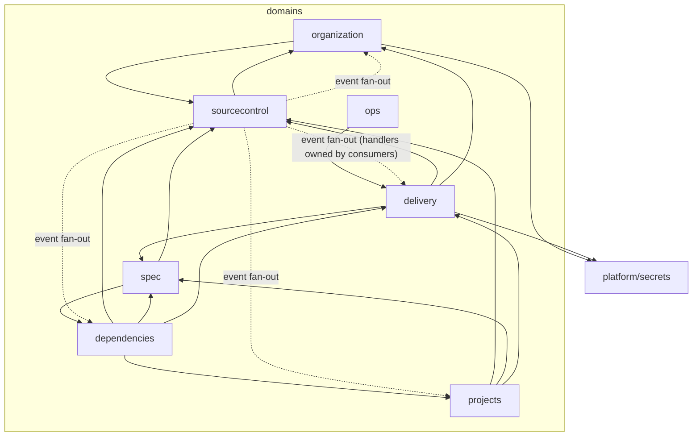
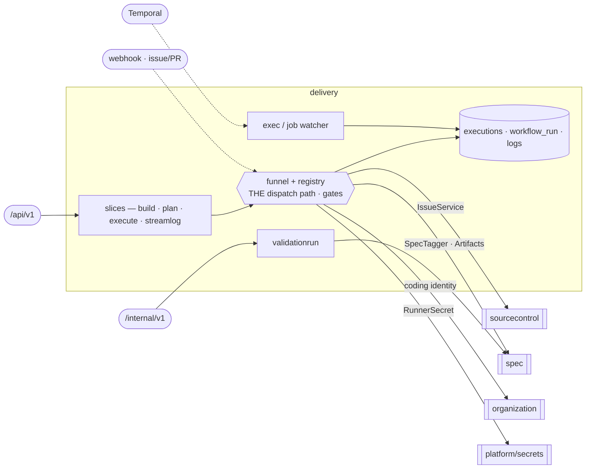

# Target Architecture — Domain-Oriented Modules with Vertical Slices

**Status: proposal (greenfield target). Not built.** Scope: `services/aep-api` (Go BFF) and
`services/collab` (TS live-collaboration server), with the console + agents touch-points noted where
the boundary crosses services. Grounded in `code_strucutre.md` (the maintainable-codebase-for-agents
principles) and the platform's ubiquitous language (`CONTEXT.md`).

This is a **north-star** structure, designed greenfield — it optimizes for the ideal domain shape,
treating the current contract-first / gate / shared-kernel constraints as negotiable *except* where an
invariant is genuinely load-bearing (those are kept and called out). §1–18 are the *target*; the
step-by-step, validated route to it is [§19 — Phased migration plan](#19-phased-migration-plan).

---

## Table of contents

1. [Why this refactor (and what it is *not*)](#1-why-this-refactor-and-what-it-is-not)
2. [The target top-level tree](#2-the-target-top-level-tree)
3. [The seven domains](#3-the-seven-domains)
4. [Domain dependency graph](#4-domain-dependency-graph)
5. [Structural convention: the vertical slice](#5-structural-convention-the-vertical-slice)
6. [Structural convention: HTTP handler co-location](#6-structural-convention-http-handler-co-location)
7. [Structural convention: persistence](#7-structural-convention-persistence)
8. [Structural convention: the composition root](#8-structural-convention-the-composition-root)
9. [The platform kernel](#9-the-platform-kernel)
10. [The five boundary decisions](#10-the-five-boundary-decisions)
11. [collab — the live-editing arm of Spec Authoring](#11-collab--the-live-editing-arm-of-spec-authoring)
12. [Relationship to the testability plan (and a reachability note)](#12-relationship-to-the-testability-plan-and-a-reachability-note)
13. [Enforcement: the evolved arch-lock](#13-enforcement-the-evolved-arch-lock)
14. [Invariants preserved](#14-invariants-preserved)
15. [How the target scores on the five characteristics](#15-how-the-target-scores-on-the-five-characteristics)
16. [Deliberately not doing](#16-deliberately-not-doing)
17. [AGENTS.md guardrails to keep this in place](#17-agentsmd-guardrails-to-keep-this-in-place)
18. [Documentation convention: the README/diagram ladder](#18-documentation-convention-the-readmediagram-ladder)
19. [Phased migration plan](#19-phased-migration-plan)

---

## 1. Why this refactor (and what it is *not*)

`aep-api` is **already** a CI-enforced vertical-slice layout: 24 feature packages under
`internal/feature/`, a mechanically-locked feature→feature import allowlist, "no flat
services/controllers" arch-tests, no global mutable state, and a deny-by-default tenant gate that makes
IDOR unrepresentable. This is not a layered mess, and the refactor is not a rescue.

The refactor closes the **three specific gaps** between today's *feature* layout and the article's
*domain-module-with-co-located-slice* ideal:

| # | Gap today | Target |
|---|---|---|
| 1 | **Handlers exiled** to a global `internal/api/` layer (61 methods on one `apiServer` type), forced by oapi-codegen's single `StrictServerInterface`. A slice for feature X spans ≥4 locations. | Handlers co-located into the domain, embedded into a thin edge ([§6](#6-structural-convention-http-handler-co-location)). |
| 2 | **Persistence is global** — a mixed-bag `models/` + shared `repositories/` + inline raw gorm in 8 features. | Domain-owned model + repository; one central ordered migration list ([§7](#7-structural-convention-persistence)). |
| 3 | **~900-line composition-root `Assemble`** with load-bearing order + `With*`/`Set*` setter sprawl. | Per-domain `Module(Deps)` seams; constructor injection; thin root ([§8](#8-structural-convention-the-composition-root)). |

Everything the current design does *well* is preserved verbatim ([§14](#14-invariants-preserved)).

---

## 2. The target top-level tree

The first thing an agent sees in `internal/` should **scream the business capabilities**, not the
framework. Seven business domains sit beside one platform kernel.

```text
services/aep-api/
  cmd/aep-api/                       main: config.Load → Resolve (I/O) → Assemble (pure) → serve
  packages/contracts/api/v1/
    openapi.yaml                     ONE committed contract, operations tagged per domain
  internal/
    edge/                            THE only package that imports every domain's httpapi aggregator;
                                     builds the strict handlers (embeds them → satisfies the generated
                                     StrictServerInterface), mounts the 5 surfaces, applies the gate
    gen/  igen/                      generated wire types — ONE PER SURFACE (public / S2S); leaves.
                                     They cannot merge: both export StrictServerInterface (§6)
    migrate/                         the ONE ordered migration list + base-models aggregation; names
                                     domain-owned steps, so it (like edge) may import every domain (§7)
    app/                             the thin composition root (Resolve + Assemble over domain Modules)

    organization/                    ┐
    spec/                            │  the seven business domains
    delivery/                        │  (each: model + repository + ports + slices + httpapi + module)
    dependencies/                    │
    projects/                        │
    sourcecontrol/                   │
    ops/                             ┘

    platform/                        the kernel — domain-free, arch-locked
      tenant/ auth/ obs/ async/ httpkit/ k8sname/ ocerr/ patch/ validate/
      gitfs/ agentfold/ designspec/ taskplan/ taskmeta/
      database/                      gorm conn + the migration Runner/Step MECHANISM only (domain-free;
                                     the ordered list itself lives in internal/migrate — §7)
      secrets/                       NEW — the unified secret-backend module (folds in credentials/)
      clients/                       openchoreo github thundersvc secretmanagersvc agentsvc
                                     clustergatewayproxy k8s oauth oidc observability httpx
      testkit/                       dbtest componenttest contracttest gittest
  (models/ and repositories/ are DISSOLVED into the domains)
```

Every domain package has the same skeleton:

```text
internal/<domain>/
  model.go            the domain's entities (gorm) + pure value types it owns
  repository.go       persistence port (interface) + gorm impl — the ONLY file that imports gorm
  ports.go            the consumer-side ports this domain needs from other domains (interfaces)
  <the domain core>   shared invariants that slices lean on (e.g. delivery/funnel.go)
  module.go           Module(Deps) (*Module, error) — constructs the domain, returns offered ports
  httpapi/            aggregator that embeds this domain's slice handlers
  <slice>/            one folder per use-case (its own Go package) — handler + orchestration + test
  ...
```

---

## 3. The seven domains

Derived by three independent lenses (data-ownership, coupling-cohesion, business-capability) that
converged on 6 of 7 memberships; the one conflict (runtimeconfig) is resolved in
[§10](#10-the-five-boundary-decisions).

### 3.1 Organization Onboarding & Settings — `internal/organization/`
Bring a tenant org onto the platform (JIT onboarding + phantom-OU trust guard) and own every per-org,
org-keyed record that configures its integrations, all fronted by the consolidated `/config` resource.

- **Absorbs**: organization, orgconfig, orgcreds, idp.
- **Owns**: `Organization` (incl. `thunder_org_uuid` backfill), `OrgCredential` (GitHub PAT/App),
  `OrgAnthropicCredential`, `OrganizationIDPProfile` + `IDPAuditEvent`; the Thunder per-org publisher app.
- **Slices**: `listorgs`, `ensureorg` (JIT), `getconfig`/`patchconfig` (atomic multi-section),
  `connectgithub`, `connectcallback`, `githubstatus`, `disconnectgithub`, `listinstallations`,
  `connectanthropic`, `idpapp` (ensure/revoke/regenerate/updateprofile), `refreshrunnercreds` (S2S).
- **Consumes**: `sourcecontrol` (a GitHub App is simultaneously a credential and a repo/webhook
  registration); `platform/secrets` (writes the connected credentials).

### 3.2 Spec Authoring & Versioning — `internal/spec/`
Turn a prompt into a versioned requirements+design Spec stored as committed truth in git, let humans
and agents co-edit it live, cut and read the `v<N>` Spec version, and steer authoring with the org's
Skill library. **Single write-authority over the git spec-content store and its version tags.**

- **Absorbs**: genai, requirements, design, files, artifacts, skills. Also absorbs today's *homeless*
  collab server-side pieces (the `/collab/validate` oracle, the session descriptor, the genai fold) —
  see [§11](#11-collab--the-live-editing-arm-of-spec-authoring).
- **Owns**: git spec content (requirements.md, specs/design/**), the annotated `v<N>` tag (the version
  store), `AgentTurn` (turn lifecycle), the org-skills repo, the resumable-turn SSE broker (in-memory
  durability seam).
- **Slices**: `generateturn`/`streamturn`/`attachturn`/`sweepturns`, `generaterequirements`,
  `generatedesign`, `deriveauth`/`attachskills`/`collectspec` (design build-path helpers),
  `cuttag`/`listtags`/`readbundle`, `listfiles`/`readfile`/`applyfiles`, `collabsession`/`collabvalidate`,
  `skills` (list/create/update/delete/import/sync/reconcile).
- **Consumes**: `sourcecontrol` (the gitfs Workspace/GitOps engine hosts all spec + skills git content);
  `dependencies` (the CRT marker vocabulary for end-user-auth derivation; a design-save best-effort
  upsert of declared external resources — a cross-domain **write via port**).

### 3.3 Delivery Pipeline — `internal/delivery/`
Implement a versioned Spec end-to-end: plan Tasks (GitHub issues), route Executions through the ONE
funnel, dispatch coding agents to open/merge PRs, build/deploy each component, and run validation —
orchestrated by the Temporal dev/task/validation workflows.

- **Absorbs**: build, devflow, task, execution, codingagent, validation.
- **Owns**: `workflow_run` (DevflowRun), `Execution`, `CodingAgentLog`, the GitHub-issue Tasks
  (semantics; physical store is `sourcecontrol`'s host), Temporal workflow state. **Owns THE funnel +
  executor registry + `executions` table as one `admit`/`finish`/`reevaluate` write-API** (see
  [§10.3](#103-execution-store-ownership)).
- **Domain core**: `funnel.go` (the single dispatch path — gates, cycles, retry), `registry.go`
  (executor class → executor). The arch-locked `task ⊥ execution` split becomes an **internal package
  boundary inside this domain** (they still speak only `platform/taskmeta` + executions rows).
- **Slices**: `buildproject`, `getbuild`, `buildpreflight`, `plantasks`, `plantap`, `listtasks`,
  `gettask`, `executetask`/`hold`/`unhold`, `streamtasklog`, `codingdispatch`, `execwatcher`,
  `jobwatcher`, `validationrun`, `validationcontext`/`validationcredentials` (S2S runner callbacks).
- **Consumes**: `sourcecontrol` (issues/PRs/webhooks); `spec` (SpecTagger to cut the tag, ArtifactStore
  for status snapshots + design reads, skills clone at dispatch, validation criteria at HEAD);
  `organization` (coding-pod identities/keys); `platform/secrets` (runner secrets).

### 3.4 Dependencies & Provisioning — `internal/dependencies/`
Discover the platform-resource catalog and resource-type markers, provision the platform + external
resources a Spec declares, broker cross-project org-service access, coordinate the `aep:provision`
gate, and wire the resulting runtime config onto deployed apps.

- **Absorbs**: dependencies, provisioning, **runtimeconfig** (see [§10.1](#101-runtimeconfig-placement)).
- **Owns**: `ExternalResource`, `AccessRequest`, the authored OC external Resource model + provisioned
  binding values, the `aep:provision` gate issues (via `sourcecontrol`).
- **Slices**: `resourcecatalog`/`resourcetypes`/`mcpdiscovery` (design-time, org-scoped),
  `collectvalues`/`savevalues`, `registerexternal`, `provisionforbuild`/`deprovision`,
  `requestaccess`/`listaccess`/`grantaccess`, `admitprovision`/`reevalgate`, `emitruntimeconfig`.
- **Consumes**: `sourcecontrol` (gate issues); `spec` (design at HEAD — what to provision);
  `delivery` (the funnel's admit/reevaluate port — provisioning is the **ops-class executor**);
  `projects` (writes the ReleaseBinding through a Project port).

### 3.5 Project & Components — `internal/projects/`
Manage a project's lifecycle and its components, and render the whole pipeline from a single read: the
Stage aggregate (spec/build/deploy/validation), live version, components, deployments, env-config,
per-component OpenAPI.

- **Absorbs**: project, component.
- **Owns**: the OpenChoreo `Project`/`Component` aggregate roots (OC is the store), `ComponentConfig`,
  and the `ReleaseBinding` write-authority (multi-writer inputs, single write-authority at the port —
  see [§10.1](#101-runtimeconfig-placement)).
- **Slices**: `createproject`/`getproject`/`listprojects`/`deleteproject`, `projectstatus` (the Stage
  aggregate — reads everything by design, through ports), `listcomponents`/`getcomponent`,
  `triggerbuild`/`listbuilds`/`buildlogs`/`listdeployments`/`componentopenapi`,
  `getcomponentconfig`/`updatecomponentconfig`, `ensurecomponent`/`traitsync`.
- **Consumes**: `sourcecontrol` (repo/webhook bootstrap on create); `spec` (design read + spec-stage
  snapshot); `delivery` (build/exec status for the Stage aggregate, via `SetStageSources` port).

### 3.6 Source Control & Webhooks — `internal/sourcecontrol/`
The git-host integration substrate every other domain builds on: per-project repo/issue/PR/webhook
lifecycle over a provider-neutral Host port, and the single inbound GitHub webhook receiver that
HMAC-verifies, dedups, and fans events out to consuming domains.

- **Absorbs**: gitrepo, webhook. *(Kept a thin top-level domain rather than demoted to the kernel — see
  [§10.2](#102-gitrepo-a-thin-domain-not-kernel). It is substrate-flavored, and that trade-off is
  accepted deliberately.)*
- **Owns**: `GitRepository` (the coordinate registry), `WebhookDelivery`/`WebhookPayload` (the inbound
  dedup log), the bare-mirror workspace handle (via `platform/gitfs`), the GitHub host connection state.
- **Slices**: `repolifecycle` (create/ensure/get/list/delete + workspace trash), `issues`
  (create/list/close/comment/label/mergePR — the shared IssueService port), `registerwebhook`,
  `receivewebhook` (HMAC verify → dedup → **router fan-out**), `installationlifecycle`.
- **Consumes**: `organization` (resolve the GitHub App/PAT credential + routing-key→ocOrgID).
- **Fan-out (dispatches events INTO, does not consume)**: the receiver's router invokes handlers
  **owned by the consuming domains** (`delivery` for issues/PR, `dependencies` for access/gate,
  `projects` for trait, `organization` for installation), registered via a port. No internal event bus.

### 3.7 Incident RCA — `internal/ops/`
Capture RCA-agent incident reports and correlate them with live Dispatched/Deployed executions — a
self-contained user-scoped capability.

- **Absorbs**: rcaagent.
- **Owns**: `RcaAgentReport`.
- **Slices**: `listreports`/`getreport`/`createreport`.
- **Consumes**: `delivery` (reads the Execution store to correlate — read-through port, no import of
  internals).

---

## 4. Domain dependency graph

All edges are **consumer-side ports wired at the root** unless noted. The kernel has no inbound arrows
from domains-into-it drawn here (every domain may use `platform/*`); the point is the domain→domain
shape.



`sourcecontrol` is the most-depended-on domain (the accepted substrate trade-off). `delivery` is the
integration hub of the pipeline. `ops` is a pure leaf.

---

## 5. Structural convention: the vertical slice

**A slice is its own Go sub-package — one folder per use-case.** This is the literal realization of the
article's slice ("the unit of change, validation, and verification"), adapted to Go where folder =
package.

```text
internal/delivery/
  model.go  repository.go  ports.go  funnel.go  registry.go   ← domain core (shared invariants)
  taskmeta/                                                    ← (in platform/, see §9) pure vocab
  buildproject/     handler.go  orchestrate.go  validate.go  buildproject_test.go
  executetask/      handler.go  orchestrate.go  executetask_test.go
  streamtasklog/    handler.go  stream.go  streamtasklog_test.go
  httpapi/          aggregate.go  ← embeds the slice handlers (§6)
  module.go
```

Rules (mechanically enforced, [§13](#13-enforcement-the-evolved-arch-lock)):

- **The domain-root package holds the shared core** (entity model, repository, ports, and cross-slice
  invariants like `funnel`). Slices import the root; **the root must not import its slices** (no cycle).
- **A slice must not import a sibling slice.** Shared behavior between two slices lives in the
  domain-root — but only after the duplication is real and stable (the article: *"let duplication
  survive a little longer… once repeated behavior is stable, extraction is more likely to produce a
  shared seam that matches reality"*). This is exactly what makes a slice a real blast-radius boundary.
- **Accepted costs** (chosen with eyes open): more, smaller packages; longer import paths; a larger
  arch import-graph to police; cross-slice sharing must go through the root.

---

## 6. Structural convention: HTTP handler co-location

**Decision: one committed contract, handlers embedded into the domains.** This keeps the single source
of truth (one `openapi.yaml`, one validator, one embedded spec, one FE client) while moving the handler
into its slice.

- Operations in `openapi.yaml` are **tagged by domain**.
- **One generated wire-type package *per surface*** — `internal/gen` (public, from `apigen`) and
  `internal/igen` (S2S, from `igen`). Each is a leaf; every domain's `httpapi` imports the one it needs.
  > **They cannot be merged into a single `gen`:** both generated packages export
  > `StrictServerInterface`, `ServerInterfaceWrapper`, `NewStrictHandler(WithOptions)` and
  > `StrictMiddlewareFunc` — merging is a duplicate-symbol compile failure. So there are **two**
  > promotion targets (`apiServer` over `gen`, `internalServer` over `igen`), each with its own
  > `var _` assertion and its own aggregation.
- **Each slice defines its handler method** on its own handler struct, in the slice package, with the
  exact generated signature (it reads `tenant.BoundOrgFromContext`, calls the slice's orchestration,
  returns a `gen.<Op>ResponseObject`).
- **Two-level embedding** makes Go's method promotion satisfy the single interface without a cycle:

```go
// internal/delivery/httpapi/aggregate.go  (imports the slices + gen; NOT imported by the domain-root)
// A PURE aggregator: it declares no methods of its own, it only embeds slice handlers.
type Handlers struct {
    *buildproject.Handler
    *executetask.Handler
    *streamtasklog.Handler
    // ... one embed per delivery slice
}

// internal/edge/edge.go  (the ONE package that imports every domain httpapi)
//
// The embedded field name is the type's UNQUALIFIED name, so embedding
// *organization.Handlers and *spec.Handlers directly is `Handlers redeclared`.
// Local aliases give distinct field names while each domain keeps the clean type
// name — promotion and reflection both see through them. The SAME collision
// happens one level down (every slice names its type `Handler`), so a domain's
// aggregator needs the same aliases.
type (
    organizationHandlers = organization.Handlers
    specHandlers         = spec.Handlers
    deliveryHandlers     = delivery.Handlers
)

type apiServer struct {
    *organizationHandlers
    *specHandlers
    *deliveryHandlers
    // ... one embed per domain
}
var _ gen.StrictServerInterface = (*apiServer)(nil)   // satisfied entirely by promotion
```

Each operation belongs to exactly one domain, so no op is promoted from two embeds. Two properties
make that a *mechanical* guarantee rather than a hope, and both are verified in
[§19.1](#191-the-edge-mechanism--a-verified-theorem-not-an-assertion):

- **`apiServer` declares no methods** — it composes, it never implements. A method on the composite
  would sit at depth-0 and silently beat every embed.
- **A domain aggregator declares no methods either** — it only embeds slice handlers, so a migrated
  op reaches the edge at **depth-2**. An aggregator that implemented an op directly would sit at
  depth-1 and silently beat the shimmed legacy method (green build, dead legacy duplicate).

The tenant gate, kin-openapi validator, error envelope, and SSE plumbing stay in `edge` + `platform`,
unchanged.

- **The five surfaces** are all composed in `edge`: the public `/api/v1` strict chain (embeds every
  domain's `httpapi`), the internal S2S `/internal/v1` chain (embeds the S2S handlers domains
  contribute — creds-refresh from `organization`, validation callbacks from `delivery`), the MCP
  JSON-RPC mount (from `dependencies`), the webhook + connect raw routes (from `sourcecontrol`), and dev.
- **Fallback** if method sets ever collide or per-domain compile isolation is wanted:
  oapi-codegen **tag-filtered multi-package generation** (one gen package per domain, per-domain routers
  composed at the edge). The embedding approach is the default because it needs zero extra codegen config.

---

## 7. Structural convention: persistence

**Decision: domain-owned models + repositories; one central ordered migration list.**

- Each entity has **one owning domain**. Its `model.go` (gorm struct + pure value types) and
  `repository.go` (persistence port interface + gorm impl) live in the domain-root. **`gorm.io/gorm` is
  imported only by `<domain>/repository.go`** — the per-domain continuation of today's gorm ratchet.
- Slices use the repository interface, **never raw gorm**.
- The global `models/` and `repositories/` packages **dissolve**. Pure-DTO types that lived in `models/`
  only to dodge the feature-import ban move to their domain or become shared `gen` types; `wp_naming.go`
  moves to `platform/tenant`.

> **The dual-purpose types cost a wire/domain split** *(found by building P1)*.
>
> **Eight** schemas still point `x-go-type` at a hand-written `models/` type (`RcaAgentReport` was the
> ninth until P1 split it). Verify the live list before planning a phase — `grep -c 'x-go-type: models\.'
> packages/contracts/api/v1/openapi.yaml` — because it shrinks by one every time a domain takes its
> entity, and a stale list understates the work:
>
> | Schema | Domain that inherits it |
> |---|---|
> | `ComponentConfig`, `EnvVar` | `projects` (P7) |
> | `AccessRequest` | `dependencies` (P8) |
> | `ConfigPatch`, `ConfigProjection`, `GitProviderProjection`, `IDPProjection`, `LLMProjection` | **`organization` (P3) — five, the largest share** |
>
> For each, the gorm model (or hand-written tri-state type) **is** the wire type and `gen` imports
> `models`. Re-pointing that at the owning domain is **not available**: `gen` is
> imported by `clients/*` (bound for `platform/clients`) and by every domain's `httpapi`, so
> `gen → <domain>` would make the kernel import a domain and give every domain a transitive dependency
> on that one. **`gen` stays a leaf** ([§2](#2-the-target-top-level-tree)).
>
> So an entity's move costs a **split**: the domain keeps the gorm model, the contract drops the alias
> and `gen` generates the wire type, and the domain root owns the one projection between them
> (`<domain>/wire.go` — not a slice, since all slices need it). Verified byte-identical on
> `RcaAgentReport`, with two caveats worth knowing before P2:
> - **JSON key order changes** (struct order → alphabetical). Benign — key order is not semantic — but a
>   byte-diff of a response body is not the right way to check a phase.
> - **Presence must be re-checked field by field.** `prefer-skip-optional-pointer` gives an optional
>   field `omitempty`, so a hand-written `json:"dispatched"` (always sent) silently becomes omitted when
>   false. The fix is to mark it `required` — an accuracy fix that ripples to the console's generated
>   types and its fixtures. **A "backend" phase can require a console change.**
>
> The dividend: the wire type has no `OrgID`, so the tenant key cannot be serialised into a response —
> previously that was one deleted `json:"-"` tag away.
- **Cross-domain data access is only through the owner's typed port** — never a second package reaching
  the same table. Concretely:
  - `ops` reads `Execution` via a `delivery` read-port.
  - `spec`'s design-save writes `ExternalResource` via a `dependencies` port.
  - `dependencies`' `runtimeconfig` writes the `ReleaseBinding` via a `projects` port.
- **Migrations stay ONE centrally-ordered list** (cross-domain FK / partial-index / phase-step ordering
  is load-bearing — the single ordered list is the invariant that guarantees it), split in two so the
  kernel stays domain-free ([§13](#13-enforcement-the-evolved-arch-lock)):
  - **mechanism** — the `Runner`, the `Step` type, and the gorm connection live in `platform/database`
    (domain-free);
  - **the ordered list + base-models aggregation** — which *names* domain-owned steps and entities —
    lives in a small edge-like **`internal/migrate`** package (the only other package besides `edge`
    permitted to import every domain).
  Each domain **registers** its base-models + steps; the registration guard is preserved, and a
  **golden ordered-sequence test pins the exact step order** — which is load-bearing *and* non-obvious
  (`phase2_pra` runs before `phase0`). Never reorder; only move a step's registration call-site.

---

## 8. Structural convention: the composition root

**Decision: per-domain `Module` with typed `Deps`; a thin root; no DI framework.**

```go
// internal/delivery/module.go — the domain ROOT holds the Deps TYPE only
type Deps struct {
    Repo    sourcecontrol.RepoPort      // ports it NEEDS, as typed interfaces
    Specs   spec.ArtifactPort
    Ident   organization.IdentityPort
    Secrets secrets.RunnerSecretPort
    Infra   platform.Infra              // the resolved boot bundle (DB, clients…)
}

// internal/delivery/httpapi/aggregate.go — and the domain is ASSEMBLED here
type Module struct {
    Funnel   delivery.FunnelPort         // ports it OFFERS to other domains
    Handlers *Handlers
    Watchers []platform.Watcher
}
func New(d delivery.Deps) (*Module, error) { /* pure wiring; constructor injection only */ }
```

> **Why the assembly is not in the root** *(found by building P1)*. The obvious shape —
> `module.go` in the domain root returning `*httpapi.Handlers` — **cannot compile**: the root would
> import `httpapi`, `httpapi` imports the slices, and the slices import the root. A cycle. The
> aggregator package is the only place that can see both the root and the slices, so it is where the
> domain is assembled; the root keeps the `Deps` **type** (it names only ports, so no cycle) and its
> `Validate`. Note also that `type Module` + `func Module` in one package is `Module redeclared` — the
> constructor is `New`.

```go
// internal/app/assemble.go  (thin; wiring order is a topological sort, not incidental)
infra := Resolve(cfg)                                   // ALL boot I/O, central (unchanged split)
sc    := sourcecontrol.Module(sourcecontrol.Deps{Infra: infra, Org: /*late*/})
org   := organization.Module(organization.Deps{Infra: infra, Repo: sc.Repo, Secrets: sec.Port})
spec_ := spec.Module(spec.Deps{Infra: infra, Repo: sc.Repo, Deps: dep.Markers})
del   := delivery.Module(delivery.Deps{Infra: infra, Repo: sc.Repo, Specs: spec_.Artifacts, ...})
// edge embeds the domain httpapi aggregators; main serves edge.Handler + all Modules' Watchers
```

- **Constructor injection only** — the `With*`/`Set*` setter chains are gone. If exactly **one** genuine
  object-graph cycle survives (e.g. the funnel ⇄ an executor that signals it), it gets **one sanctioned,
  named late-binder** — and the arch-lock bans every other setter.
- **`Resolve` (I/O) vs `Assemble`/`Module` (pure) is preserved.** Each `Module` is pure, so a
  per-domain assembly test builds that domain's real graph with a faked `Infra` in milliseconds — and
  the whole-graph assembly test still runs in milliseconds with `Fake()`.
- **No DI framework** (wire/fx) — the article warns against machinery an agent must trace; plain Go
  wiring in one thin file is more legible.

---

## 9. The platform kernel

`internal/platform/*` is **domain-free and arch-locked**. It holds genuine cross-cutting primitives with
no single domain owner — the layer every slice sits on.

| Kernel package | Role |
|---|---|
| `tenant` | `OrgHandle` tenant key, `Caller`, gate mode (ctx-carried); `wp_naming` moves here |
| `auth` | the single RS256 token authority + inbound JWKS verify + the deny-by-default gate primitives |
| `obs`, `async`, `httpkit`, `k8sname`, `ocerr`, `patch`, `validate` | correlation/logging, panic-barriered spawn, response writers, name derivation, OC→HTTP mapping, PATCH tri-state, validators |
| `gitfs` | the git **storage engine** (bare mirrors, plumbing, tags, per-SHA snapshots) — the "database driver" for the spec/skills git stores |
| `agentfold`, `designspec`, `taskplan` | the agent-fold parity engine, the design.json schema, the tool-result codec |
| `taskmeta` | the **shared** Task/machine-block encoding + derived-status algebra — used by BOTH `delivery` (task/execution) and `dependencies` (provision gate issues), so it is a shared pure leaf here, not domain-owned |
| `database` | one gorm conn + the **one ordered migration list** (domains register steps) |
| **`secrets`** | **NEW** — the unified secret-backend module ([§10.4](#104-secrets-a-platform-module)) |
| `clients/*` | outbound integration adapters (openchoreo, github, thundersvc, secretmanagersvc, agentsvc, clustergatewayproxy, k8s, oauth, oidc, observability, httpx) |
| `testkit/*` | dbtest, componenttest, contracttest, gittest harnesses |

`internal/gen` (generated wire types) and `internal/edge` (the surface composer) are edge machinery that
sit beside the kernel; `edge` is the single exception allowed to import every domain's `httpapi`.

---

## 10. The five boundary decisions

The lens-derivation surfaced five judgment calls no lens could settle objectively. Each was decided
deliberately; the rationale is recorded here because a future reader will ask "why."

### 10.1 runtimeconfig placement
**Decision: `dependencies`, writing the ReleaseBinding via a `projects` port.**
The lenses split — its persisted write-target is `projects`' OC ReleaseBinding (data-ownership lens),
but its compile-time imports (`dependencies/resources`, *not* component) and its reason-to-exist (a
thunder-app dependency's runtime-wiring follow-through) point to `dependencies` (capability lens). We
follow the coupling evidence and place the *capability* in `dependencies`; the *write* goes through a
`projects` port so the ReleaseBinding keeps a single write-authority at the seam even though it has
three writers (component config, runtimeconfig, provisioning values).

### 10.2 gitrepo: a thin domain, not kernel
**Decision: keep "Source Control & Webhooks" a thin top-level domain.**
gitrepo is imported by 12+ features — the signature of substrate — and the alternative was demoting the
git-host capability to `platform/gitprovider`. We keep it a domain because it owns a real entity
(`GitRepository`) and the user's mental model treats "the project's repo" as a first-class thing. The
trade-off (many domains depend on it via port; it is substrate-flavored) is accepted so the tree keeps
source-control legible as its own concept.

### 10.3 Execution store ownership
**Decision: `delivery` owns the funnel + registry + `executions` table as one `admit`/`finish`/
`reevaluate` write-API; `provisioning` is an "ops"-class Executor that calls it via port.**
An Execution is "coding, build, **or ops**" (`CONTEXT.md`) — inherently a Delivery concept spanning
classes. Rather than split the table by class (which would duplicate the funnel/gate/reeval machinery)
or absorb the whole provisioning feature into Delivery, provisioning registers an ops executor into
Delivery's registry and calls the admit/reevaluate port — exactly as codingagent is the coding
executor. One physical owner, one write-API, many callers; the funnel invariant (one dispatch path,
gates unbypassable) is preserved.

### 10.3.1 Delivery's internal structure — kernel-root + feature sub-packages (ADR)

**Problem.** Delivery is the one domain whose absorbed features are densely cross-coupled AND carry a
load-bearing internal boundary. The arch rules leave exactly one legal intra-domain import direction —
**slice → root** (`root ⊥ slice`, `slice ⊥ sibling`, only `httpapi` may import slices). But the six
features cross-reference each other five ways (`build → devflow`, `build → task`, `codingagent →
execution`, `codingagent → devflow`, `execution → devflow`), and §1's **`task ⊥ execution`** split must
survive as an *internal* boundary. Two facts collide: (a) if every service sits flat in the root (the
P3/P4 shape), `task ⊥ execution` dissolves — both live in one package; (b) if `task` and `execution` are
peer sub-packages, `codingagent → execution` becomes a forbidden sibling import.

**Decision.** Delivery is **not** the flat-root-of-services shape spec/organization use, and **not**
per-op slices. It is a **shared-kernel ROOT + one cohesive sub-package per feature**, each sub-package
owning its service *and* its HTTP handlers. The rule that makes it legal: **anything referenced across
feature boundaries is a TYPE or PORT and lives in the root; the feature logic that references it lives in
a sub-package that imports only the root.**

- **`internal/delivery/` (root) — the domain kernel** (types + ports + shared infra, no feature logic):
  - the executions write-API surface: the `Executor` port, `DispatchRequest`, `TaskFacts`, the
    `Registry` (class→executor), the `ExecutionStore` port, and the `Funnel`'s `admit`/`finish`/
    `reevaluate` entry types (`Dispatcher`/`Reevaluator` ports);
  - the task-log stream contract (`TaskStreamHub` + its frame types);
  - devflow's *shared* infra: the Temporal `Runtime`, the `Signaler` + `SignalLookup`, and the workflow
    I/O vocabulary (`DevFlowInput`, `TaskFlow{Input,Result,Status}`, `DevWorkflowID`, the status consts);
  - the shared read DTOs every reader join needs (`TaskView`, `ExecutionView`, `Lineage`) and the
    `platform/taskmeta` re-exports;
  - **no gorm** — persistence stays in `repositories.{Execution,WorkflowRun,CodingAgentLog}Repository`
    (the gorm-into-`delivery/repository.go` move defers to P9, as every domain's did).
- **Sub-packages (the "slices", each a feature cluster):** `taskflow` (task Commands/Reads/Plan/
  WebhookEvents + list/get/promote handlers), `execution` (the Funnel/Events/sweep + `TaskStreamService`
  + stream-task-log handler), `buildpipe` (build Service/Preflight/TemporalRunner + build/preflight
  handlers), `codingdispatch` (the CodingExecutor + dispatcher + watchers + templates), `validationrun`
  (validation context/credentials services + the two S2S handlers), `devflowwork` (the Temporal
  workflows/activities/worker). Each imports **only the root**.

**Why this preserves `task ⊥ execution`.** `taskflow` and `execution` are peer sub-packages; neither
imports the other. `taskflow` reaches the funnel through the root `Dispatcher` port (the funnel, in the
`execution` sub-package, satisfies it — wired at the composition root); they otherwise share only
`taskmeta` + executions rows, exactly as §1 requires. The old `TestTaskExecutionSplit` (a
`feature/task ⊥ feature/execution` check) is **replaced** by this sub-package relationship, re-asserted
by a delivery-internal test that `taskflow` imports neither `execution` nor `codingdispatch`.

**Why the cross-edges become legal.** Each former feature→feature edge now targets a root TYPE:
`codingdispatch → root.Executor/DispatchRequest/TaskStreamHub`, `buildpipe → root.Runtime/DevFlowInput`
+ `root.TaskView`, `execution → root.Signaler`. All are slice→root. The one that was a data join —
`build → task.TaskView` — is a root DTO plus a `TaskReader` port (satisfied by `taskflow`, wired at the
root), never a sub-package import.

**codingagent's gorm + setters (the P6 payoff).** codingagent is delivery's only raw-gorm importer, and
its reads are two kinds: its own `CodingAgentLog` (→ a new `repositories.CodingAgentLogRepository`) and
raw **org-credential** reads (`Organization`/`OrgCredential`/`OrgAnthropicCredential`/
`OrganizationIDPProfile`) it does through the `*gorm.DB` its `With*` setters inject. The fold removes the
gorm: `CodingAgentLog` moves behind the new repository, and the org reads swap onto the **existing P3a
org repositories** (`repositories.{Organization,OrgCredential,OrgAnthropic,IDP}Repository`) — consumed
directly, exactly as spec/task consume `repositories.*`, so the row-usage code is untouched and only the
query mechanism changes. Naming `models.OrgCredential` here is fence-legal (shared kernel); wrapping
those reads in a codingagent-vocabulary port + moving the org entities into `organization` is the P9
cleanup (with every domain's entity move), not a P6 gate. Removing the `db` removes the reason the
`WithProxy(db)`/`WithK8sJobDispatch(db)` setters carry it; the remaining mutable `With*(...)` chain
collapses into **constructor injection** as a follow-on. Result of P6a: delivery is gorm-free (trim the
`codingagent` `gormImporters` row).

### 10.4 Secrets: a platform module
**Decision: `platform/secrets` consolidates the backend mechanics behind a few purpose-specific ports.**
Secret storage was spread across OpenBao (git tokens), SM-API (runner mirrors), K8s ExternalSecrets
(pods), and Postgres plaintext (publisher secret), with writers scattered across orgcreds/idp/
provisioning/codingagent. `platform/secrets` gives them one home and one arch-fence (extending today's
OpenBao fence), exposing purpose-specific ports (a sealed git-token store, a runner-secret mirror, an
ExternalSecret push) — **not** one god port (the four backends serve genuinely different purposes;
forcing one interface would be a false common core). The user-facing "connect my GitHub / Anthropic /
resource secret" slices stay in their business domains (`organization`, `dependencies`) and call these
ports. `internal/credentials/` folds in.

### 10.5 webhook handler ownership
**Decision: the receiver lives in `sourcecontrol`; each domain owns its event handlers, registered via
a port. No internal event bus.**
The HMAC/dedup/router receiver is cohesive with the git host, but every event *handler* belongs to a
consuming domain (issues/PR → `delivery`, access/gate → `dependencies`, trait → `projects`,
installation → `organization`). This is already the pattern; the target keeps it and resists a
speculative internal event bus over GitHub-shaped events.

---

## 11. collab — the live-editing arm of Spec Authoring

**Bounded context:** collab is **not** its own context. It is the **live-editing arm of the Spec
Authoring & Versioning domain, realized across a service boundary.** The committed truth (git, owned by
aep-api) and the live `Y.Doc` (hosted by collab) are two representations of the **same aggregate** — the
project's spec bundle keyed by verbatim repo path. aep-api is the committed-truth arm; collab is the
live arm and holds **zero durable truth** (it verifies nothing, stores nothing durable). Both write
through one shared model, `@aep/collab-doc` (the ubiquitous language of the live arm; its Go counterpart
is `platform/agentfold`, and the D14 byte-parity manifest is the contract test proving the two
implementations agree — a standing lockstep tax this refactor does not remove).

The homeless server-side collab pieces (the `/collab/validate` oracle, the session descriptor, Files
read/apply, the genai fold) are **absorbed under the Spec Authoring domain owner** in aep-api, instead
of today's spread across `internal/api/` + `feature/{requirements,files,genai}` + `platform/agentfold`.

### 11.1 The edit architecture (the real fix)

The genuine defect is at the **doc layer**, not the git layer: two engines write committed truth — the
collab committer (`files/apply`, doc-wins) and genai's `commitFold` (D14/D15 manifest) — and they
reconcile only at `gitfs.Mutate`, never at the doc; and the seed fires once and never re-reads, so an
open room silently diverges from HEAD. The target:

- **`gitfs.Mutate` stays the single git chokepoint** (per-repo flock + force-with-lease + D15/409) — the
  git layer already serializes safely; it is not the bug.
- **Room-liveness gates the fold** *(chosen policy)*: while a room is live for a project, **every turn
  runs in room-mode (relay-only, no fold)**, so the committer flush is the sole git writer and no
  `commitFold` can land concurrently — **the turn/fold race becomes unrepresentable**, not reconciled
  after the fact.
- **Live git→doc re-seed** replaces the one-shot seed: on an external-commit signal (a non-turn HEAD
  move — PR-merge build Execution, external merge, build tag), collab rebases its baseline and
  non-overwritingly re-seeds. **Pull, not push** — collab revalidates HEAD on flush + a timer, keeping
  the dependency arrow one-way (live arm → truth arm, never reverse).
- **Fold-aware 409** replaces blind doc-wins: a conflict on a path the doc actually edited → 3-way
  against the re-seeded baseline (the live edit is defended); a path only an external commit touched →
  adopt HEAD (git wins).
- **The #162 flush-then-tag gate generalizes** to a reusable `flush-then-read-HEAD` Spec-Authoring
  operation for any committed-truth reader that can race a live room (build tag, plan turn, validation,
  artifact status).
- **Review-hold covers all agent-authored files**, keyed on per-path agent-authorship tracked in room
  state (not just markdown); delete+recreate of an existing file is an edit, not a review-escaping new
  file.
- **Session-end commit uses a stable org bot identity** (not the expiring `lastToken`); the participant
  token authorizes the apply, and `Co-authored-by` trailers carry the real authors.

### 11.2 collab's internal structure — three capability slices

```text
services/collab/src/
  access/      onAuthenticate + isSpecRoom shape-gate + validateAccess oracle
               → CollabContext + participant/commit-identity registration
  seeding/     onLoadDocument + the live re-seed handler + owns the baseline the committer diffs
  committer/   onStoreDocument + beforeUnloadDocument + onStateless(flush)
               → applyFiles (one bot commit) + fold-aware 409; the sole git writer for a live room
  wiring.ts    (was server.ts + main.ts) — pure composition
  roomstore.ts injected RoomStore interface (replaces the global `rooms` Map singleton)
packages/collab-doc   the shared Y.Doc model (unchanged; the live arm's ubiquitous language)
```

Each slice owns its own Hocuspocus hook + its own BFF call + its own state. Removed smells: the global
`rooms` Map → an **injected `RoomStore`** (swappable interface; single-replica now, cross-node deferred);
the `force: boolean` 5-positional flag → **named intents** (`interimFlush` holds unreviewed agent files
/ `finalFlush` accepts-by-default); scattered `devMode`/`!bff` guards → a **null-object `BffClient`**;
dev doubles (`mockbff`/`fixtures`) **out of the prod bundle**.

### 11.3 The ports (and killing the duplicated conventions)

Contracts between collab and the Spec Authoring domain in aep-api:

| Port | Direction | Contract |
|---|---|---|
| Room access oracle | collab → aep-api | `validateAccess(token, roomId) → {name,email,projectName}`; **the sole room-id splitter** (only aep-api knows the org) |
| Spec files read | collab → aep-api | `fetchSpecFiles(token, project) → SpecFile[]` (seed + console offline read; same committed truth) |
| Spec files apply | collab → aep-api | `applyFiles(token, project, {writes[baseSha], deletes, message}) → {commitSha, files[sha]}` |
| Live-doc peer protocol | console + agents ↔ collab | Hocuspocus WS carrying `@aep/collab-doc` transactions; `{roomId, wsUrl}` descriptor |
| Flush gate | console ↔ collab | stateless `{type:flush,id} → {type:flushed,id}` (generalized per §11.1) |

Three string conventions currently re-derived in ≥4 uncoupled places collapse into **one shared
contract**: the room-id scheme (`spec-<org>-<project>`) — made authoritative through
`GetSpecCollabSession` (built but dead today; the console consumes `{roomId,wsUrl}` instead of building
them), with aep-api the sole splitter; `SPECS_PREFIX` (`specs/`) — one Spec-Authoring tree-root constant
on the Files contract; the `@users.noreply.aep.dev` derivation — one platform git-identity seam consumed
by both the committer trailers and the genai author capture.

---

## 12. Relationship to the testability plan (and a reachability note)

`docs/design/api_target.md` is a **different, complementary** document: a step-by-step *testability*
plan (Resolve/Assemble split, dead-code deletion, seams-with-their-first-test) already partly landed on
the `api-test` branch. Several of its moves are load-bearing prerequisites for *this* structure —
notably the `Resolve`(I/O) vs `Assemble`(pure) split ([§8](#8-structural-convention-the-composition-root))
and the gorm-import ratchet ([§7](#7-structural-convention-persistence)). This document is the
*structural* target that plan's seams make reachable.

This is a **greenfield north-star**, not a migration script. If executed incrementally, the natural
order is: (1) finish the gorm ratchet per-feature → each feature owns a repository; (2) introduce
`platform/secrets` and route the scattered writers through it; (3) per domain, in dependency order
(`sourcecontrol` → `organization`/`spec` → `delivery` → `dependencies`/`projects` → `ops`): fold the
feature(s) + their handler + their models into the domain skeleton behind a `Module`, using
branch-by-abstraction so the edge keeps compiling; (4) collapse `internal/api/` into `edge` once every
handler has moved; (5) tighten the arch-lock to the new rules ([§13](#13-enforcement-the-evolved-arch-lock))
after each domain lands. Each domain move is independently shippable and green.

---

## 13. Enforcement: the evolved arch-lock

The article endorses **mechanically-enforced dependency rules** (OpenAI; refs ArchUnit, Import Linter,
fitness-function-driven development). The current `internal/arch/arch_test.go` philosophy scales to the
domain/slice layout, **strict**, discovered-from-disk, CI-blocking:

```text
domain → domain          : consumer-side ports by default; a minimal, rationale'd allowlist ONLY for
                           shared typed vocabulary that genuinely must cross (e.g. delivery→spec errors.As)
domain-root → its slice  : FORBIDDEN            slice → sibling slice : FORBIDDEN
slice → domain-root, platform : OK
gorm.io/gorm             : only in <domain>/repository.go              (the per-domain ratchet)
openbao / sm-api / k8s-secret SDKs : only platform/secrets            (extends today's credentials fence)
platform → any domain    : FORBIDDEN                                   (kernel stays domain-free)
platform/taskmeta        : pure leaf (no gorm / net/http / os)         (preserved)
generated edge           : the ONLY package that imports every domain's httpapi aggregator
no With*/Set* in the composition root : except ONE sanctioned, named late-binder (§8)
```

- The **minimal allowlist, not dogmatic zero**, honors the article's caveat that aggressive
  decomposition adds boundary friction — a shared typed vocabulary that must cross gets an allowlisted
  edge with rationale, everything else is a consumer-side port.
- **Slice isolation is what makes a slice a real boundary** — without `slice ⊥ sibling slice`, a slice
  is a naming convention, not a blast-radius guarantee.
- Every rule is **discovered from disk** (`os.ReadDir`), so a new domain or slice is policed the moment
  it exists, under plain `go test`.

---

## 14. Invariants preserved

Greenfield keeps these — the article endorses each, and they are the codebase's best assets:

- **The deny-by-default tenant gate.** Org travels **only** in a verified JWT claim (never a path/query/
  body input) → IDOR is unrepresentable; a single RS256 token authority. This stays **one central place
  in `platform/auth` + `edge`** and is **never distributed into domains**.
- **`Resolve` (I/O) vs `Assemble`/`Module` (pure) split** — millisecond assembly tests.
- **No global mutable state / singletons** — gate mode rides ctx, DB/clients/tokens are injected.
- **Contract-first single spec + kin-openapi validator + embedded contract** — one source of truth.
- **`taskmeta` is a pure leaf**; the `task ⊥ execution` split stays a real package boundary (now internal
  to `delivery`).
- **`gitfs.Mutate` is the single git write chokepoint.**

---

## 15. How the target scores on the five characteristics

| Characteristic | Today | Target |
|---|---|---|
| **Locality** | a slice spans ≥4 locations (handler / deps / feature / app / adapter) | a use-case is one slice sub-package; its handler, orchestration, validation, and test co-locate |
| **Blast radius** | feature-import allowlist bounds cross-feature leaks; slices unbounded | `slice ⊥ sibling slice` + `root ⊥ slice` make a slice a mechanically-enforced boundary |
| **Boundary integrity** | port-based cross-feature edges, but real collaborators visible only at the root | typed per-domain `Module` `Deps`/offers make cross-domain edges greppable; secrets/git/tenant are named seams |
| **Navigability** | top level is 24 flat features + a technical `api/` layer | top level screams 7 business domains + a kernel; each domain has one skeleton |
| **Rebuild/test scope** | dbtest + componenttest + assembly tests already narrow | per-domain assembly test + per-slice test cluster; domain-scoped `go test` |

---

## 16. Deliberately not doing

Carried in the spirit of `api_target.md`'s discipline — rejected machinery, pinned so it is not
re-proposed:

- **No DI framework** — plain Go wiring in the thin root ([§8](#8-structural-convention-the-composition-root)).
- **No per-domain OpenAPI contracts** — one committed spec, handlers embedded ([§6](#6-structural-convention-http-handler-co-location));
  tag-filtered codegen is a fallback, not the default.
- **No per-domain migration lists** — the one ordered list stays central ([§7](#7-structural-convention-persistence)).
- **No god Secrets port** — a few purpose-specific ports, not one interface over four different backends
  ([§10.4](#104-secrets-a-platform-module)).
- **No internal event bus** over GitHub webhooks — handlers register via a port ([§10.5](#105-webhook-handler-ownership)).
- **No `executions` table split by class** and **no absorbing provisioning into delivery** — one
  write-API, many callers ([§10.3](#103-execution-store-ownership)).
- **No demotion of `sourcecontrol` to the kernel** — kept a thin legible domain ([§10.2](#102-gitrepo-a-thin-domain-not-kernel)).
- **No push-based external-commit notification** for collab — pull keeps the dependency one-way ([§11.1](#111-the-edit-architecture-the-real-fix)).
- **No cross-node collab doc-authority** yet — `RoomStore` is swappable but single-replica now
  ([§11.2](#112-collabs-internal-structure--three-capability-slices)).
- **No new abstraction for the TS↔Go fold parity** — the manifest lockstep tax is named, not
  abstracted away ([§11](#11-collab--the-live-editing-arm-of-spec-authoring)).

---

## 17. AGENTS.md guardrails to keep this in place

Post-migration, paste the aep-api block into **`services/aep-api/AGENTS.md`** (new file) and the collab
block into **`services/collab/AGENTS.md`**. The arch-lock ([§13](#13-enforcement-the-evolved-arch-lock))
mechanically enforces most of these — this is the human-readable index. Keep it short.

**Docs are part of the change — AGENTS.md owns keeping the map true (both files).**
Every unit ships with its map, per the [README/diagram ladder (§18)](#18-documentation-convention-the-readmediagram-ladder)

**aep-api — hold the domain/slice line**
- One use-case = one **slice folder** `internal/<domain>/<usecase>/` — handler + logic + test together.
- New endpoint → tag the op in `openapi.yaml`, `make gen-api`, implement the slice's handler method, embed it in `<domain>/httpapi`. Never add behaviour in `edge/`.
- No domain imports another domain — declare a **port** in your `ports.go`, wire the adapter at the root. (The allowlist is for shared *types* only.)
- A slice never imports a sibling slice; a domain-root never imports its slices. Share via the root, and only once duplication is real.
- Persistence lives in the domain root: `model.go` + `repository.go`; `gorm` only in `repository.go`; a new table → one step in `platform/database`'s single ordered list.
- Secrets only through `platform/secrets`. Wiring only via `Module(Deps)` + constructor injection (no `With*`/`Set*`); boot I/O only in `Resolve`.
- Never take org as request input — read `tenant.BoundOrgFromContext` and pass it explicitly; the gate stays in `edge`/`platform/auth`.
- Before you commit: `go test ./internal/arch/...` — it is the source of truth.

**collab — hold the live-arm line**
- Every change lands in one slice: `access` / `seeding` / `committer`. collab stores **no durable truth**.
- Room live ⇒ the committer is the **sole** writer to committed truth; turns run room-mode (relay-only).
- Room-id / `specs/` prefix / noreply email come from the shared contract — never re-derive them.

---

## 18. Documentation convention: the README/diagram ladder

Progressive disclosure: an agent climbs **repo → domain → (sub-package) → slice**, each level adding
only its own detail and **linking up, never restating**. This manual is the *why*; the per-unit docs
are the *map*. Docs are present-tense final state (written after a unit ships), and every line must be
cheaper to keep true than to let rot — if a line would drift the moment code changes, it is duplicating
a source of truth (`openapi.yaml`, `ports.go`, `model.go`, `internal/arch`, `CONTEXT.md`); delete it.

### 18.1 The ladder

| Lvl | Artifact & path | Budget | Contains | Diagram |
|---|---|---|---|---|
| **0** | `services/<svc>/AGENTS.md` | ≤50 ln + 1 | one-liner + links to this manual & `CONTEXT.md`; the domain map ([§4](#4-domain-dependency-graph), simplified) + a 7-row `domain → responsibility → path` table; the [§17](#17-agentsmd-guardrails-to-keep-this-in-place) guardrails; `go test ./internal/arch/...` | the domain **map** |
| **0.5** | `services/aep-api/docs/flows.md` *(optional, rare)* | ≤3 flows | the **only** home of cross-domain sequence diagrams — one per genuinely-confusing multi-domain request | **sequence** |
| **1** | `internal/<domain>/README.md` (7) | ≤60 ln **incl.** 1 diagram | Responsibility (1–2 sentences + link to [§3.x](#3-the-seven-domains)); Slices table; Ports table; Owns; Invariants (2–4, or point to `doc.go`) | the domain **context+flow** |
| **2** | sub-package | family README ≤28 ln + 1 · kernel index ≤20 ln · else `doc.go` ≤6 ln | README **only** for a capability sub-family (≥2 members behind a shared invariant + an internal fan-out) or the one `platform/` index (table); mechanical aggregators (`httpapi/`) get a `doc.go` | small **fan-out** (family only) |
| **3** | slice — Go `doc.go` / TS header, **never a README** | ≤12 ln | one-line use-case; trigger + in→out; ports touched; the one non-obvious invariant | none |

A slice is ~3 files — a README beside it is over-documentation invisible to `go doc` and rots unseen; a
package doc-comment lives next to the code and shows in hover. **No diagram below the domain level, ever;
one diagram per doc, maximum.**

### 18.2 Shared diagram vocabulary (so a box reads the same at every zoom)

mermaid, monochrome, ≤~15 nodes. **Shapes:** `[rect]` code you own · `[(cylinder)]` a store you own
(gorm/git/OpenChoreo/GitHub) · `[[double]]` a **peer domain via a port** (a boundary crossing — zoom
elsewhere) · `(["stadium"])` a system-edge surface/actor (`/api/v1`, Console, Temporal, webhook) ·
`{{hex}}` a decision chokepoint (e.g. the funnel). **Edges (only two):** solid `-->` = sync call / port
/ compile-time dep; dotted `-.->` = async / event / fan-out. Every edge **label is the port or verb**.
Direction: repo map `graph TD`; domain `flowchart LR` (surface→store, reads like a request).

**The zoom rule** (welds the pictures into one coherent map): a domain diagram's outbound `[[peer]]`
edges **must equal** that domain's outbound edges in the repo map, and a sequence's participants **must
be** repo-map nodes. Any cross-level disagreement is then a visible bug, not silent drift.

### 18.3 Templates

**Domain README** (`internal/<domain>/README.md`):

````markdown
# <domain> — <one-line capability>

<1–2 sentence bounded-context responsibility.>
[Why & boundary decisions →](../../../docs/design/domain-oriented-architecture.md#3x-<domain>)

```mermaid
flowchart LR
  API(["/api/v1"]) --> SL
  EVENT(["webhook / Temporal"]) -.-> CORE
  subgraph <domain>
    SL[slices]
    CORE{{decision core}}
    SL --> CORE
    CORE --> DB[(owned store)]
  end
  CORE -->|PortName| PEER[[peer domain]]
```

## Slices   | Slice | Use-case | Entry |   (one row per slice, no prose)
## Ports    | Port | needs\|offers | peer · contract |
## Owns     - <entity/store> — <gorm table | OpenChoreo | git | GitHub>, single write-authority.
## Invariants — don't break   - <2–4 rules, or one-line pointers to doc.go>   (omit if trivial)
````

**Slice** (`internal/<domain>/<usecase>/doc.go` — never a README):

```go
// Package <slice> <one-line use-case>.
//
// Trigger: <wire op / event / S2S callback>.
// In→out:  <bound org (tenant.BoundOrgFromContext) + inputs> → <result>.
// Ports:   <PortName> (<peer/kernel>), <PortName> (<peer>).
// Invariant: org is never a request input; no sibling-slice imports.  // only if non-obvious
package <slice>
```

`platform/` gets one index README (package→role table, no diagram); collab slices carry the same
five facts as a TS top-of-file header (`Hook(s)` · `BFF port` · `State` · one invariant).

### 18.4 Worked example — `internal/delivery/README.md`

The hardest domain, still one screen — the diagram carries the flow, the tables carry navigation:

````markdown
# delivery — Delivery Pipeline

Implement a versioned Spec end-to-end: plan Tasks (GitHub issues), route every Execution through the
**one funnel**, dispatch coding agents (PRs), build/deploy components, and run validation.
[Why & boundary decisions →](../../../docs/design/domain-oriented-architecture.md#33-delivery-pipeline)



## Slices
| Slice | Use-case | Entry |
|---|---|---|
| `buildproject` `getbuild` `buildpreflight` | cut `v<N>` → build/deploy | `POST .../build` |
| `plantasks` `plantap` | plan turn → GitHub-issue Tasks | `POST .../tasks:plan` |
| `executetask` `hold` `unhold` | command label → funnel intent | `POST .../tasks/{n}:execute` |
| `streamtasklog` | SSE task/execution/line timeline | `GET .../tasks/{n}/log` |
| `codingdispatch` | coding executor (K8s job → PR) | funnel |
| `validationrun` `validationcontext` `validationcredentials` | run + S2S callbacks | `/internal/v1` |
| `execwatcher` `jobwatcher` | reconcile pod/job → Execution | Temporal |

## Ports
| Port | Dir | Peer · contract |
|---|---|---|
| RepoPort · IssueService | needs | `sourcecontrol` — repos, issues/PRs |
| SpecTagger · ArtifactStore | needs | `spec` — cut `v<N>`, status/design snapshot, criteria@HEAD |
| IdentityPort | needs | `organization` — coding-pod identity/keys |
| RunnerSecretPort | needs | `platform/secrets` — runner secrets |
| **FunnelPort** admit·finish·reevaluate | offers | `dependencies` (ops executor), `projects` (stage) |
| Execution read-port | offers | `ops` (RCA correlation) |

## Owns
- `executions` (one write-API), `workflow_run`, `coding_agent_logs` — gorm, single owner.
- Task **semantics** (labels · machine-block · derived status); physical store is GitHub via `sourcecontrol`.

## Invariants — don't break
- **One funnel.** Every intent enters `funnel.go`; admission is the `executions` partial-unique index.
- **`task` ⊥ `execution`** stay separate internal packages; they speak only `platform/taskmeta` + rows.
- **Provisioning is an ops-class Executor** via `FunnelPort` — not a table split.
- No Execution spans a human gate: merging a PR *spawns* the build Execution.
````

### 18.5 Guardrails (keep it concise + current)

- **Length is a ceiling, not a target.** Over one screen ⇒ cut prose to table rows or split the domain.
- **Never restate the level above.** Repo-wide conventions live once in `AGENTS.md` (+ `internal/arch`);
  the *why* lives once in this manual — lower docs **link** the `§`, at most one reminder of the single
  invariant *this* unit must not break.
- **Name, don't inline.** Name the op/port/table/file (`admission is `funnel.go``); never paste schemas,
  struct dumps, SQL, signatures, or a file inventory — those live in the code and rot on every edit.
- **Wire shape = `openapi.yaml`**; port/entity detail = `ports.go`/`model.go`; glossary = `CONTEXT.md`.
  Reference them; re-stating a room-id scheme / `specs/` prefix is the semantic coupling [§11.3](#113-the-ports-and-killing-the-duplicated-conventions) kills.
- **Every diagram is a boundary or a flow** — no decorative or class diagrams; no wiring/DI detail
  outside the composition root; the zoom rule ([§18.2](#182-shared-diagram-vocabulary-so-a-box-reads-the-same-at-every-zoom)) makes drift a visible bug.

---

## 19. Phased migration plan

Ten phases (**P0–P9**): expanded-scaffolding-first → pilot → substrate-first vertical domain march →
collab fork → strict lock-down. Every phase is **one independently-shippable green PR** (or a short
train of green PRs), and **the edge serves all 61 ops at every commit**.

Derived by proposing three competing strategies (scaffolding-first / domain-vertical / concern-first),
adversarially validating each, and merging. Concern-first was rejected — its own validator conceded the
structural phases collapse back into domain-at-a-time while paying a double-touch churn tax. Pure
substrate-first was rejected as the *opening* move: `gitrepo`'s relocation touches **75 files across 18
packages**, making the worst phase first — backwards for risk-retirement. Hence: pilot the pattern on a
3-op leaf, *then* let substrate-first govern the bulk.

### 19.1 The edge mechanism — a verified theorem, not an assertion

> **The plan's most important correction.** The intuitive claim — *"disjoint op sets make a half-broken
> edge impossible, because Go promotion would be ambiguous"* — is **false**, and was reproduced. With the
> mandated two-level embedding (`edge → domain/httpapi → slice`), a method left on legacy sits at
> **depth-1** and **shadows** the domain's at **depth-2**: it compiles **green** and silently serves the
> **stale legacy body** while the new slice is dead code. `componenttest` cannot catch it — both bodies
> return the same shape.

The fix is one line, landed in **P0 before the first op moves** — a shim that equalises depth:

```go
type legacyShim struct{ *legacy.Handlers }   // legacy methods now sit at depth-2
type apiServer struct {
    legacyShim                                // depth-2
    *ops.Handlers                             // depth-2  (edge → domain/httpapi → slice)
    // ... one embed per landed domain
}
var _ gen.StrictServerInterface = (*apiServer)(nil)
```

All states were built and run — and are now pinned as an executable test
(`internal/api/promotion_theorem_test.go`, which compiles each state in a temp module and asserts what
it builds/serves, so a future toolchain change fails loudly here instead of silently in production):

| State | Without the shim | With the shim |
|---|---|---|
| **Under-coverage** (cut from legacy, not implemented) | interface unsatisfied → **compile error** | same — **compile error** (`missing method`) |
| **Double-coverage** (forgot to cut from legacy) | green; **silently serves stale legacy** ⚠️ | `ambiguous selector` → **compile error** |
| **Correct cut** | green, serves domain | green, serves domain |

Two independent nets, both landed in P0:

1. **The `legacyShim`** — makes the likely slip a build failure. It fires *only on a same-depth tie*,
   which is why it is not sufficient alone.
2. **The method-origin reflection gate** (`internal/api/method_origin_test.go`) — a ledger mapping each
   of the 61 contract ops to the embed expected to serve it. It asks every embed directly, so it catches
   double coverage **at any depth**, and it fails if an op moves without the ledger being updated.
   Each net was verified to fire alone by mutation.

**Three preconditions the nets depend on.** Each is pinned, and — this is the point — *not all of them
can be pinned by reflection*:

- **`apiServer` declares no methods** — a method declared on the composite sits at **depth-0** and
  shadows every embed, shim included. **Reflection cannot see this**: a shadowing method changes nothing
  about what the *embeds* provide, so the origin gate still reports `legacyShim`, the ledger still agrees,
  and all of it passes while the edge serves a body no embed supplied. Pinned by **parsing the source**
  for receivers of type `apiServer` (`TestApiServerDeclaresNoMethods`). *(This hole was real: the first
  implementation asked reflection, and a planted shadowing method compiled green with every gate passing.)*
- **A domain aggregator declares no methods**, only embeds slice handlers — otherwise its op sits at
  depth-1 and beats the shimmed legacy method at depth-2. The compiler cannot catch this; the reflection
  gate does, because it ignores depth.
- **Every embed is a struct or `*struct`** (`TestEmbedsAreConcrete`) — an embedded *interface* is
  invisible to the detector (`reflect.PointerTo(iface)` has an empty method set), so the op would resolve
  through it at depth-1 while the ledger silently agreed with itself.

`TestLegacyIsShimmed` pins the shape itself, since "simplifying" the shim away is how this protection
would die quietly.

An op move is **atomic in one commit**: cut from `legacyHandlers` → add to the slice handler → aggregate
in `<domain>/httpapi` → embed in `edge` → flip the op's `opOwner` row. In P9 the shim is deleted; all
embeds are depth-2, so the ambiguity theorem survives on its own.

*(`var _` uses a **nil** pointer — it proves the method **set**, never the wiring. A nil sub-handler
inside a Module still builds green and panics at runtime; that is why every phase also has a per-domain
assembly test asserting non-nil wiring.)*

### 19.2 Prerequisites

- `api_target.md` steps 1–2 landed on `api-test`: RED suite fixed, gorm allowlist frozen, migration-step
  registration guard, `database.BaseModels()` as the single AutoMigrate source, and the
  **`Resolve`(impure) / `Assemble`(pure) split** — all verified present.
- **The pre-existing `make test-db` RED is fixed or explicitly baselined first**
  (`workflow_run ListByProject` asserts `want 2`, dev fixture records 3 — unrelated to this refactor).
  Left alone it would **mask a genuine P6 delivery regression**. P9 requires it *genuinely fixed*.
- Docker/Colima up, so the dbtest lane really runs rather than silently skipping.
- `api_target.md`'s two unfinished tails are **absorbed, not run separately**: step 6 (setter-kill) dies
  with `codingagent` in P6; step 11 (gorm payoff) rides each domain's `repository.go`.

### 19.3 The phases

| # | Phase | Depends | Blast radius |
|---|---|---|---|
| **P0** | **Scaffolding** — legacyShim + method-origin gate, two-package gen relocation, BaseModels/migration inversion, gorm-ratchet **redesign**, re-export-shim convention, `platform/secrets`, permissive fixture-proven arch rules, dbtest baseline | — | wide but **mechanical**; zero behaviour |
| **P1** | **Pilot — `ops`/rcaagent** full vertical (3 ops, 1 entity): proves the pattern *and* the consumer-before-provider bridge | P0 | tiny, self-contained |
| **P2** | **sourcecontrol** — the substrate, so 12+ consumers wire a real port, not a bridge | P0,P1 | largest mechanical (75 files/18 pkgs), held by shims |
| **P3** | **organization** + secrets rerouting; closes org↔SC as **ordered ports** | P0–P2 | moderate, security-sensitive |
| **P4** | **spec** — pre-split into 3 sub-trains (turns+tags \| files+skills \| collab-oracle+descriptor) | P0,P1,P2 | large but partitioned |
| **P5** | **collab** — 3 slices + injected RoomStore + **room-liveness-gates-fold** *(forks; runs parallel to P6)* | P4 | cross-service; **the one intentional behaviour change** |
| **P6** | **delivery** — the funnel/registry/executions write-API; kills codingagent's setters; retires ops' bridge | P0–P4 | largest **behaviour** radius |
| **P7** | **projects** — lifecycle + Stage aggregate + ReleaseBinding write-authority port | P0,P1,P2,P4,P6 | moderate |
| **P8** | **dependencies** (+runtimeconfig) — ops-class executor via FunnelPort; **empties the gorm feature fence**; `execution_repository` finally dies | P0,P1,P2,P4,P6,P7 | moderate |
| **P9** | **Strict lock-down** — delete legacy/shims/bridges, flip arch-lock strict, finalise the doc ladder | all | deletion + test-tightening only |

**Critical path:** `P0 → P1 → P2 → P3/P4 → P6 (P5 alongside) → P7 → P8 → P9`.
**Parallel:** P5 ∥ P6 (different service/language/reviewers — the biggest schedule win); P3 ∥ P4 after P2
(disjoint ops/entities; expect a one-line merge conflict each in `edge` + `Assemble` — coordinate, don't
co-edit); P4's three sub-trains merge in any order. **Never** run two wide relocations concurrently, and
never parallelise anything with P9.

### 19.4 Invariants held at every phase boundary

- The edge **compiles and serves all 61 public ops** (+ S2S) — both `var _` assertions hold, each op
  promoted from exactly one embed. **No silent stale-serve** (§19.1).
- `make test` (fast lane), `go test ./internal/arch/...`, `make build/lint/typecheck/license-check` — green.
  `make test-db` green modulo the one baselined RED.
- **Behaviour byte-identical**, except P5 (the one deliberate change).
- The **deny-by-default tenant gate stays central** in `edge` + `platform/auth` — never distributed into
  domains as handlers move; org is never a request input, so IDOR stays unrepresentable.
- The ordered migration list is **never reordered** — only registration call-sites move (golden test pins it).
- `gitfs.Mutate` stays the single git chokepoint; `taskmeta` a pure leaf; Resolve/Assemble stays split.
- Arch rules **co-evolve inside each domain phase** — never deferred (discovered-from-disk, they go RED
  the moment a directory moves).

### 19.5 Exit gates — no phase is "done" until these pass

Every phase carries a mix of automated and agent-run gates; all are subagent-runnable.

| Kind | What it proves | Run by |
|---|---|---|
| `build-typecheck-lint` | repo-wide green + `gen-api-check` (codegen never clobbers the contract) | command |
| `automated-test` | fast lane; **edge-whole + a planted double-coverage mutation FAILS with `ambiguous selector`** (proves the net *fires*, not merely that it builds); per-domain assembly asserts **non-nil** wiring | command + planted mutation |
| `arch-lock` | the phase's rule subset, incl. the method-origin gate mapping each op to its owner; **every rule has a planted-fixture negative test proving it fires** | command |
| `dbtest` | real Postgres, real migrator, **golden step order unchanged** | command |
| `componenttest` | all 5 surfaces + the phase's ops round-trip the **real** assembled graph | command |
| `contracttest` | wire shape unchanged (diff vs pre-migration is **empty**) | command |
| `agent-review` | behaviour preservation (verbatim bodies), zero dead code, zero leaked cross-domain imports, **no orphan bridges** (each labelled with its retirement phase) | subagent |
| `agent-verify-behavior` | the affected flow exercised against a **running** service, compared to a pre-phase baseline | subagent |
| `doc-ladder-check` | the domain README + every slice `doc.go` exist, within budget, **zoom rule holds** vs §4 | subagent |

P5 is deliberately gated on a **deterministic turn/fold divergence regression in CI** — *not* the manual
e2e — because a cross-service behaviour change must not depend on a human noticing. The live e2e is
confirmation, not the gate.

### 19.5.1 Findings from execution (P0–P3)

Corrections that only building the phases produced — recorded so later phases inherit them, not the
surprise:

- **The kernel must name no domain entity, even in a port.** A consumer-side port *type* still couples:
  `platform/gitfs/reaper`'s `ListAll` returned `[]models.GitRepository`, so moving that entity to a domain
  would make the kernel import it. Give the kernel consumer a port in *its own* vocabulary (a
  `RepoCoordinate`, three fields) and project onto it at the root. This is a **permanent** root adapter,
  not a migration bridge.
- **Relocating a widely-shared kernel-adjacent type can cycle.** Moving the workspace-naming vocabulary
  into `platform/gitfs` cycled: `gitfs.RepoRef` carries a `secrets.Credential`, so `models → gitfs →
  secrets` closed a loop with a `secrets` test that imports `models`. The fix is also the cleaner
  factoring — path naming is credential-independent, so it lives in a **pure leaf** (`gitfs/naming`,
  stdlib-only) that anything can depend on without pulling in the engine's secret backend. Check the
  transitive closure (`go list -deps`) before relocating a type into a kernel package, never grep.
- **A "backend" phase can require a console change.** Marking `dispatched` `required` (an accuracy fix
  during the wire/domain split) changed the console's generated types and three fixtures. Regenerate and
  typecheck the console as part of any contract edit.
- **The 503-vs-panic harness contract is per-domain.** A domain is embedded as a pointer, so an unwired
  domain panics where a pre-migration handler nil-guarded to 503. Preserve exactly what each domain did
  before (the edge assembles an empty domain for the nil-tolerant ones; the strict ones keep failing loud).

**P3 (`organization`) findings** — the largest surprises so far, all corrections to §7's assumptions:

- **Not every `x-go-type` schema is a P1-style split.** §7 lists `organization` inheriting *five*
  schemas "each costing a wire/domain split." Building it showed the opposite: `ConfigProjection`,
  `ConfigPatch`, and the three `*Projection`/`*Write` types in `models/org_config.go` are **already pure,
  OrgID-free, secret-free wire DTOs** — hand-written *because* codegen cannot express their semantics
  (`ConfigPatch` is `patch.Field[T]` three-state; the projections use pointer-null). They are not gorm
  entities doing double duty, so there is nothing to *split* — the domain just references them. The
  P1 split (drop the alias, let `gen` generate, map in `wire.go`) is **unavailable** for them: `gen`
  cannot generate a `patch.Field`. They stay `x-go-type: models.X` and only need a gen-importable home
  when `models/` finally dissolves (P9), not a P3 split. **Re-classify a schema before planning its
  phase: gorm-entity-as-wire-type → split; hand-written-uncodegennable DTO → relocate at P9.**
- **`igen` had the same leaf violation as `gen`.** The internal S2S contract pointed
  `x-go-type: orgcreds.RefreshResponse`, so `igen` imported the feature about to become a domain. Fixed
  as a decoupled preliminary (drop the alias → `igen` generates its own type → the edge S2S handler
  projects the domain value). The internal contract still `x-go-type`s three `validation.*` types
  (delivery/P6) — same fix, deferred to that phase.
- **The org↔SC cycle needs no late-binder.** §19.6 reserved worry for it, but `sourcecontrol`'s host
  ports already take the kernel `secrets.Credential`, and `sourcecontrol` imports **no** org package
  (`go list -deps`, not the grep that flagged a comment). `organization` consuming `sourcecontrol`'s
  `AppInstallOps` is a plain consumer-side port — no cycle, no ordered-binder machinery.
- **A domain with raw-inline gorm must pay the "gorm payoff" during the fold.** Unlike `sourcecontrol`
  (whose services already spoke `repositories.RepoRepository`), the four org features query gorm inline
  in ~10 files, several inside `tx.Begin()` + `pg_advisory_xact_lock` transactions. The domain fence
  forbids gorm outside `<domain>/repository.go`, so the fold *requires* extracting it. Mirroring
  `sourcecontrol`, the extracted impl lands in `repositories/` (a **transactional-closure** API —
  `repo.Tx(fn)` + `tx.AdvisoryLock(key)` — preserves the lock-held-across-validation semantics that no
  dbtest covers), deferring gorm-into-`organization/repository.go` + the entity move to P9 together.
- **`platform/secrets` already names an org entity.** `secrets/org_resolver.go` reads
  `models.OrgCredential` — the same "kernel names a domain entity" shape as P2c's reaper. It is fine only
  because the entity stays in `models/`; it gets the P2c treatment (a port in the kernel's vocabulary,
  projected at the root) whenever the entity finally moves.
- **HTTP-vertical ops that share an orchestrator + a component test must move together** (not freely
  op-by-op). P3b's six `/config` ops all delegate to one `organization.Service` and share
  `config_component_test`; moving one alone would force the test to wire *both* the new domain handler and
  the legacy `OrgConfigSvc` at once — a transitional mess. Group a phase's slice-carving by
  (orchestrator, component-test), not by individual op. `ListOrganizations` (its own service + test + a
  tenant-gate carve-out) was a separate group.
- **The domain's edge nil-contract is set by what its handlers did before, not a house default.**
  organization is embedded **fail-loud** (direct `deps.Organization`, no `OrEmpty`) because its
  pre-migration handlers had no nil guard — the opposite of sourcecontrol's 503-tolerant `sourceControlOrEmpty`.
- **"Secrets rerouting" was mostly pre-paid by P0.** The enforceable requirement — the OpenBao-SDK import
  fence — already holds: `organization` reaches OpenBao only through the `secrets.OpenBaoStore` interface,
  never the SDK, so `TestImportFences` passes unchanged. The §10.4 *consolidation* (relocating the SM-API
  mirror + ExternalSecret-push mechanics into `platform/secrets` as purpose-specific ports) is target polish,
  not fence-required, and is deferred while those mechanics stay coupled to the credential lifecycle.

**P4 (`spec`) findings** — the largest fold (6 features, ~17k LOC, absorbing the artifacts hub):

- **The slice⊥sibling rule forces the engines into the domain ROOT, not sub-packages.** The tempting
  structure — each absorbed feature (genai, artifacts, files, design, skills) as its own sub-package —
  fails: the HTTP slices call the engines, and a slice may only import the domain root, never a sibling
  slice. So the engines must be flat in `package spec` (as organization's services are), which forces
  resolving the identifier collisions a flat merge creates. For spec those were exactly three
  consumer-side ports/ctors (`NewService`, `RepoResolver`, `GitGateway`, all shared by genai+files+
  artifacts) plus a duplicate `ErrProjectRepoNotFound` sentinel (genai's and files' were byte-identical —
  merged onto one) and a handful of test helpers. Rename the NEWCOMER; the hub lands first.
- **Order the fold hub-first.** artifacts is consumed by ~20 packages incl. design + skills + six
  still-legacy features; land it first so the rest reference it as domain-root machinery. The still-legacy
  consumers (build/component/project/task/…) then hold a sanctioned feature→domain edge — delete their
  stale `artifacts` `featureEdgeAllowlist` rows (the test only polices feature→feature).
- **A move silently breaks file-relative paths — they compile green and fail only at RUN.** The depth
  changed from `internal/feature/<x>` (3) to `internal/spec` (2), so a `runtime.Caller`-relative
  `os.DirFS` walk (the skills library, `../../../../..` → `../../../..`) and two `testdata` golden dirs
  (`../../../` → `../../`) all pointed one level too high. `go build` and `go vet` pass; only the running
  test catches it. Grep every moved test package for `..`-relative paths and `runtime.Caller`.
- **A shared test-fixture sub-package cycles once its consumer folds in.** `spec/artifactstest`
  (a fake ArtifactService) imports `spec`; design's tests used it fine while design was a separate
  feature, but once design became an INTERNAL `spec` test the import cycles (`spec_test → artifactstest →
  spec`). The exported fake stays for the still-legacy external consumers; spec's own tests get an
  in-package twin. They unify in P9 when those consumers become domains.
- **A domain→feature edge in the fold needs a projection port, not a direct import.** design named
  `feature/dependencies/resources.TypeMarkers`; moving design into the spec domain would make the domain
  import a feature (banned). Cut it the P2c way: spec gets its own `CRTMarkers` value type and its
  `resourceMarkerCatalog` port returns THAT; a `crtMarkerCatalog` adapter at the root projects the
  dependencies catalog onto it. dependencies becomes a domain in P8; the port stays either way. (This was
  §3.2's one real cross-domain read — the rest were same-package once artifacts landed.)
- **`igen`'s `validation.*` leaf violation is still owed.** P3.0 fixed `igen`'s `orgcreds.RefreshResponse`
  alias; the internal contract still `x-go-type`s three `validation.*` types, deferred to delivery/P6
  (same decoupled-preliminary fix).
- **P4c (secrets) was again pre-paid by P0**, like P3c: spec reaches secret backends only through
  `platform/secrets` interfaces, so `TestImportFences` holds with no code. genai's gorm extracted to
  `repositories/turn_repository.go` (P4.0) with the turn VOCABULARY re-exported into the domain via type
  aliases — the clean "gorm payoff deferred, vocabulary stays" split.

**P6 (`delivery`) findings** — the one domain with a load-bearing internal boundary (§10.3.1 designed its
kernel-root + sub-package shape *before* relocating; these are the surprises from executing it):

- **`TestDomainsAreFeatureFree` scans test files too**, so entangled features cannot move one at a time.
  `task`'s component test imported `feature/execution`, so `task` could not become a domain sub-package
  while `execution` was still a feature — the four cross-coupled features (execution/task/build/codingagent)
  had to move as one train after the **kernel was extracted first**. Only `validation` and `devflow` were
  cleanly isolated enough to move solo. Extract the shared kernel before any entangled feature, not after.
- **Lifting a workflow's I/O vocabulary is a re-qualification, not surgery — do it with a lexer, not a
  comment-stripping regex.** Moving the ~25 devflow vocab symbols (DevFlowInput/Status, the DevPhase*/
  TaskPhase*/Outcome* enums, DevWorkflowID, DevFlowWorkflowName) to the root re-qualified ~180 sites across
  the Temporal workflow files. A naive `//`-stripping pass wrongly rewrote an identifier **inside a string
  literal** (a markdown template `# Lineage diff:`), compile-green but behaviour-wrong. A proper Go-token
  walker (skip strings/raw-strings/runes/line+block comments) is the safe tool. Two real collisions needed
  care: a moved const in a `switch case X:` must be rewritten (ends in `:`), while a struct FIELD named the
  same as the moved func (`ValidationFlowInput.DevWorkflowID` vs the `DevWorkflowID()` func) must NOT —
  rewrite the func only when followed by `(`.
- **The migration deletes to make its point.** The `opsExecutionBridge` (the P1 "consumer-before-provider"
  demo) retired exactly as its pragma promised: `execution.OpsExecutionReader` implements `ops.ExecutionReader`
  directly (a legal `delivery → ops` provider→consumer-port edge, acyclic because `ops` imports no delivery),
  the app-root bridge is deleted, and **nothing in `internal/ops` changed** — the property the bridge existed
  to prove. `TestNoShimsSurvivePastTheirPhase` (`<=`, not `<`) forces this the moment `currentPhase` reaches P6.
- **Delivery's `Deps` cannot live in the domain root.** Every other domain keeps `Deps` in its root (§7's
  P1 finding #2), but delivery's services live in sub-packages the root may not import (`root ⊥ slice`). The
  `httpapi` aggregator — the one package allowed to name the siblings — is where `Deps` + `New` sit. This is
  a structural consequence of the kernel-root shape, not a workaround.
- **A domain sub-package legitimately imports another whole domain.** `delivery/build` imports `spec`
  (`SpecSaveResult`/`SpecValidationError`) and `sourcecontrol`; `delivery/execution` imports `ops`. `slice ⊥
  sibling` bans only *same-domain* sibling slices, and `TestDomainsAreFeatureFree` bans only `feature/*` —
  cross-*domain* type/port edges are allowed and are how the pipeline composes the authoring + RCA domains.
- **A `git mv` into a package named `build` hits `.gitignore`.** The root `build/` ignore pattern swallowed
  `internal/delivery/build/`; the codebase already carried a `!…/internal/feature/build/` negation for the
  old location, so the fix was repointing that one line — worth knowing before moving any package whose name
  collides with a build-output convention.

### 19.6 Cross-cutting risks

| Risk | Mitigation |
|---|---|
| **Silent stale-serve** (moved handler left on legacy) — the headline risk, empirically confirmed | `legacyShim` (compile error) **+** method-origin gate — both in P0, before any op moves |
| `database.BaseModels()` hard-references models that are about to move to domains | P0 **inverts registration**: mechanism in `platform/database`, ordered list in `internal/migrate` |
| The gorm ratchet is shrink-only, so it goes RED the moment a domain adds `repository.go` | P0 adds a discovered-from-disk **per-domain fence** AND **carves the seven domains out of the legacy list** (`inTargetDomain`). Both halves are required: adding the fence alone leaves the rules contradicting, so every domain phase would have to GROW a list documented as shrink-only — rotting it into a rubber stamp. `TestGormRulesHandOffCleanly` pins the partition |
| "Each phase touches only its domain" is **false** for substrate (gitrepo = 75 files/18 pkgs) | P0's **re-export shims** (type-alias packages at old paths); deleted in P9 |
| Migration order is load-bearing **and non-obvious** (`phase2_pra` before `phase0`) | never reorder; golden ordered-sequence test; move call-sites only |
| Pre-existing dbtest RED masks a real P6 regression | fixed/baselined in P0; **genuinely fixed** by P9 |
| Two cycles compete for "exactly one" late-binder (org↔SC, funnel⇄executor) | mechanism = rationale'd allowlist; **policy = one entry**, reserved for funnel⇄executor; org↔SC resolved as **ordered ports** |
| Stale bridges outliving their peer | every bridge **labelled at creation** with its retiring phase; the review subagent hunts orphans |
| Long-lived branches / merge storms | trains of individually-green PRs, never a mega-branch |

### 19.7 Definition of done

**Target reached** — `internal/` holds exactly the 7 domains + `platform/` + `edge/` + `gen/`+`igen/` +
`migrate/` + `app/`; every domain has the full skeleton; **every op resolves to its domain slice and none
to legacy** (method-origin gate); collab is 3 slices holding zero durable truth with the fold race
unrepresentable.
**Old scaffolding deleted** — `go list` **fails** for `internal/api`, `internal/feature`, `models`,
`repositories`; the shim, every bridge, and `execution_repository` are gone; `internal/app` imports gorm
in zero files; `internal/credentials/` folded into `platform/secrets`.
**Mechanically locked** — the full strict ruleset green, **every rule with a negative test proving it
fires**; exactly one late-binder.
**Fully green** — repo-root `make build && make test && make lint && make typecheck && make license-check`;
`make test-db` **fully** green (the workflow_run row genuinely fixed); componenttest covers all 5 surfaces
× 61 ops; contract wire-shape diff empty.
**Behaviour + docs** — unchanged except P5 (proven by its CI divergence regression); the doc ladder
complete at all four levels with the zoom rule holding; and a **final fresh-env e2e ALL-PASS with zero
manual intervention** (teardown → fresh spawn → seed → prompt→spec→build→deploy→validate).
