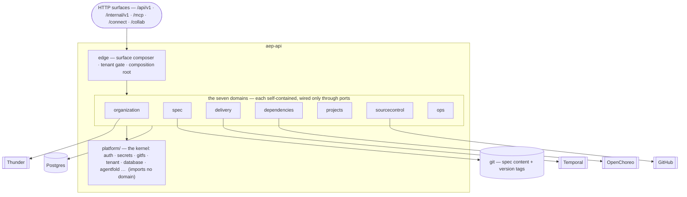

# aep-api — the platform BFF

aep-api is the platform's Go **backend-for-frontend**: a contract-first HTTP service
organized as **domain-oriented modules with vertical slices**. A request enters through
`edge` (which authenticates it and binds its tenant), fans out to one of **seven
domains**, and each domain does its work over **ports** — to its peers and to a shared
**platform kernel**. The boundaries below aren't a style guide; they're compiled and
CI-enforced by `internal/arch`.

> **L1 · the map.** Zoom up → the repo overview [`docs/architecture.md`](../../docs/architecture.md).
> Zoom down → each domain's own README (linked in the table). Ground truth → the tests in
> `internal/arch` and each package's `doc.go`.

## The map

**Legend (the same shapes at every zoom level):** `subgraph` = the unit you're looking
inside · `["box"]` = a package within it · `[[Name]]` = something *outside* the current
unit — another domain or an external system, always reached over a port · `[(store)]` = a
datastore · `(["/surface"])` = an inbound HTTP surface.

## The seven domains

| Domain | Owns | Shape | README |
|---|---|---|---|
| **organization** | tenant onboarding + every per-org config (GitHub / Anthropic / IDP), behind `/config` | flat-root | [→](internal/organization/README.md) |
| **spec** | git-committed requirements+design spec, `v<N>` version tags, agent turns, the org Skill library | flat-root | [→](internal/spec/README.md) |
| **delivery** | the version's **milestone run loop**: plan, dispatch the coding agent, merge, build, validate | kernel-root | [→](internal/delivery/README.md) |
| **dependencies** | resource-type catalog + provisioning + runtime-config convergence | kernel-root | [→](internal/dependencies/README.md) |
| **projects** | OpenChoreo `Project`/`Component` write-authority + the whole-pipeline Stage aggregate read | flat-root | [→](internal/projects/README.md) |
| **sourcecontrol** | repos / issues / webhooks over a provider-neutral `Host`, + the bare-mirror workspace | flat-root | [→](internal/sourcecontrol/README.md) |
| **ops** | incident RCA reports, correlated live against Task executions | flat-root | [→](internal/ops/README.md) |

## The kernel, the edge, and the rest

- **`platform/`** — the shared **kernel**: `auth`, `secrets`, `gitfs`, `tenant`,
  `database`, `agentfold`, `orgconfig`, `patch`, `validate`, `httpkit`, `k8sname`, `obs`,
  plus the test kits (`componenttest`, `dbtest`, …). It carries no business logic and
  **imports no domain** — the dependency arrow only ever points *into* it.
- **`edge/`** — the **surface composer / composition root**: the single package that
  wires every domain together, mounts the HTTP surfaces, and runs the deny-by-default
  **tenant gate**. It is the only place domains meet.
- **`clients/`** — outbound adapters to external systems (`openchoreo`, `thundersvc`,
  `secretmanagersvc`, `clustergatewayproxy`, `oauth`, `oidc`, `observability`, `k8s`).
- **supporting:** `app` (public composition **seam** — `Run(Options)`), `config`,
  `migrate` (ordered schema steps), `gen`/`igen` (generated contract types),
  `arch` (the executable rules), `seed`.

## Composition seam (`app.Run(Options)`)

Process lifecycle lives in the importable package
`github.com/wso2/aep/aep-api/app`. Callers build `Options` (via
`NewOSSOptions` or an overlay's own wiring) and call `Run`, which loads config.
Auth seam contracts live in public `github.com/wso2/aep/aep-api/ocauth`. Domain
graph assembly stays in `internal/app`; only the composition **seam** is
exported.

**Nil `Options` fields are feature off-switches** — they disable a capability
cleanly, never panic, and never silently pick a different OpenChoreo credential
path:

| Field | Nil means |
|---|---|
| `AuthProvider` | no bearer on M2M OC calls |
| `RequestAuthStrategy` | all-M2M / never pass-through (**direct-OC mode**) |
| `ImpersonateOrgResolver` (+ optional late-bound builder) | no `X-Impersonate-Org` |
| `SecretsProvider` | construct the default SM-API provider when its URL is configured |

**OSS `cmd/aep-api`** runs in **direct-OC mode**: M2M `AuthProvider` when service
auth is configured, `DirectOCStrategy` (always M2M), and a nil impersonation
resolver. An **overlay module** is a separate process entry that imports the
same `app` package and injects different `Options` — typically a **PAS strategy**
that chooses pass-through user JWT vs M2M + impersonation per request. Detail →
[`design/composition-seam.md`](design/composition-seam.md).

## Conventions

- **Contract-first.** Every HTTP op is generated from
  `packages/contracts/api/…/openapi.yaml` into a strict server interface; handlers fill
  it. Change the contract → `make gen-api` → let the compile errors drive the handlers.
- **Vertical slice.** A use-case is *one folder* — HTTP handler + service + wire mapping —
  not a layer smeared across the tree.
- **Two domain shapes.** *flat-root* (services live in the domain's root package; `Deps`
  in the root) for simple domains; *kernel-root* (root = shared types + ports only;
  feature logic in sub-packages that import only the root; `Deps` in `httpapi`) when
  features are densely cross-coupled. Default to flat-root.
- **Persistence in the domain.** Each domain owns its gorm in `<domain>/repository.go`
  and its entities alongside it. There is no shared `models/` or `repositories/`.
- **The composition root.** `edge` is the only package that wires domains together;
  domains never import each other's packages — only each other's **ports**.

## Vocabulary (structural terms used across every README)

| Term | Meaning |
|---|---|
| **domain** | one of the seven top-level capabilities; owns its data and its slices |
| **vertical slice** | one use-case as one folder: handler + service + wire mapping |
| **port** | a typed seam between domains — *needs* (an interface a domain requires) / *offers* (one it exposes). Domains meet only at ports |
| **flat-root** | domain shape: services in the root package; slices import the root |
| **kernel-root** | domain shape: root holds only shared types + ports; feature logic in sub-packages importing only the root |
| **edge** | the surface composer / composition root — wires all domains, mounts surfaces, runs the tenant gate |
| **aggregator** | a domain's `httpapi` package that embeds its slice handlers and declares no methods of its own |
| **milestone run** | delivery's single dispatch door — one supervised loop over one GitHub milestone, dispatching the coding agent cycle by cycle until the version settles |
| **seam / Options** | public `app.Options` injectables that are the only place deployment behaviour differs at process start |
| **direct-OC mode** | OSS default: all-M2M OpenChoreo auth, never user-JWT pass-through, no impersonation header |
| **PAS strategy** | overlay-supplied `RequestAuthStrategy` that decides pass-through vs M2M (+ impersonation) per OC request |
| **overlay module** | separate Go module / `main` that imports `app` and wires cloud-specific `Options` |

*Product & platform terms (committed-truth, phantom-OU, tenant gate) → [`docs/glossary.md`](../../docs/glossary.md).*

## Platform invariants

Cross-cutting rules live here once; each domain README carries only its *domain-specific*
invariants. **If a rule here and its named test disagree, the test wins** — these docs
point at enforcement, they don't restate it.

**Structural — CI-enforced by `internal/arch`** (run `go test ./internal/arch/...`):

- Persistence lives in the owning domain (`<domain>/repository.go`); no shared
  `models/`/`repositories/` → `TestGormFencedToDomainRepository`
- The platform kernel imports no domain → `TestPlatformImportsNoDomain`
- Domains name no `internal/feature/*` and reach peers only through ports →
  `TestDomainsAreFeatureFree`
- A domain root never imports its own slices; a slice never imports a sibling →
  `TestDomainRootNeverImportsItsSlices` · `TestSliceNeverImportsSibling`
- HTTP aggregators declare no methods → `TestAggregatorsDeclareNoMethods`
- delivery's `task ⊥ run` split — dispatch has exactly one door →
  `TestTaskRunSplit`
- the machine-block encoding stays a pure domain leaf → `TestTaskmetaIsPure`
- The legacy flat layout is gone; all seven domains landed → `TestFlatPackagesDeleted` ·
  `TestAllDomainsLanded`
- Secret-backend SDKs are fenced to `platform/secrets` → `TestImportFences`
  (in `platform/secrets`)

**Hygiene — CI-enforced by `make deadcode-check`:**

- No function is unreachable from the `cmd/aep-api` main, with tests *not* counting
  as callers → `scripts/deadcode.sh` (rationale + marker policy inline). Test seams
  and unwired infra carry a `//deadcode:keep` marker.

**Runtime — enforced by middleware + component tests:**

- **Deny-by-default tenant gate.** A request's org comes only from a verified JWT claim —
  never from a path, query, or body — so cross-org access is unrepresentable →
  `edge/tenant_gate_test.go` + every domain's `*_component_test.go`
- **Phantom-OU trust guard.** A JWT `ouId` is rejected only when a wired validator
  positively reports it does not exist (empty id / no validator / transient error all
  fail open) → `organization/ou_validation_test.go`

## Where to look

- A domain's boundaries, ports, and local invariants → its README (table above).
- Why a structural rule exists / how it's enforced → the named test in `internal/arch`,
  or the package's `doc.go`.
- Decisions → [`docs/decisions/`](../../docs/decisions/) (this ladder is
  [ADR-0008](../../docs/decisions/ADR-0008-architecture-in-readme-ladder.md)).
- Why delivery executes a version as one milestone run, and what that costs →
  [ADR-0011](../../docs/decisions/ADR-0011-milestone-is-the-unit-of-execution.md).
