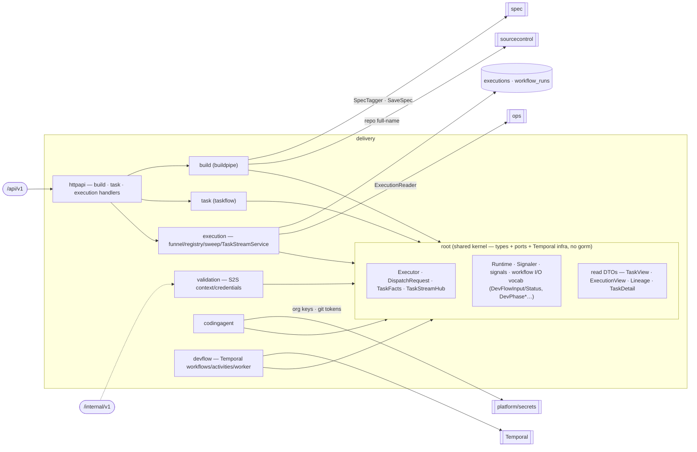

# delivery — Delivery Pipeline

Take a versioned Spec end-to-end: plan the Tasks, route every Execution through the ONE funnel, dispatch
coding agents, build/deploy the components, and run validation. **Single write-authority over the
executions store and the Temporal dev/task/validation workflows.**
[Why & boundary decisions →](../../../../docs/design/domain-oriented-architecture.md#33-delivery-pipeline--internaldelivery)

## Internal shape — kernel-ROOT + feature sub-packages (§10.3.1)

Delivery is **not** the flat-root-of-services layout spec/organization/ops use, and **not** per-op slices.
Its absorbed features are densely cross-coupled AND carry the load-bearing `task ⊥ execution` split, which
the ordinary rules (`root ⊥ slice`, `slice ⊥ sibling`) cannot satisfy flat. The resolution: **anything
referenced across a feature boundary is a TYPE or PORT that lives in the ROOT; the feature logic that uses
it lives in a sub-package importing only the root.** `task` and `execution` are then peer sub-packages that
never import each other (the split survives as an internal boundary, re-asserted by `TestTaskExecutionSplit`),
and every former feature→feature edge becomes a legal slice→root type reference.

| Sub-package | Owns | Reaches the root for |
|---|---|---|
| `build` (buildpipe) | the whole-spec gate + `v<N>` tag cut, dev-workflow start/status, builds history, dep-drawer preflight | `Runtime`, the workflow I/O vocab, `TaskView` (via `TaskReader` port) |
| `task` (taskflow) | GitHub-native Task Commands/Reads/Plan + list/get/promote handlers | the read DTOs; reaches the funnel via the `Dispatcher` port |
| `execution` | the ONE funnel (admit/finish/reevaluate), registry, sweep, `TaskStreamService`, `OpsExecutionReader` | `Executor`/`DispatchRequest`/`TaskFacts`, `Signaler`, `TaskStreamHub` |
| `codingagent` | the CodingExecutor + dispatcher + job watchers + templates | `Executor`/`DispatchRequest`/`TaskStreamHub`, `Signaler` |
| `devflow` | the Temporal dev/task/validation workflows, activities, worker | `Runtime`, `Signaler`, the workflow I/O vocab |
| `validation` | the two S2S validation runner callbacks (context / test-credentials) | — (no cross-edges; least entangled) |
| `httpapi` | the aggregator: embeds build/task/execution handlers; **holds `Deps`** (see below) | imports the sub-packages (the exempt aggregator) |

**`Deps` lives in `httpapi`, not the root.** Every other domain keeps its `Deps` in the domain root, but
delivery's services live in sub-packages the root may not import (`root ⊥ slice`). The `httpapi` aggregator
is the one package allowed to name them, so `httpapi.Deps` + `httpapi.New` is where composition sits.

## Ports
| Port | Dir | Peer · contract |
|---|---|---|
| `Dispatcher` / `Reevaluator` | offers | `task` → the funnel's single dispatch door (root type, satisfied by `execution`) |
| `TaskReader` (returns root `TaskView`) | needs | `build` → the durable GitHub⋈executions read (satisfied by `*task.Reads` at the root) |
| `SpecTagger` (`*spec.SpecSaveResult`) · `SpecCollector` · `AuthDeriver` | needs | `spec` — the whole-spec gate + tag cut + design reads |
| `RepoLookup` (`owner/name`) | needs | `sourcecontrol` — repo full-name resolution |
| org-credential reads · `AnthropicKeyResolver` | needs | `platform/secrets` / P3a org repositories — coding-agent runner secrets |
| `ExecutionReader` (`ops.ExecutionFact`) | offers | `ops` — latest-execution-per-kind correlation (`execution.OpsExecutionReader`, P6-retired the app bridge) |
| `ValidationContext` · `ValidationCredentials` | offers | the S2S runner callbacks (`/internal/v1`, via the internalServer — not the public edge) |

## Owns
- The **executions** write-API (admit/finish/reevaluate through the funnel) and **workflow_runs**; the
  Temporal `Runtime`, `Signaler`, and the dev/task/validation workflows.
- **Persistence today**: the executions/workflow_runs/coding_agent_logs gorm lives in `repositories/`
  (`Execution`/`WorkflowRun`/`CodingAgentLog` repositories) and the entities in `models/` — this domain is
  **gorm-free** (the gorm-into-`delivery/repository.go` + entity move defer to P9, as every domain's did).

## Invariants — don't break
- **`task ⊥ execution`.** The GitHub-facing half (`task`) and the platform-owned half (`execution`) are
  peer sub-packages that never import each other; `task` reaches the funnel only through the root
  `Dispatcher` port. `TestTaskExecutionSplit` + `slice ⊥ sibling` both enforce it.
- **One funnel door.** Every Execution (coding, build, validation, provisioning) is admitted/finished/
  reevaluated through `execution`'s funnel — the single place org-fencing, dedup, and dep-gating live.
- **The kernel names no feature.** The root holds only types/ports/Temporal infra; it never imports a
  sub-package (`root ⊥ slice`), and the domain never imports `internal/feature/*`.
- **`Signaler` stays a nil-safe concrete type**, not an interface — its nil-safety (no-op when Temporal is
  unavailable) is load-bearing for tests and degraded runs.
- **Deny-by-default tenant gate is upstream.** Handlers read the org from the gate-bound context only; org
  never travels in a path/query/body, so IDOR across the executions store is unrepresentable.
