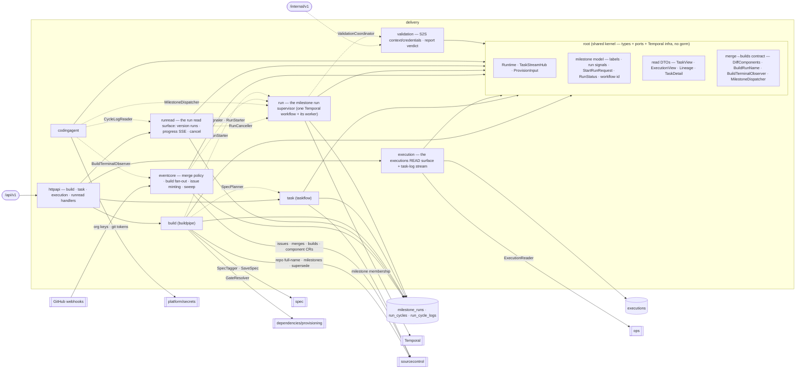

# delivery — Delivery Pipeline

> **L2 · a domain.** Part of the [aep-api architecture](../../README.md).

Take a versioned Spec end-to-end: cut the version, plan its Tasks into a GitHub MILESTONE, and run one
supervised loop that dispatches the coding agent at that milestone until it settles — merging, building,
deploying and validating along the way. **Single write-authority over the milestone-run store and the one
Temporal workflow that drives it.**

## Internal shape — kernel-root + feature sub-packages

Delivery is **not** the flat-root-of-services layout spec/organization/ops use, and **not** per-op slices.
Its absorbed features are densely cross-coupled AND carry a load-bearing split — the GitHub-facing Task
surface must never reach the dispatcher — which the ordinary rules (`root ⊥ slice`, `slice ⊥ sibling`)
cannot satisfy flat. The resolution: **anything referenced across a feature boundary is a TYPE or PORT
that lives in the ROOT; the feature logic that uses it lives in a sub-package importing only the root.**
`task` and `run` are then peer sub-packages that never import each other (`TestTaskRunSplit` re-asserts
it), and every former feature→feature edge becomes a legal slice→root type reference.

| Sub-package | Owns | Reaches the root for |
|---|---|---|
| `build` (buildpipe) | the whole-spec gate + `v<N>` tag cut, **the milestone plan path** (supersede the previous version, mint `v<N>`'s milestone, admit the run row, then plan its Tasks and mint its gates), the version ledger, dep-drawer preflight | `MilestoneRun`/`StartRunRequest`, and the planner via `SpecPlanner` |
| `task` (taskflow) | the GitHub-native Task READ surface (list/get, scoped to a version by milestone membership) + the plan turn, which mints one **prose** issue per Task **into the version's milestone**, assigned at creation; plus the SRE/RCA handoff's adoption leg | the read DTOs, the milestone label vocabulary, and the run rows (via `MilestoneResolver`) |
| `execution` | the executions READ surface: the per-Task progress endpoint, the task-log SSE stream, `OpsExecutionReader`. It writes nothing and dispatches nothing — the only execution rows left are the provisioning gates' | `TaskStreamHub`, the executions kernel |
| `eventcore` | the event plane of the milestone-run loop: the auto-merge policy seam, the merged-PR path-diff build fan-out + per-`(component, SHA)` re-trigger budget, fix/conflict/red-main issue minting, milestone-matched predicate re-evaluation, adoption, and the reconcile sweep | the milestone model (labels, `MilestoneRun`/`RunCycle`, run signals), `DiffComponents`/`BuildRunName` and `BuildTerminalObserver`; **no Temporal** — it reaches the supervisor only through the `RunSignaler`/`RunStarter` ports |
| `run` | the milestone run SUPERVISOR: the wait state + dispatch predicate, the cycle loop, the four budgets + no-progress + ceiling, the validation cycle, settle, and cancel. Plus the `Supervisor` handle the event plane and the build click signal and start runs through | `Runtime`, the milestone model, `RunStatus`/`MilestoneRunWorkflowID`, `MilestoneDispatch`, `DiffComponents`/`BuildRunNamePrefix`; **no GitHub client, no gorm** |
| `runread` | the run READ surface: a version's runs + their cycles, ONE SSE stream stitching the per-cycle agent logs, and cancel. Owns no state and decides nothing | the run/cycle entities and `IsTerminalRunState`; reaches the pod log through `CycleLogReader` and the supervisor through `RunCanceller`, so it drags in neither a cluster client nor a workflow engine |
| `codingagent` | the CodingExecutor (ONE dispatch entry point: launch a cycle's agent Job), the build-auth retry, the job watchers and the Job templates | `MilestoneDispatch`/`MilestoneDispatcher`, `TaskStreamHub`, `BuildTerminalObserver` |
| `validation` | the two S2S validation runner callbacks (context / test-credentials), the validation issue, and the report → verdict rule | — (no cross-edges; least entangled) |
| `httpapi` | the aggregator: embeds build/task/execution/runread handlers; **holds `Deps`** (see below) | imports the sub-packages (the exempt aggregator) |

**`Deps` lives in `httpapi`, not the root.** Every other domain keeps its `Deps` in the domain root, but
delivery's services live in sub-packages the root may not import (`root ⊥ slice`). The `httpapi` aggregator
is the one package allowed to name them, so `httpapi.Deps` + `httpapi.New` is where composition sits.

## Ports
| Port | Dir | Peer · contract |
|---|---|---|
| `Adopter` (`AdoptIssue`) | needs | `task` → the event plane. The handoff's dispatch leg: file a bare issue under the deployed version's milestone and start an incident run over it |
| `MilestoneResolver` (`MilestoneNumberForTag`) | needs | `task` → the root run repository. A `?tag=` query is milestone membership, resolved through the platform's own rows |
| `SpecTagger` (`*spec.SpecSaveResult`) · `SpecCollector` · `AuthDeriver` | needs | `spec` — the whole-spec gate + tag cut + design reads |
| `RepoLookup` (`owner/name`) | needs | `sourcecontrol` — repo full-name resolution |
| org-credential reads · `AnthropicKeyResolver` | needs | `platform/secrets` / P3a org repositories — coding-agent runner secrets |
| `ExecutionReader` (`ops.ExecutionFact`) | offers | `ops` — latest-execution-per-kind correlation (`execution.OpsExecutionReader`, P6-retired the app bridge) |
| `BuildTerminalObserver` (root) | offers | the OpenChoreo watcher → the event plane: a settled build reported outwards, so watcher and event plane stay peer sub-packages |
| `MilestoneDispatcher` (root, over `MilestoneDispatch`) | offers | the coding agent → the supervisor: launch one agent run at a milestone and answer with its Job ref. The dispatch prompt is a milestone reference; the runner discovers its own working set. Satisfied by `*codingagent.CodingExecutor`, which writes no execution row — the cycle record is the supervisor's bookkeeping |
| `ComponentEnsurer` | needs | `eventcore` → the projects component service + the runtime-config emitter. Provision a component's OpenChoreo CR immediately before its first build; see the invariant below |
| `RunReader` · `CycleReader` · `CycleLogReader` · `RunCanceller` | needs | `runread` → the root run/cycle repositories, `codingagent`'s pod-log reader, and `*run.Supervisor`. Four reads and one write, which is the whole dependency surface of the read model |
| `RunSignaler` · `RunStarter` | needs | `eventcore` and `build` → the run supervisor. Signal a run, start one. Interfaces, which is what keeps both the event plane and the build click free of a workflow engine; both are declared over the root `StartRunRequest`, and `*run.Supervisor` satisfies both |
| `RunStore` · `CycleStore` · `MilestoneReader` · `PRReader` · `DesignReader` · `BuildReader` · `ValidationCoordinator` | needs | `run` → the root repositories, `sourcecontrol`, the design reader, `clients/openchoreo` and `delivery/validation`. Every I/O the loop performs, named once; `BuildReader` is read-ONLY because the supervisor never triggers a build |
| `MilestoneClient` (mint · list a milestone's issues · close issue · close milestone) | needs | `build` → `sourcecontrol`. The plan path's whole GitHub surface: create `v<N>` idempotently, and supersede `v<N-1>` |
| `MilestoneRunStore` (active-run read · admit · settle · list) | needs | `build` → the root run repository. The 409 pre-check and the admission that arms the spec-run mutex |
| `SpecPlanner` (`PlanIntoMilestone`) | needs | `build` → `task`. The planning turn, reached through the root exactly as `TaskReader` is, so `build` names no sibling |
| `GateResolver` (author dependencies + mint gates into a milestone) | needs | `build` → `dependencies/provisioning`. Gates are dispatch holds, never agent work |
| `BuildTrigger` (trigger at commit + list a component's runs) | needs | `clients/openchoreo` — the fan-out, and the run list the re-trigger budget is derived from |
| `IssueClient` (mint · milestone membership · milestone counts · assign) · `PRReader` · `PRMerger` | needs | `sourcecontrol` — every GitHub write the event plane makes, on the org's own credential |
| `ValidationContext` · `ValidationCredentials` | offers | the S2S runner callbacks (`/internal/v1`, via the internalServer — not the public edge) |

## Owns
- The **executions** store (now provisioning gates only) and the Temporal `Runtime` + the one workflow on it.
- The **build click's whole sequence** (`build`): mutex → repo → drawer pre-tag work → dependency hard
  gate → whole-spec gate + `v<N>` tag cut → supersede → milestone → run row → plan. The ORDER is the
  domain fact `build` owns; the two halves it does not own (the planning turn, the gate resolvers) are
  root ports.
- The **event plane** (`eventcore`): the platform's whole reaction to a pull request, a milestone-matched
  issue and a build terminal. It merges, mints and signals — the supervisor decides. Its three GitHub
  effects are a squash-merge, an issue in a milestone, and a build pinned to a merge SHA.
- The **milestone run** store: a run row per (org, project, milestone) — origin, small state, terminal
  reason, budget counters, validation verdict — and one **cycle record per dispatch** under it (kind,
  attempts, Job ref, branch, the pull request's number AND its page on the host, merge SHA). The pull
  request URL is stored as the webhook reported it, never composed from the repo row and the number:
  the repo URL is a *clone* URL, and a reader that assembles links from it encodes both the host's URL
  grammar and that spelling. The milestone **number** is the key; the title is kept
  only as the `v<N>` tag a `?tag=` query resolves through. Loop position is read from the latest cycle, and
  per-component build/deploy status is derived from OpenChoreo on read — neither is stored.
- **Delivery's agent SPEND**, on the cycle record: a cycle IS one agent run, so its captured token usage
  and the USD stamped on it at capture (`cost_usd`, amended console ADR-0011) are where both the build and
  validation phases of Settings → Usage come from. The phase is read from the cycle's kind. `RecordUsage`
  is the one cycle mutator NOT fenced on `ended_at IS NULL`: usage arrives from the terminal-log capture,
  and a cycle closes on the merge webhook seconds after its Job exits — fencing it would discard nearly
  every capture. `PhaseUsageRollup` sums this with the executions table, which today contributes nothing
  (its only remaining kind, `provision`, runs no model).
- The **run loop** (`run`): one Temporal workflow per milestone, `run-<org>-<project>-<milestoneNumber>`,
  whose id is REUSED after a terminal run because a milestone sees sequential runs across its life. It
  owns the four budgets, the no-progress rule, the cycle ceiling, the validation cycle and settle — and
  nothing else: it detects no event and writes no issue.
- **Persistence**: every gorm in this domain sits at the ROOT (the fence `TestGormFencedToDomainRepository`
  draws), as single write-authority — `repository_execution.go` · `repository_coding_agent_log.go` ·
  `repository_run.go` · `repository_cycle.go` · `repository_run_cycle_log.go` over the `execution.go` /
  `coding_agent_log.go` / `milestone_run.go` / `run_cycle.go` / `run_cycle_log.go` entities. Their tables
  are `executions` · `coding_agent_logs` · `milestone_runs` · `run_cycles` · `run_cycle_logs`.
  `usage_rollup.go` is the one read that spans two of them, and is a plain function over both
  repositories rather than a third store.

## Invariants — don't break
- **`task ⊥ run`.** The GitHub-facing Task surface and the run supervisor are peer sub-packages that never
  import each other, in either direction. Dispatch has exactly ONE door — a run works a milestone — so a
  `task` that could reach the supervisor would be a second door with the run's budgets bypassed.
  `TestTaskRunSplit` + `slice ⊥ sibling` both enforce it.
- **One active spec run per project.** At most one non-terminal (`planning`/`waiting`/`running`) `spec-build`
  milestone run exists per (org, project) — a partial unique index (`ux_milestone_runs_spec_active_v2`, created
  by the `milestone_runs` migration; AutoMigrate cannot express one) that admission hits with
  `INSERT … ON CONFLICT DO NOTHING`, so the invariant holds under concurrency and not merely under the
  endpoint's pre-check. Both answers are the same 409. `incident-adoption` runs sit deliberately outside
  the index and execute concurrently on their own milestones.
- **The version is claimed before it is planned.** The run row IS that mutex, so the build click admits it
  synchronously — supersede, mint the milestone, admit — and only then runs the planning turn, detached
  from the request. Admitting after planning would leave the mutex unarmed for the minutes an LLM turn
  takes, which is exactly the window a double-click lands in. A plan that cannot land settles the run it
  armed (`plan-failed`), so a failure never wedges the project behind its own mutex.
- **A version supersedes its predecessor, found through the run rows.** Before `v<N+1>`'s milestone exists,
  `v<N>`'s still-open issues are closed with a `Superseded by v<N+1>` comment — the agent work first, then
  the gates that were holding it — and then the milestone. The previous milestone is located by the NUMBER
  recorded on a run row, never by matching titles against GitHub (titles are renamable, and title filters
  are case-insensitive while create-uniqueness is not). This is what keeps the reconcile sweep sound: a
  superseded milestone holds no open `aep` issue, so the sweep's trigger never fires on it.
- **Every issue body is prose; nothing platform-side parses one.** That holds for planned Tasks, for
  dispatch gates and for the validation issue alike: the milestone is the version pin, LABELS carry every
  routable fact, and ordering is the "Depends on #N" lines the AGENT honours. Dedupe on re-plan is the
  title slug against the milestone's own issues, which makes reconcile additive-only and a crash re-run a
  no-op. Gates (`aep:provision` + `aep:dep/<slug>`, minted by `dependencies/provisioning`) and the
  validation issue (`aep:validation`) deliberately do NOT carry `aep` — a gate is a dispatch hold and the
  validation issue is a phase of the run, and neither may hold the settle predicate open.
- **Milestone assignment rides issue creation.** A plan costs `1+N` content-generating requests against
  GitHub's 80-per-minute ceiling: one milestone create plus one issue create per Task. Never
  create-then-PATCH, and never a label pre-create per issue (`sourcecontrol` memoises the ensure).
- **Settled rows are never resurrected.** Every run and cycle mutator is a guarded update — fenced on the
  run not being terminal, or the cycle not being closed — and returns `(nil, nil)` when it changes no row,
  so a duplicate webhook or signal is a no-op rather than a rewrite of a recorded outcome.
- **A component's CR is provisioned immediately before its first build, by the FAN-OUT.** A cycle is
  scoped to a milestone and may touch several components, so no dispatch knows which component is about to
  be built; the merged-PR fan-out is the last point that does. It ensures the OpenChoreo Component CR (and
  emits any web-app runtime config) per component, then triggers — without it a first-ever component's
  build fails "Component not found". An unensurable component is not built: triggering a build for a CR
  that does not exist only fails later, and less clearly.
- **Every event-plane handler keys off a milestone run row.** It resolves the run first — by the agent's
  `aep/m<milestone#>-…` branch, by the milestone a payload embeds, by the cycle that landed a commit, or
  (for incidents and adoption) by the deployed version's run — and returns having written nothing when
  there is none. That gate is what keeps the plane's authority scoped to work the platform started, and
  what lets it share the `pull_request` and `issues` routing keys with other handlers without racing them.
- **The event plane imports no workflow engine.** It detects, mints and signals; the supervisor decides.
  The dependency direction is enforced as a package boundary — the supervisor is reachable only through
  the `RunSignaler`/`RunStarter` ports, so no loop decision can be smuggled into a webhook handler.
- **A signal is a wake-up, never evidence.** The supervisor re-reads GROUND TRUTH before acting on any
  signal: the milestone's own issue counts at every cycle boundary, and the CYCLE RECORD (not the payload)
  to decide whether the agent's pull request landed — a human's pull request merging mid-cycle raises the
  identical signal. That is what makes a lost delivery cost latency rather than correctness, and it is why
  the wait state can be unbounded with cancel as its only expiry.
- **The supervisor counts its own budgets.** They are workflow state, written OUT to the run row for the
  read model and never read back: a replay must reproduce the same decisions without a database. The one
  budget it does not count is the automatic build re-trigger — that is the event plane's, derived from the
  WorkflowRuns themselves, and the supervisor reads the same runs rather than keeping a second tally.
- **Every terminal reason names exactly one failure class.** `redispatch-budget` is agent death (including
  a Job that exited without a pull request); `build-retrigger-budget` is a build that stayed red through
  its one automatic re-trigger with no fix issue to recover it; `fix-chain-budget` and `conflict-budget`
  bound the two recovery chains; `no-progress` is a green cycle that left the milestone unchanged;
  `cycle-ceiling` is the backstop over all of them; `validation-failed` is the verdict. A run that settles
  for a reason outside this list is a bug in the loop, not a new state.
- **Settle closes the milestone; nothing branches on that.** Milestone state is display only, closed
  milestones still accept new issues, and a failed or cancelled increment leaves its milestone OPEN
  because the way forward from it is more work in the same version. A stray gate never blocks settle:
  gates hold dispatch, and with an empty working set they hold nothing.
- **A run that has never dispatched does not settle on an empty working set — it waits.** "Nothing
  left to do" means DELIVERED only in contrast to work the run actually did; with zero cycles behind
  it the same reading is indistinguishable from a milestone whose issues have not been minted yet,
  because the version is claimed before it is planned (above) and a poll can land inside that window.
  So the run parks in the unbounded wait and re-derives on every `issues` webhook and at the poll
  backstop. Three things end it: work arriving, a human cancelling, or — when the planning turn itself
  failed and no issue is ever coming — the plan path settling the row it armed with `plan-failed`.
  Those two writers cannot race: the plan path starts the supervisor only after planning returns, so a
  run that failed to plan has no workflow behind it, and the repository's non-terminal guard on
  `Settle` is the backstop if that ordering ever changes.
- **One task queue, one worker.** `run.WorkerWatcher` owns it: a task queue must be served by ONE worker
  that knows every workflow on it, and the run supervisor is the only workflow left. Two workers polling
  one queue with disjoint registrations would fail whichever tasks each picked up by accident.
- **Cancel is a signal, not a Temporal cancellation.** A cancelled context could not run the activities
  that record the outcome, so the run settles its own row and closes its own cycle on the ordinary path.
- **Echo suppression is `issues.*`-only.** Every label, comment and milestone assignment the platform
  writes fires an `issues.*` delivery straight back, so those handlers drop self-sender deliveries. It is
  deliberately NOT applied to `pull_request.*`: in App mode the coding runner opens its PR as the same
  `<slug>[bot]` login, and suppressing that would strand the run waiting for a PR that already exists.
- **Handlers are idempotent, without a seen-it table.** A redelivered webhook re-runs the handler, so
  merging re-reads the live PR first, minting passes a `DedupeKey`, and triggering a build counts the
  WorkflowRuns OpenChoreo already holds for `(component, commit)` — the same count that enforces the
  one-automatic-re-trigger budget, so idempotency and the budget can never disagree. Per-component build
  state is derived from OpenChoreo on read, never stored, which is why a counter column would be wrong.
- **The kernel names no feature.** The root holds only types/ports/Temporal infra; it never imports a
  sub-package (`root ⊥ slice`), and the domain never imports `internal/feature/*`.
- **`*run.Supervisor` stays a nil-safe concrete type**, not an interface, at the composition root — the
  event plane and the build click both hold it unconditionally, and a degraded boot (Temporal down) has to
  be a logged no-op rather than a nil check at each call site.
- **The run progress stream is ONE connection over every cycle, and only a terminal run settles it.**
  `stream-run-progress` (`GET .../runs/{runId}/progress`, `text/event-stream`) carries a `cycle` frame per
  cycle record and a `line` frame per agent-log entry, each line stamped with its cycle id, its 1-based
  cycle index and an **emitter chip** (`main` | `subagent`) so the console renders one accordion section
  per cycle and can tell the run's main agent from the work it fanned out with the Task tool. The frame
  kind rides in a `type` field inside the `data:` payload so it passes the shared agent-stream parser.
  A live run — including one parked in `waiting` — holds the stream open indefinitely; a terminal run
  streams its history, sends `done` + `[DONE]`, and the server closes. The server keeps no cursor; the
  client dedups by cycle id and `(cycleId, seq)`.
- **A cycle's agent log is keyed by the CYCLE, not by an execution.** `coding_agent_logs` is FK'd to
  `executions(id)` and a milestone run mints no execution row, so the milestone loop has its own sidecar,
  `run_cycle_logs`, keyed `(cycle_id, run_name)` — one row per attempt, since a re-dispatch keeps the
  cycle and takes a new Job. The `JobWatcher` captures it when the cycle's Job goes terminal and does
  NOTHING else on that pass: a Job that exited zero says nothing about whether the cycle landed, and the
  cycle's outcome is the supervisor's, learned from webhooks. Without the capture a finished run would
  have no history at all — the Job's TTL reaps the pod long before anyone opens an old version's page.
- **The task-log stream is one connection, no server cursor.** `stream-task-log`
  (`GET .../tasks/{issueNumber}/log`, `text/event-stream`) carries a Task's whole live state — `task` /
  `execution` / `line` / `done` frames, the frame kind in a `type` field inside the `data:` payload so it
  rides the shared agent-stream parser. The server buffers no history and keeps no cursor; the client
  dedups and a reconnect re-derives. It settles when the Task's ISSUE closes, because nothing further will
  arrive on it. It is the per-ISSUE view; a run's own feed is `stream-run-progress`.
- **`derivedStatus` is the issue's own state, and only that.** Two values — `pending` (open) and `merged`
  (closed) — both deliberately members of the retired ten-value vocabulary, because the console consumes
  the field UNTYPED and a chip keyed on an unknown string renders as nothing. Anything richer belongs on
  the run's cycle timeline, which is where the loop's real position lives.
- **Validation is the run's last CYCLE and never builds.** The supervisor mints the validation issue at
  deployed-green (never at plan time — an issue nothing can work until every component deploys would hold
  every cycle boundary open), dispatches one cycle at it with `AEP_TASK_KIND=validation`, and reads the
  committed report back as the run's VERDICT. The acceptance oracle
  `specs/validation/validation-criteria.json` is read-only input authored in the design phase (spec domain).
- **The list read returns three populations, and hides one** (`task/reads.go` `ListByTag`, the read-model
  boundary). Every row carries the label-derived `executorClass` the console sections on: `coding` (agent
  work), `provision` (a dispatch gate, which the console renders as a hold banner rather than a row), and
  `ledger` — a bare human issue that joined the milestone carrying none of the platform's labels. The
  **validation issue is always hidden**: it is a phase of the run, not an implementation task, and its
  verdict rides `deploy.validation` on the project status and the version's run story. `get-task` and
  `stream-task-log` still serve it by issue number.
  A LEDGER issue is returned by the milestone-scoped read and only by it — the untagged read is two label
  queries, and a ledger issue is defined by carrying no label to query on. Milestone membership is the only
  handle there is.
- Platform-wide rules (tenant gate, secrets fence, persistence-in-domain) → [../../README.md](../../README.md).
