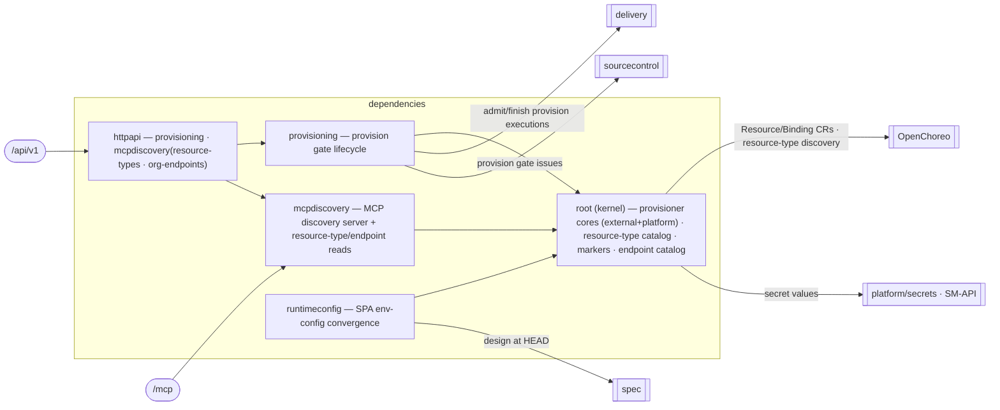

# dependencies — Dependencies & Provisioning

> **L2 · a domain.** Part of the [aep-api architecture](../../README.md).

Discover the platform-resource catalog and resource-type markers, provision the platform + external
resources a Spec declares, broker cross-project org-service access, coordinate the `provision` gate,
and wire the resulting runtime config onto deployed apps. **The two halves of OpenChoreo's
`Workload.spec.dependencies[]` — resources (external / platform-resource) and endpoints (component /
org-service) — live here; provisioning mints the milestone's `provision` gates and keeps their
execution rows.**

## Structure — kernel-root domain
Unlike the flat-root domains (`spec`/`organization`/`projects`), `dependencies` is the kernel-root shape
`delivery` uses. The two **pure provisioner cores** — `resources` (external + platform provisioner cores,
the `ResourceTypeCatalog` and `TypeMarkers`; the ref/env-var naming itself moved to `platform/ocname`,
shared with `spec`'s wiring derivation) and `endpoints`
(the org-service `Catalog` + `resolve`) — have no back-edges and are the shared kernel every service builds
on, so `slice → root` is the only legal direction and they **are** the root package `dependencies`. The
three services are sub-package slices that import only that root.

| Slice | Ops / role | Reaches |
|---|---|---|
| `provisioning` | 9 HTTP ops: list/delete/collect-values external resources, list-workload-dependencies, project readiness, provision-platform, dependency-status, request/list org-service access + the `provision` gate lifecycle, watcher, teardown | root cores; delivery (provision execution rows); sourcecontrol (gate issues); `WorkloadDepSource` (deployed Workload consumer refs) |
| `mcpdiscovery` | the MCP discovery server (including `list_groups`, the design-time directory-group catalog, and `slice_openapi_spec`, which cuts the operations a design uses from a provider's whole document — fetched outside the model's context — with the provenance the dependency file records) + `ListPlatformResourceTypes` and `ListOrgEndpoints` HTTP reads; `list_external_resources` is RT-backed (Registered at register Ensure and Project Externals with an authored RT), not provisioned-only | root `ResourceTypeLister` / external RT catalog / endpoint catalog |
| `runtimeconfig` | the SPA `env-config.js` convergence service + its watcher (no HTTP op) | root naming/markers; spec (design at HEAD); repositories (execution enumerate) |

Each slice owns its service AND its HTTP handler (as delivery's `build` slice does); `httpapi` aggregates
the two handler-bearing slices and **holds `Deps`** — the kernel-root consequence that the root may not name
its own sub-package services (`root ⊥ slice`), so assembly lives in the one package allowed to import the
slices.

## Ports
| Port | Dir | Peer · contract |
|---|---|---|
| SecretWriter | needs | `platform/secrets` — SM-API vault writes for external-resource secret values |
| OC `Resource`/`ResourceReleaseBinding` CRUD · `ClusterResourceType` discovery | needs | `openchoreo` client — OC is the store |
| WorkloadDepSource | needs | `openchoreo` client — deployed Workload consumer refs (resource + endpoint) for Overview `list-workload-dependencies`; GetResource 404s are dangling and omitted |
| ExecutionStore (admit/finish) | needs | `delivery` — a gate's provisioning run is the last remaining execution row, and this is its write surface |
| IssueClient (provision gate · endpoint-wiring comment) | needs | `sourcecontrol` — gate issues closed via a no-secrets reference, and the ADR-0004 endpoint comment + its `aep:wired` completeness marker on the working set |
| OrgResourceDocs | needs | `sourcecontrol` — the first file row on register/update mints the per-org `org-resource-docs` GitHub repo (sentinel project `_resource-docs`) via `EnsureBareRepo` + `Workspace.Mutate`; URL-only and keep-path rows never mint |
| ProviderResolver (endpoint targets) | needs | root `Catalog` — any-visibility provider lookup for an access request, namespace/project-visible resolves for the wiring block |
| DesignReader / DesignBundleReader | needs | `spec` — design at HEAD (what to provision) + provider design bundles |
| ResourceMarkerCatalog | needs | root `ResourceTypeCatalog.MarkersByName` — CRT `end-user-auth` marker lookup for thunder overlay at platform-resource create. Nil skips overlay |
| SecurityJSONReader | needs | `spec.ArtifactService` — `security.json` bytes at HEAD (empty tag) or a `v<N>` spec tag (`GetDesignAtSpecTag`). Absent file is no overlay; parse of a present file is provisioning's job. The overlay DERIVES both CRT parameters: `scopes` is the OIDC scopes plus every catalog handle, and nothing in the document names the client |
| ProjectNamer | needs | `openchoreo` project client — the project's display name, which becomes the sign-in client's `displayName` (suffixed `· <web app>` when the project has several). Best-effort: an unreadable name falls back to the project id rather than failing a provision |
| RolesEnsurer | needs | `identity` — the build-time roles ensure. The roles gate calls it inside `ProvisionForBuild`, driven by the DESIGN at the tag rather than the drawer inputs, so a role added in a later version is still created. Reports a `RolesEnsureOutcome`, never an identity entity. The outcome carries each test account's login, which the gate publishes as its own comment on the ticket before closing it — that comment is where a validation agent reads the credentials it signs in with, and a failure to publish fails the build |
| GroupCatalogLister | needs | `identity` — the groups already on the org environment's directory, behind the `list_groups` MCP tool. Read-only, with no write counterpart on this surface: groups are created at build time, never by a model |
| the 11 public ops (provisioning 9 + mcpdiscovery `ListPlatformResourceTypes` and `ListOrgEndpoints`) | offers | the edge (`dependenciesHandlers`) |

## Owns
- `ExternalResource` (an in-memory definition, NOT a DB row — see Persistence), `AccessRequest`, the
  authored OC external Resource model + provisioned binding values, the `provision` gate issues
  (via `sourcecontrol`), the **resolved `endpoints:` half** of the consumer-side `dependencies:` block the
  coding agent copies into `workload.yaml` (ADR-0004 — resolved here, never patched onto a Workload CR; the
  `resources:` half is derived in `spec` at design save, ADR-0013), and the resource-type catalog projection.
- **Org resource-docs file bytes** in the per-org `org-resource-docs` repo (not `org-skills`, not
  project `PutReferences`). Register/update file rows commit UTF-8 via `OrgResourceDocs`; list/GET
  surface only `type` + `url`/`path` pointers from the `ResourceType` `aep.wso2.com/resource-docs`
  annotation — never file bodies.
- **Persistence**: only `AccessRequest` is persisted (`repository_access_request.go` over
  `access_request.go`), single write-authority. `ExternalResource` is an in-memory definition, not a
  DB row — the org-namespaced OpenChoreo `ResourceType` is the registry (ADR-0009).

## Invariants — don't break
- **`env-config.js` is ready or absent, never partial** — and "ready" means exactly *the keys the SPA needs
  to START*: a sibling backend's address, a platform resource's outputs. `src/env.ts` throws on a missing
  key at module load, so half a file is worse than the stale one the pod already has. The SPA's OWN
  external URL is deliberately not one of those keys: it exists only once the SPA has a rendered binding,
  so requiring it before the first write is a demand the SPA cannot meet until it has already been
  deployed — and the one thing that needs it (registering the callback URL with an OIDC dependency) is not
  read by the bundle at all. That registration is SOFT: it is retried by the deploy stage's converge pass
  and by the converge watcher, and it never holds the file back. Grading it hard once withheld
  `window._env_` entirely and served a blank page. ADR-0019.
- **Secret values never leave the SecretWriter port.** External-resource secret values route through SM-API;
  issue bodies, comments, and API responses carry only names / paths / refs — never secret material. The
  domain imports no secret-backend SDK (the fence holds via `platform/secrets`).
- **A gate issue is PROSE plus two labels.** `provision` is its KIND — and it deliberately carries no `aep`
  arming label, so nothing works it and it is never subtracted from a working set; `aep:dep/<slug>`
  keys it to the dependency it holds. That pair is the whole index: both the mint-time dedupe and the
  drawer's resolve are LABEL queries, never a body read (bodies are prose a human may rewrite) and never a
  title match. A gate deliberately does not carry `aep` — it is a hold on the next dispatch, never agent
  work — and it holds only DISPATCH: an open gate never blocks a run from settling.
- **External values never mint a provision gate.** A Project External is authored from the design's
  union schema: plain defaults, `secretStorePath` empty unless a rebuild already saved a non-empty
  value. A Registered External is authored from the org value plane: non-secret configured cells
  become binding `environmentConfigs` (the ResourceType CEL input, not a second secret store);
  `secretStorePath` is the org-catalog vault key persisted when register writes secrets through
  OrgSecretWriter (empty when that writer is unwired). Secret cell values are never copied into
  Plain. Project readiness iterates the design schema; stale binding keys cannot make a
  dependency configured.
- **Consumption instructions on the ResourceType mark Registered** (ADR-0021). The process-local
  org value plane is a cache: after aep-api restart, `registeredEnvCells` synthesizes configured
  cells from the RT and `OrgCatalogVaultKey` reconstructs the org-catalog vault path — it does
  not re-write secrets. Empty consumption instructions keep the row a Project External.
- **A gate's provisioning run keeps an execution row.** It is the one execution kind the milestone model
  still writes: admitted when the drawer submits, finished by the readiness watcher, and its terminal state
  is what closes the gate issue.
- **Dependency wiring is SAID, never patched** (ADR-0004), and this domain now says only HALF of it
  (ADR-0013). A resource's `ref` + env-var names need no binding to compute, so design save stamps them
  into the dependency's own `wiring` block in `design.json` (`spec/derive_wiring.go`) and the agent reads
  them from its own tree. What is left here is the `endpoints:` half — the part that genuinely needs live
  resolution: a cross-project org-service (the provider may not have published) and a same-project
  sibling's endpoint name (it comes from a `workload.yaml` nobody has written yet).
- **The endpoint comment goes up at CYCLE DISPATCH**, through delivery's `WiringPublisher` port, onto the
  run's working set (open `aep`, minus gates and validation), keyed by component in its content because no
  label attributes an issue to a component. Dispatch — not gate resolution — because the dispatch predicate
  already guarantees what the comment needs: no gate open (so everything resolvable has), and a non-empty
  working set (so somebody is listening). Posting at gate resolution had neither guarantee, and a project
  whose gates closed before its issues were planned got nothing and no retry. It is idempotent on the
  `aep:wired` marker, stamped **only when the block was complete** — a partial post stays unlabelled so the
  next dispatch supersedes it rather than a first partial answer being treated as final.
- **The wire quirks the contract-first cutover pinned stay pinned**: wrong-kind → 400, not-found/
  not-registered → 404, in-use → 409, provision-failure → 502; get-dependency-status and list-access-requests
  return their empty-but-present shapes; a nil service 503s (the surface exists with the feature unwired).
- **Platform-resource catalog may be disabled.** When `PLATFORM_RESOURCES_ENABLED=false`,
  `ResourceTypeCatalog.List` returns an empty slice without calling OpenChoreo. HTTP
  `GET .../platform-resource-types`, MCP `list_platform_resource_types`, and design-save
  marker/wiring stamping all degrade off that empty catalog (no separate API signal).
  Spec's build-claim membership check also skip-opens on that empty map so a disabled
  catalog does not 409 every build. Any future entry point that discovers platform
  resource types must honor the same flag.
- **A provision wait-answer is permanent; a transport blip is not.** `ErrProvisionPermanent`
  wraps wait answers — `Ready=False` / `ResourceTypeNotFound` on the Resource (even when
  a prior release exists), or a create whose `latestRelease` never appears — and survives
  aggregation with `%w` so `ProvisionGates` can mark it non-retryable. GetResource blips
  stay retryable. After the
  first permanent platform fault, remaining **platform-resource** waits in that sequential
  loop are skipped (externals and org-services still run). Delivery's twin sentinel
  (`ErrProvisionPermanent` on `build_fanout.go`) is the Temporal seam, matching
  `ErrDeployPermanent`.
- Platform-wide rules (tenant gate, secrets fence, feature-free domains) → [../../README.md](../../README.md).
