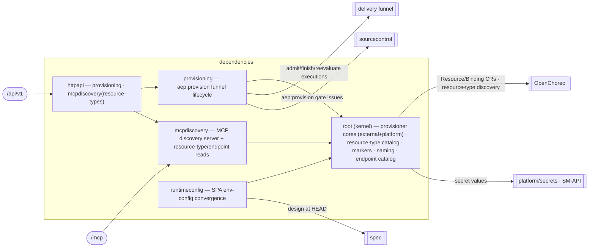

# dependencies — Dependencies & Provisioning

Discover the platform-resource catalog and resource-type markers, provision the platform + external
resources a Spec declares, broker cross-project org-service access, coordinate the `aep:provision` gate,
and wire the resulting runtime config onto deployed apps. **The two halves of OpenChoreo's
`Workload.spec.dependencies[]` — resources (external / platform-resource) and endpoints (component /
org-service) — live here; provisioning drives them through the delivery funnel as an ops-class executor.**
[Why & boundary decisions →](../../../../docs/design/domain-oriented-architecture.md#34-dependencies--provisioning--internaldependencies)

## Structure — kernel-root domain
Unlike the flat-root domains (`spec`/`organization`/`projects`), `dependencies` is the kernel-root shape
`delivery` uses. The two **pure provisioner cores** — `resources` (external + platform provisioner cores,
the `ResourceTypeCatalog`, `TypeMarkers`, `ExternalResourceBindingName`/`EnvVarName` naming) and `endpoints`
(the org-service `Catalog` + `resolve`) — have no back-edges and are the shared kernel every service builds
on, so `slice → root` is the only legal direction and they **are** the root package `dependencies`. The
three services are sub-package slices that import only that root.

| Slice | Ops / role | Reaches |
|---|---|---|
| `provisioning` | 7 HTTP ops: list/delete/collect-values external resources, provision-platform, dependency-status, request/list org-service access + the aep:provision funnel lifecycle, watcher, teardown | root cores; delivery funnel (executions); sourcecontrol (gate issues) |
| `mcpdiscovery` | the MCP discovery server + `ListPlatformResourceTypes` HTTP read | root `ResourceTypeLister` / endpoint catalog |
| `runtimeconfig` | the SPA `env-config.js` convergence service + its watcher (no HTTP op) | root naming/markers; spec (design at HEAD); repositories (execution enumerate) |

Each slice owns its service AND its HTTP handler (as delivery's `build` slice does); `httpapi` aggregates
the two handler-bearing slices and **holds `Deps`** — the kernel-root consequence that the root may not name
its own sub-package services (`root ⊥ slice`), so assembly lives in the one package allowed to import the
slices.

## Ports
| Port | Dir | Peer · contract |
|---|---|---|
| SecretWriter | needs | `platform/secrets` — SM-API vault writes for external-resource secret values |
| OC `Resource`/`ResourceReleaseBinding` CRUD · `ClusterResourceType` discovery | needs | `openchoreo` client — OC is the store |
| ExecutionStore · Reevaluator (admit/finish/reevaluate) | needs | `delivery` — provisioning is the **ops-class executor**; satisfied today by `repositories.ExecutionRepository` + the funnel, formalised as a delivery `FunnelPort` when the store moves internal in P9 |
| IssueClient (aep:provision gate) | needs | `sourcecontrol` — gate issues, closed via a no-secrets reference |
| DesignReader / DesignBundleReader | needs | `spec` — design at HEAD (what to provision) + provider design bundles |
| the 8 public ops | offers | the edge (`dependenciesHandlers`) |

## Owns
- `ExternalResource`, `AccessRequest`, the authored OC external Resource model + provisioned binding values,
  the `aep:provision` gate issues (via `sourcecontrol`), and the resource-type catalog projection.
- **Persistence today**: `ExternalResource`/`AccessRequest` gorm lives in `repositories.{ExternalResource,
  AccessRequest}Repository`, the entities (`models.ExternalResource`/`AccessRequest`, `AccessRequest` still
  `x-go-type: models.X` on the wire) in `models/`. The domain is **gorm-free** — runtimeconfig's watcher gorm
  moved to `repositories.ExecutionRepository.DistinctDeployedProjects` in P8.0, and the gorm-into-domain +
  entity move + the `AccessRequest` wire split all defer to P9, as every domain's did.

## Invariants — don't break
- **Deny-by-default tenant gate is upstream.** Every provisioning op reads the org from the gate-bound
  context only and passes it explicitly (as both the OC namespace/issues org and the SM-API org id); org
  never travels in a path/query/body, so cross-org access is unrepresentable.
- **Secret values never leave the SecretWriter port.** External-resource secret values route through SM-API;
  issue bodies, comments, and API responses carry only names / paths / refs — never secret material. The
  domain imports no secret-backend SDK (the fence holds via `platform/secrets`).
- **Provisioning is an ops-class Executor**, not a table split: it drives the executions rows through the
  delivery funnel's admit/finish/reevaluate, so the funnel invariant (one dispatch path, gates unbypassable)
  is preserved even though provisioning is a separate domain.
- **The wire quirks the contract-first cutover pinned stay pinned**: wrong-kind → 400, not-found/
  not-registered → 404, in-use → 409, provision-failure → 502; get-dependency-status and list-access-requests
  return their empty-but-present shapes; a nil service 503s (the surface exists with the feature unwired).
- **dependencies names no feature.** It consumes spec / sourcecontrol / delivery as domain→domain edges,
  never `internal/feature/*` (`TestDomainsAreFeatureFree`).
