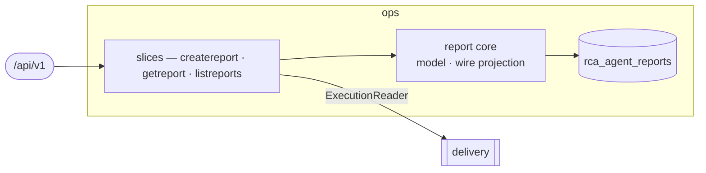

# ops — Incident RCA

Capture RCA-agent incident reports and correlate them with live Task executions, so the console's
Alerts bell and stepper show the *current* state rather than the write-time snapshot.
[Why & boundary decisions →](../../../../docs/design/domain-oriented-architecture.md#37-incident-rca--internalops)

## Slices
| Slice | Use-case | Entry |
|---|---|---|
| `createreport` | record a handoff report | `POST /rca-agent/reports` |
| `getreport` | read one, reconciled against live executions | `GET /rca-agent/reports/{reportId}` |
| `listreports` | keyset page, newest first | `GET /rca-agent/reports` |

## Ports
| Port | Dir | Peer · contract |
|---|---|---|
| `Repository` | needs | own store — `repository.go` (the only gorm file) |
| `ExecutionReader` | needs | `delivery` — latest execution per kind for a Task. **Optional**: nil disables correlation. Until P6 the composition root bridges it to the legacy execution repository (`internal/app/ops_adapters.go`) |

## Owns
- `rca_agent_reports` — gorm, single write-authority. Created by `internal/migrate`'s
  `phase10_rca_agent_reports` step, not AutoMigrate.

## Invariants — don't break
- **Correlation only promotes false→true**, and is best-effort: a lookup failure serves the stored
  snapshot rather than failing the read. `Deployed` requires a *succeeded* build (the "Verify Fix"
  threshold), not merely a build.
- **An empty page marshals to `"items":null`**, not `[]` — the contract marks `items` nullable and the
  mapping in `wire.go` preserves nil deliberately.
- Org is never a request input: slices read `tenant.BoundOrgFromContext` and pass it explicitly.
- `ExecutionFact` is ops' own vocabulary, not delivery's entity — that is what let this domain land
  five phases before its provider.
