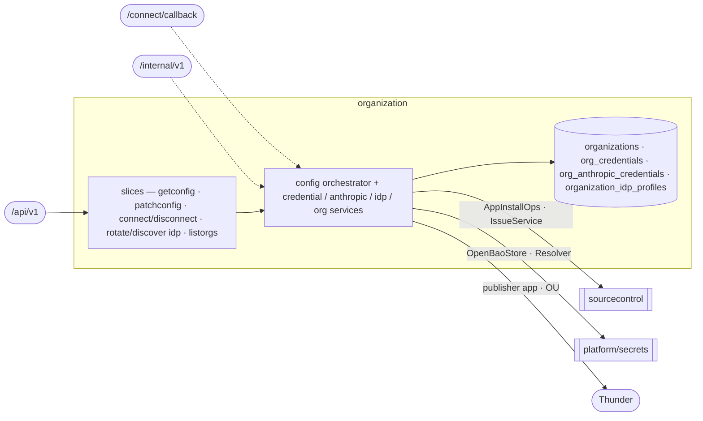

# organization — Organization Onboarding & Settings

Bring a tenant org onto the platform (JIT onboarding + the phantom-OU trust guard) and own every
per-org, org-keyed record that configures its integrations — GitHub credential, Anthropic key, IDP
publisher — all fronted by the consolidated `/config` resource.
[Why & boundary decisions →](../../../../docs/design/domain-oriented-architecture.md#31-organization-onboarding--settings--internalorganization)

## Slices
| Slice | Use-case | Entry |
|---|---|---|
| `getconfig` `patchconfig` | read / atomic multi-section write of the org config | `GET`+`PATCH .../config` |
| `connectgithub` `disconnectgithub` | start GitHub App connect / disconnect cascade | `POST .../config:connect-git-provider` etc. |
| `rotateidp` `discoveridp` | rotate the publisher client secret / OIDC discovery | `POST .../config:rotate-idp-secret` etc. |
| `listorgs` | enumerate orgs (tenant-gate carve-out — no org ctx) | `GET /organizations` |

*Not yet carved (still flat in the domain root): the credential/anthropic/idp lifecycle services + the
raw connect-callback controller + the S2S credentials-refresh — they carve into slices later, as sourcecontrol's did.*

## Ports
| Port | Dir | Peer · contract |
|---|---|---|
| `AppInstallOps` · `IssueService` | needs | `sourcecontrol` — App/PAT probes, disconnect issue cascade |
| `OpenBaoStore` · `Resolver` · `AppTokenMinter` | needs | `platform/secrets` — sealed git-token/anthropic store, credential resolution |
| `thundersvc` · `secretmanagersvc` · `clustergatewayproxy` | needs | publisher-app CRUD + OU check · SM-API mirror · ExternalSecret push |
| `OrganizationService` · `CredentialService` · `AnthropicCredentialService` · `IDPService` | offers | `delivery` (coding identity/key/publisher) · `sourcecontrol` (credential resolution) |
| `CredentialsRefreshService` | offers | the S2S runner-refresh op (edge projects it onto `igen.RefreshResponse`) |

## Owns
- `organizations` (+ `thunder_org_uuid`), `org_credentials`, `org_anthropic_credentials`,
  `organization_idp_profiles` + `idp_audit_events` — **still in the global `models/`+`repositories/`**
  (the entity move + gorm-into-domain defer to P9, alongside sourcecontrol's `GitRepository`).

## Invariants — don't break
- **The phantom-OU trust guard** (`ouIsTrustworthy`): reject a JWT `ouId` ONLY when a wired validator
  positively reports it does not exist; empty id / no validator / transient error all fail-open. A phantom
  OU poisons `wc-` namespace derivation + the publisher OU binding. Both write paths are guarded.
- **This domain is FAIL-LOUD**, not nil-tolerant: a nil collaborator panics (its pre-migration handlers had
  no nil guard), unlike sourcecontrol's 503 — the edge assigns it directly, no `OrEmpty`.
- The `/config` PATCH is an **atomic multi-section** apply; sections are three-state `patch.Field`.
- Org config wire types (`ConfigProjection`/`ConfigPatch`/`*Projection`) are hand-written pure DTOs in
  `models/` (codegen can't express them) — referenced directly, **not** a wire/domain split.
- Org is never a request input (except the `ListOrganizations` carve-out, which carries none): read
  `tenant.BoundOrgFromContext`. Secret backends are reached only through `platform/secrets`.
