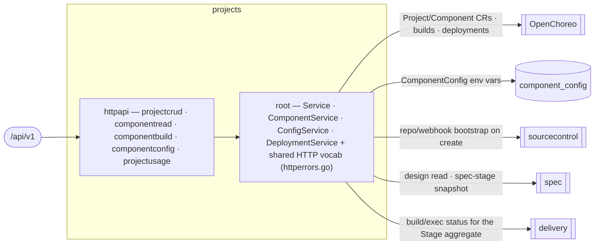

# projects — Project & Components

> **L2 · a domain.** Part of the [aep-api architecture](../../README.md).

Manage a project's lifecycle and its components, and render the whole pipeline from a single read: the
Stage aggregate (spec/build/deploy/validation), live version, components, deployments, env-config, and
per-component OpenAPI. **The OpenChoreo `Project`/`Component` aggregate roots live in OC; this domain is
their write-authority + the read projection.**

## Structure — flat-root domain
Unlike `delivery` (kernel-root), `projects` is the flat-root-of-services shape `spec`/`organization` use: the
services (`Service`, `ComponentService`, `ConfigService`, `DeploymentService`) live in the root package
`projects`, so `Deps` sits in the root and `httpapi/` assembles the slices from it. The two merged features
(project + component) had zero symbol collisions, so the domain is one flat package plus its HTTP slices.

| Slice | Ops | Root service |
|---|---|---|
| `projectcrud` | list / create / get / delete project + get-project-status (the Stage aggregate) | `*Service` |
| `componentread` | list-components / get-component | `ComponentService` |
| `componentbuild` | trigger-build / list-builds / build-logs / list-deployments / component-openapi | `ComponentService` |
| `componentconfig` | get / update component env-config | `ConfigService` |
| `projectusage` | list-project-usage (org-wide per-project usage cards, #291) | `*UsageService` — folds spec-turn + coding-execution per-project usage, labels by live projects, orders by stamped cost |

The shared HTTP vocabulary — `RequireSlug`, `RequireComponentSlugs`, `MapProjectError`, `MapComponentError`
and the private `errFromStatus` — lives in the ROOT (`httperrors.go`), because a slice may not import a
sibling (`slice ⊥ sibling`); the slices call the exported root helpers. This is the flat-root analogue of
delivery's kernel: shared behaviour belongs in the root the slices import.

## Ports
| Port | Dir | Peer · contract |
|---|---|---|
| repo/workspace bootstrap · repo-name conflict | needs | `sourcecontrol` — on project create/delete |
| design read · spec-stage snapshot | needs | `spec` — the Stage aggregate's spec column + component OpenAPI source |
| `descriptorWriter` | needs | `spec` — stamps `specs/.agentic-engineer.toml` on create (best-effort; nil is a no-op) |
| `kickoffStarter` (`SetKickoffStarter`) | needs | `spec` — fires the new project's opening `/start` turn (#562), after the descriptor commit the turn reads the idea from and before the create returns. Bounded + error-swallowing on its own side; nil is a no-op |
| `projectCellProvisioner` (`SetProjectCellProvisioner`) | needs | `openchoreo` client — authors the `ProjectReleaseBinding` that materializes the project's cell namespace in every environment its pipeline promotes through. NOT an optional port despite the setter: from OpenChoreo 1.2.0 a Project alone only cuts a ProjectRelease, so a project without a binding reports Ready and then fails every component deploy with `namespace ... not found`. A provisioning failure is fatal to the create and compensates; an UNSET provisioner logs at ERROR and lets the create through, because refusing to create projects at all is the worse failure |
| `specTurnRows` (`SetSpecTurnSource`) | needs | `spec` — the newest `agent_turns` row (off `ix_agent_turns_project_newest`), folded into the Stage aggregate's `spec.agent`. Nil serves `""`, degrading to the pre-#562 reading rather than failing the poll |
| build/exec status (`SetStageSources` port) | needs | `delivery` — the build/deploy columns of the Stage aggregate, wired at the root |
| `runAbandoner` (`SetRunAbandoner`) | needs | `delivery` — ends the supervisors of a deleted project's live runs, wired at the root (nil is a no-op) |
| per-project agent usage (`UsageService`) | needs | `delivery` — the agent-usage ledger, keyed by lifetime (`contracts.UsageScope`) |
| OC `Project`/`Component`/`ReleaseBinding` CRUD | needs | `openchoreo` client — OC is the store |
| `Deployer` · `DeploymentReader` | offers | `delivery/run` — plan a reconcile pass over the version's state, promote each target at its OWN commit, and read back whether components are serving. The supervisor owns the verdict and what to do with a held component; this domain owns the plan and the OpenChoreo writes, which is what keeps a cluster client out of the run loop |
| `BindingConverger` (`Converge`) | offers | the config slice — an env-var edit pushes onto the live binding through the deploy path rather than patching a field of it, so the two can never write different desired states onto one object |
| `ComponentEnvVarReader` · `RuntimeFileProvider` | needs | the config slice and `dependencies/runtimeconfig` — the two projections whose values ride the binding's workload overrides. Both are declared consumer-side and both distinguish "no values" from "cannot compute yet": an unready projection leaves its field UNMANAGED rather than writing an empty one over the user's values |
| CRT catalog · binding patcher · `ThunderApplicationReader` | needs | after OC Ready, a web-app whose platform-resource CRT carries `ConsumerURLEnvConfig` stays pending until the ThunderApplication CR has the SPA callback. Wired via `SetResourceCatalog` / `SetResourceClient` / `SetThunderApplicationReader`. Any nil (or a nil store) skips the wait, so OC-only `DeploymentState` tests stay green. Service components never enter it. This domain consumes `ThunderApplicationView`; it does not GET Kubernetes |
| `EndpointGate` | needs | after OC Ready, a component that advertises an external URL stays pending until that URL ANSWERS. ONE gate, wired via `SetEndpointGate` onto BOTH the deploy-stage read (`DeploymentState`) and the status poll (`holdUnreachable`), so the supervisor and the console cannot answer differently about one component and the first probe serves both. The URL rides `ReleaseBindingSummary.ExternalURL` — the same object, no second request. Nil skips the gate, and the composition root wires one only when the data-plane gateway fronts TLS: a plane without it has no certificate to wait for, and its `*.openchoreoapis.localhost` names resolve to loopback from this process. A component that advertises no URL passes untouched |
| `OrgPublisher` | needs | `organization` — per-org Thunder publisher provisioning + the IDP profile a protected API's JWT validation is pinned to. Best-effort: a failure composes an unpinned trait rather than failing a version's deploy |
| `ProjectLister` | needs | `sourcecontrol`, at the root — every project the platform tracks, for the converge sweep. The git-repository index rather than the executions table, because the run loop mints no execution rows and a sweep reading those saw nothing on that rail |
| `Service` · `ComponentService` · `ConfigService` | offers | the edge (the 14 public ops) |

## Owns
- The OC `Project`/`Component` aggregate roots (OC is the store) and `ReleaseBinding` write-authority; the
  `ComponentConfig` env-var rows.
- **The DEPLOY** (`DeploymentService`): cut a component's release from the Workload its build posted, compose
  the whole desired binding, write it once, and report what the cluster says back. Plus `ConvergeWatcher`,
  the sweep that re-asserts deployed bindings for drift no event causes.
- **The desired-state projection** (`DesiredDeploymentFor`, `api_traits.go`, `api_operations.go`,
  `alert_rule_trait.go`, `gateway_address.go`): design facts → the two objects the platform owns, as pure
  functions.
- **Persistence**: the `component_config` gorm and its entities live in this domain (`repository_config.go`
  over `component_config.go`), single write-authority.

## Invariants — don't break
- **One object, one writer.** `DeploymentService` is the only writer of a user component's ReleaseBinding.
  Three services used to patch disjoint fields of it on three different triggers, each soft no-opping when
  the binding did not exist yet and each relying on somebody else to retry; the binding is now created
  COMPLETE, so there is no partial state to retry out of. This is not a style preference: a writer that PUTs
  the object must carry every field it owns, or it silently drops the others'.
- **The projection is pure; the service does the I/O.** `DesiredDeploymentFor` takes facts and returns the
  Component CR's trait shape AND the binding's per-environment config together, because a trait attached
  without its config does not degrade — it fails the whole binding render. The two halves land at different
  times (the shape pre-build, since a ComponentRelease freezes it; the config at deploy, since it needs a
  release to bind) and that split is forced by OpenChoreo, not chosen.
- **The gateway's operation table is projected, and refused rather than guessed** (`api_operations.go`).
  A component behind END-USER sign-in gets one `operations` row per (method, path) in its openapi.yaml —
  `public: true`, a `jwt-auth v1` policy carrying one `scopes.anyOf` handle, or a `jwt-auth v1` policy with
  NO `scopes` param, which is how "signed in, no particular permission" is expressed (`anyOf: [openid]`
  would admit every signed-in account in the org, silently). Three rules hold it together. The document is
  read by `spec.OpenAPIOperations` — the SAME classifier the openapi.yaml security gate judges it with, so
  a spec the gate passed cannot be projected as something else. An `OPTIONS` row is SYNTHESISED per path,
  because routing runs before policy and an undeclared method+path is a 404 the CORS policy never sees.
  And anything unrenderable is refused whole: one operation the RestApi CRD rejects leaves EVERY path on
  that API 404 — policy-free siblings included — so the projection falls back to the trait's `/*` default
  (every operation needs a token, none needs a scope) and reports why in `APIOperationsProblem`. The
  rendered parameter keys must all be declared by the trait's schema: OpenChoreo PRUNES an undeclared key
  silently, which does not fail a deployment — it serves the operation without the policy it was meant to
  carry. `api_operations_test.go` asserts the rendered keys against the trait yaml itself for that reason.
  The scope rides the trait PARAMETER (the contract, one value for every environment) while the issuers and
  the audience ride `traitEnvironmentConfigs` (the environment): the operation names the permission, the
  environment names whose tokens count.
- **A protected sibling is addressed through the gateway** (`gateway_address.go`). OpenChoreo resolves a
  `component`-kind dependency to the provider's project Service — right for a trusted service-to-service
  caller, wrong for a consumer that forwards UNTRUSTED traffic, because a SPA's nginx proxying the browser's
  `/api` then carries it into the project's trusted lane with nothing authenticating it. So for every
  dependency whose provider passes `ResolveAPISecurityEnabled`, the projection also publishes
  `<DEP>_GATEWAY_URL`, and the `react-webapp` proxy prefers it. Two couplings this file must keep:
  `APIGatewayContextPath` mirrors the `api-configuration` trait's `RestApi.spec.context` template (a
  mismatched prefix 404s at the gateway, it does not degrade), and the provider's endpoint must list
  `internal` or the gateway is not admitted by the component's NetworkPolicy (it authenticates, then 503s).
  The address rides the binding's env field and is overlaid ONLY when that field is already managed —
  merging into an unmanaged (nil) one would replace the user's whole config with the platform's variable.
- **OpenChoreo Ready is not deployed for a Thunder SPA.** A web-application with a platform-resource whose CRT carries `ConsumerURLEnvConfig` stays pending until `ThunderApplication.spec.redirectUris` equals the SPA callback and that generation is ready (`status.ready` and `observedGeneration >= generation`). Failed and Undeploy skip the wait; a patch or CR GET error is returned for activity retry, not invented as Failed. `FilesForComponent` is a different seam — this wait does not grade the callback onto env-config.js.
- **OpenChoreo Ready is not reachable.** OC reports a binding Ready when the control plane is done —
  release rendered, workload rolled out. Every consumer reads it as a claim about the EDGE: the
  validation sweep dispatches on it, the console counts components live by it, and a person clicks the
  URL because of it. On a cloud plane a component that has never been deployed gets a hostname that has
  never had a certificate, and cert-manager's ACME order has no happens-before edge to the binding, so
  the two are minutes apart. A component that advertises an external URL is therefore not Ready here
  until that URL answers — any HTTP response counts and only a transport failure does not, which is
  [ADR-0006](../../../../runners/remote-worker/design/decisions/ADR-0006-the-runner-proves-endpoint-reachability.md)'s
  rule and the runner's preflight is its other implementation — narrowed to the ONE URL the binding
  advertises, since the certificate is issued per host and that URL is the one a person clicks.
  A held component is `converging`, which the deploy stage already waits on and its deadline
  already fails. The first POSITIVE answer per
  release is memoised for ever, so this is not health monitoring; a negative one is memoised for a
  short retry window, because both readers are polled and a fresh connect per unreachable component
  per poll is latency a person waiting on the project page would see. The console's counts run
  through the SAME gate
  (`holdUnreachable` downgrades a Ready binding whose URL does not answer, before `deployStageStatus`
  and `countReady` see it), so the overview reads "Deploying · 1 of 2" for that window rather than
  claiming a component is live at a moment clicking its link returns a TLS error.
- **Deploy is DRIVEN, never inferred.** Components carry `autoDeploy: false`, so nothing promotes a release
  except a call to `Deploy`. That is what lets the run supervisor place validation after a version is
  genuinely serving — see [ADR-0017](../../../../docs/decisions/ADR-0017-the-platform-owns-deploy.md).
- **The deploy stage counts USER components only.** Every coding-agent cycle creates a real
  dev-environment ReleaseBinding owned by the user's project, and that binding wraps a `batch/v1 Job`
  for which OpenChoreo registers no health check — it reports `Ready=True` over a Job that is still
  running or has already failed. So the marked (`aep.wso2.com/internal`) ones are excluded in
  `ListProjectReleaseBindings`, exactly as `ListComponents` excludes the matching Components. Without
  that, one finished cycle was enough to report a project "deployed" before anything was deployed, and
  `none` became unreachable for the rest of the project's life.
- **A converge never re-pins.** `Converge` re-asserts wiring at whatever release is already serving; a user
  editing env vars must not be able to move which release is live. It also skips components with no binding
  yet — writing one with no release pinned produces an object OpenChoreo cannot render. The deploy stage's
  own last pass is a converge for the same reason: it finishes wiring that only became knowable once
  everything was up, and re-promoting to do it would re-cut a release OpenChoreo then refuses.
- **The deploy PLAN is over the version's state, ordered by the design's hard wiring edges**
  (`wiring_graph.go` over `spec.HardConfigEdges`, ADR-0026). `deploymentWaves` takes what each
  component should be serving against what it is, promotes only the behind ones whose hard providers
  are serving or promoted ahead of them, and returns the rest as HELD with the providers each waits
  on. The edges are read over the whole design: a provider with no serving release is a real
  unsatisfied edge, not an assumed-satisfied one. The fixpoint is not one pass — a consumer waiting on
  a provider that is itself held has to fall out too, or it ships against a config its provider could
  not fill.
  A provider whose address the platform stamps into a consumer's start-up config deploys first, so the
  consumer is never published with a config nothing could fill. What flows back from consumer to provider
  (CORS origins, an OIDC callback) orders nothing and is written by the converge. A cycle among hard edges
  is `ErrDeployPermanent` — nobody can go first — see
  [ADR-0019](../../../../docs/decisions/ADR-0019-deploy-order-follows-the-hard-wiring-edges.md).
- **Everything after the OC project + repo is best-effort.** Skills provisioning, the webhook, and the
  project descriptor are each logged-and-continued on failure: none of them may destroy a creation the
  user already committed to. The one exception stays the repo-NAME conflict, which can never succeed on
  retry and so compensates the project away and fails. A missing descriptor costs the user one question
  from the `/start` skill, nothing more.
- **Slug guards run before any service touch.** projectName/componentName/buildName path params are validated
  as DNS-label slugs (`RequireSlug`) and 400 on malformed BEFORE the OC client / repo is reached.
- **The wire quirks the contract-first cutover pinned stay pinned**: get-component-config returns a literal
  JSON `null` 200 when no row exists (not `{}`); get-component-openapi returns 409 *with* the componentType
  body for a non-service component; build-logs 503s when the observability client is unwired.
- **The Stage aggregate is one cheap poll (5s active / 30s idle), strict-join.** get-project-status runs
  four sources concurrently — spec from a fetch-free local-mirror snapshot, build from the newest
  `milestone_runs` row (a version's delivery IS its run), deploy from the project's `development`
  USER-COMPONENT release bindings, and the newest `agent_turns` row — with no GitHub API, Temporal
  query, or origin fetch. Any source failure fails the whole read (the console keeps last-good); the
  one carve-out: a deploy tag missing from the local mirror degrades to a 0 denominator, not a 500.
- **`spec.agent` is the one spec field git cannot answer.** exists/version/dirty all read committed truth,
  and a turn writes nothing until it lands — so through the whole kickoff (#562), the busiest moment in a
  project's life, git says the project is untouched. The newest turn row says otherwise, and folds to three
  values: `never-started`, `""`, `working`, `failed`. A COMPLETED turn folds to `""` rather than to a
  value of its own, because whatever it produced is already in git and a second vocabulary for the same
  fact could only disagree with the first. `never-started` is NOT that gap: it says no turn has ever
  run, which is the one case an empty workspace should offer to start rather than wait on.
- **The build stage carries NO task counts** — not zeroed ones, none at all. Their only honest source is
  the version's milestone on GitHub, and a 5s poll may not spend GitHub rate, so the field is absent from
  the contract rather than present and always zero; the console renders counts from the list-tasks
  response it already holds, on the surface that already pays for it.
- **A validation failure is attributed to validation, not the build.** A run whose terminal reason is
  `validation-failed` reports the Build stage `succeeded` and the failure rides `deploy.validation =
  failed`: every coding cycle landed. The carve-out keys on the run's own terminal reason, which names
  exactly one failure class, so no tally or recency heuristic is needed. Every other terminal reason keeps
  the Build card as the catch-all. `deploy.validation` itself is the run row's VERDICT column; the report
  and the per-cycle detail behind it live on the version's run story (list-build-runs).
- **`deploy.validation = none` means a verdict is EXPECTED; `cancelled` means one is not.** `none` is
  PENDING — a run is live, or a dev run filed the version's validation task and the reconcile sweep has
  not started judging it yet — so a consumer must not read it as "there is nothing to wait for". That is
  what `skipped` and `inconclusive` say, and reading `none` that way is what offered production a version
  nothing had checked. The one no-verdict state that IS settled is `cancelled`: somebody stopped the
  judging, so nothing answers until they re-ask. Every other route to no verdict — a failed increment, an
  agent that died — stays `none`, because refusing an unjudged version is the safe answer when nobody
  chose otherwise. The derivation is gated on the run's KIND (`delivery.RunValidates`), never its state
  alone: the selector feeding it falls back to the DEV run, and a cancelled dev run is an ABANDONED
  INCREMENT, so the ungated form would report an abandoned version as having nothing left to wait for.
- **A project delete takes its run SUPERVISORS down before its run ROWS.** Purging the rows does not stop
  the workflows that write them: nothing else ends a run workflow, its milestone poll retries unbounded
  against a repository the same delete removes, and its id is keyed on (org, project, milestone) alone —
  so a project later created under the same name collides with the survivor and its first run is refused
  as already-started, leaving it unsupervised. Order is therefore abandon → repo → rows, and every step is
  best-effort because the OC delete upstream has already been committed.
- **Deleting a project does not delete what it cost.** The delete purges its runs and cycles; delivery's
  `agent_usage_ledger` is retired, not purged, so Settings → Usage keeps the greyed card the page was
  always designed to show. A slug deleted and recreated therefore renders TWO cards — the live project
  billed only for its own work, and the incarnation that spent the rest — because a slug is not an
  identity. Spec-turn spend carries no lifetime marker and sits whole on whichever card is current.
- Platform-wide rules (tenant gate, secrets fence, feature-free domains) → [../../README.md](../../README.md).
