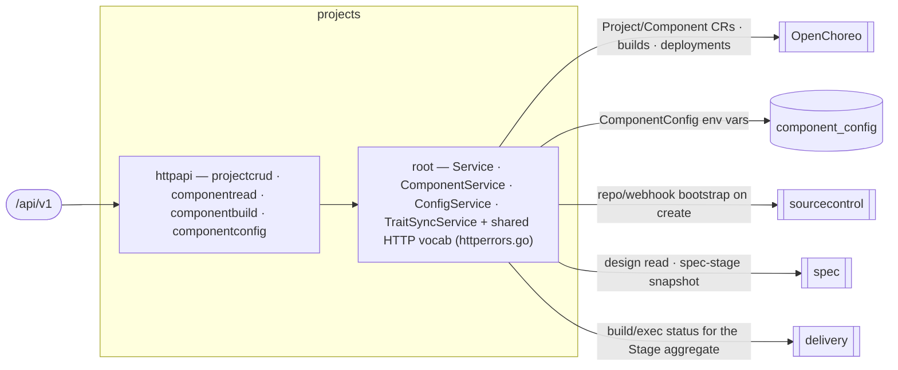

# projects — Project & Components

Manage a project's lifecycle and its components, and render the whole pipeline from a single read: the
Stage aggregate (spec/build/deploy/validation), live version, components, deployments, env-config, and
per-component OpenAPI. **The OpenChoreo `Project`/`Component` aggregate roots live in OC; this domain is
their write-authority + the read projection.**
[Why & boundary decisions →](../../../../docs/design/domain-oriented-architecture.md#35-project--components--internalprojects)

## Structure — flat-root domain
Unlike `delivery` (kernel-root), `projects` is the flat-root-of-services shape `spec`/`organization` use: the
services (`Service`, `ComponentService`, `ConfigService`, `TraitSyncService`) live in the root package
`projects`, so `Deps` sits in the root and `httpapi/` assembles the slices from it. The two merged features
(project + component) had zero symbol collisions, so the domain is one flat package plus its HTTP slices.

| Slice | Ops | Root service |
|---|---|---|
| `projectcrud` | list / create / get / delete project + get-project-status (the Stage aggregate) | `*Service` |
| `componentread` | list-components / get-component | `ComponentService` |
| `componentbuild` | trigger-build / list-builds / build-logs / list-deployments / component-openapi | `ComponentService` |
| `componentconfig` | get / update component env-config | `ConfigService` |

The shared HTTP vocabulary — `RequireSlug`, `RequireComponentSlugs`, `MapProjectError`, `MapComponentError`
and the private `errFromStatus` — lives in the ROOT (`httperrors.go`), because a slice may not import a
sibling (`slice ⊥ sibling`); the slices call the exported root helpers. This is the flat-root analogue of
delivery's kernel: shared behaviour belongs in the root the slices import.

## Ports
| Port | Dir | Peer · contract |
|---|---|---|
| repo/workspace bootstrap · repo-name conflict | needs | `sourcecontrol` — on project create/delete |
| design read · spec-stage snapshot | needs | `spec` — the Stage aggregate's spec column + component OpenAPI source |
| build/exec status (`SetStageSources` port) | needs | `delivery` — the build/deploy columns of the Stage aggregate, wired at the root |
| OC `Project`/`Component`/`ReleaseBinding` CRUD | needs | `openchoreo` client — OC is the store |
| `Service` · `ComponentService` · `ConfigService` | offers | the edge (the 14 public ops) |

## Owns
- The OC `Project`/`Component` aggregate roots (OC is the store) and `ReleaseBinding` write-authority; the
  `ComponentConfig` env-var rows.
- **Persistence today**: `ComponentConfig` gorm lives in `repositories.ConfigRepository`, the entity
  (`models.ComponentConfig`/`EnvVar`, still `x-go-type: models.X` on the wire) in `models/` — the domain is
  **gorm-free** (the gorm-into-`projects/repository.go` + entity move + the ComponentConfig/EnvVar wire split
  all defer to P9, as every domain's did).

## Invariants — don't break
- **Deny-by-default tenant gate is upstream.** Every op reads the org from the gate-bound context only and
  passes it explicitly; org never travels in a path/query/body, so cross-org access is unrepresentable.
- **Slug guards run before any service touch.** projectName/componentName/buildName path params are validated
  as DNS-label slugs (`RequireSlug`) and 400 on malformed BEFORE the OC client / repo is reached.
- **The wire quirks the contract-first cutover pinned stay pinned**: get-component-config returns a literal
  JSON `null` 200 when no row exists (not `{}`); get-component-openapi returns 409 *with* the componentType
  body for a non-service component; build-logs 503s when the observability client is unwired.
- **projects names no feature.** It consumes spec / sourcecontrol / delivery as domain→domain edges (a
  `delivery` build-status port wired at the root), never `internal/feature/*` (`TestDomainsAreFeatureFree`).
