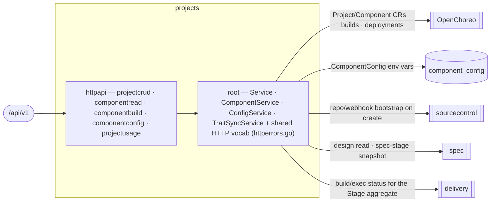

# projects — Project & Components

> **L2 · a domain.** Part of the [aep-api architecture](../../README.md).

Manage a project's lifecycle and its components, and render the whole pipeline from a single read: the
Stage aggregate (spec/build/deploy/validation), live version, components, deployments, env-config, and
per-component OpenAPI. **The OpenChoreo `Project`/`Component` aggregate roots live in OC; this domain is
their write-authority + the read projection.**

## Structure — flat-root domain
Unlike `delivery` (kernel-root), `projects` is the flat-root-of-services shape `spec`/`organization` use: the
services (`Service`, `ComponentService`, `ConfigService`, `TraitSyncService`) live in the root package
`projects`, so `Deps` sits in the root and `httpapi/` assembles the slices from it. The two merged features
(project + component) had zero symbol collisions, so the domain is one flat package plus its HTTP slices.

| Slice | Ops | Root service |
|---|---|---|
| `projectcrud` | list / create / get / delete project + get-project-status (the Stage aggregate) | `*Service` |
| `componentread` | list-components / get-component | `ComponentService` |
| `componentbuild` | trigger-build / list-builds / build-logs / list-deployments / component-openapi | `ComponentService` |
| `componentconfig` | get / update component env-config | `ConfigService` |
| `projectusage` | list-project-usage (org-wide per-project usage cards, #291) | `*UsageService` — folds spec-turn + coding-execution per-project usage, labels by live projects, orders by stamped cost |

The shared HTTP vocabulary — `RequireSlug`, `RequireComponentSlugs`, `MapProjectError`, `MapComponentError`
and the private `errFromStatus` — lives in the ROOT (`httperrors.go`), because a slice may not import a
sibling (`slice ⊥ sibling`); the slices call the exported root helpers. This is the flat-root analogue of
delivery's kernel: shared behaviour belongs in the root the slices import.

## Ports
| Port | Dir | Peer · contract |
|---|---|---|
| repo/workspace bootstrap · repo-name conflict | needs | `sourcecontrol` — on project create/delete |
| design read · spec-stage snapshot | needs | `spec` — the Stage aggregate's spec column + component OpenAPI source |
| build/exec status (`SetStageSources` port) | needs | `delivery` — the build/deploy columns of the Stage aggregate, wired at the root |
| OC `Project`/`Component`/`ReleaseBinding` CRUD | needs | `openchoreo` client — OC is the store |
| `Service` · `ComponentService` · `ConfigService` | offers | the edge (the 14 public ops) |

## Owns
- The OC `Project`/`Component` aggregate roots (OC is the store) and `ReleaseBinding` write-authority; the
  `ComponentConfig` env-var rows.
- **Persistence**: the `component_config` gorm and its entities live in this domain (`repository_config.go`
  over `component_config.go`), single write-authority.

## Invariants — don't break
- **Slug guards run before any service touch.** projectName/componentName/buildName path params are validated
  as DNS-label slugs (`RequireSlug`) and 400 on malformed BEFORE the OC client / repo is reached.
- **The wire quirks the contract-first cutover pinned stay pinned**: get-component-config returns a literal
  JSON `null` 200 when no row exists (not `{}`); get-component-openapi returns 409 *with* the componentType
  body for a non-service component; build-logs 503s when the observability client is unwired.
- **The Stage aggregate is one cheap poll (5s active / 30s idle), strict-join.** get-project-status runs
  three sources concurrently — spec from a fetch-free local-mirror snapshot, build from the newest
  `milestone_runs` row (a version's delivery IS its run), deploy from the project's `development` release
  bindings — with no GitHub API, Temporal query, or origin fetch. Any source failure fails the whole read
  (the console keeps last-good); the one carve-out: a deploy tag missing from the local mirror degrades to
  a 0 denominator, not a 500.
- **The build stage carries NO task counts** — not zeroed ones, none at all. Their only honest source is
  the version's milestone on GitHub, and a 5s poll may not spend GitHub rate, so the field is absent from
  the contract rather than present and always zero; the console renders counts from the list-tasks
  response it already holds, on the surface that already pays for it.
- **A validation failure is attributed to validation, not the build.** A run whose terminal reason is
  `validation-failed` reports the Build stage `succeeded` and the failure rides `deploy.validation =
  failed`: every coding cycle landed. The carve-out keys on the run's own terminal reason, which names
  exactly one failure class, so no tally or recency heuristic is needed. Every other terminal reason keeps
  the Build card as the catch-all. `deploy.validation` itself is the run row's VERDICT column; the report
  and the per-cycle detail behind it live on the version's run story (list-build-runs).
- Platform-wide rules (tenant gate, secrets fence, feature-free domains) → [../../README.md](../../README.md).
