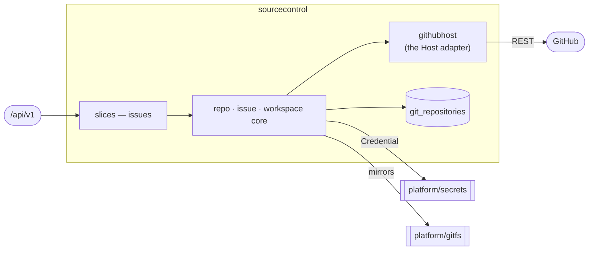

# sourcecontrol — Source Control & Webhooks

The git-host integration substrate every other domain builds on: per-project repo/issue/PR/webhook
lifecycle over a provider-neutral `Host` port, and the bare-mirror workspace behind `platform/gitfs`.
[Why & boundary decisions →](../../../../docs/design/domain-oriented-architecture.md#36-source-control--webhooks--internalsourcecontrol)

## Slices
| Slice | Use-case | Entry |
|---|---|---|
| `issues` | file / search a project's issues | `POST`+`GET /projects/{projectName}/issues` |

*Not yet carved (still in the domain root, P2c): repo lifecycle, workspace, webhook register/receive,
installation lifecycle. `feature/webhook` folds in with them.*

## Ports
| Port | Dir | Peer · contract |
|---|---|---|
| `Host` | needs | the git host — implemented by `githubhost` (the domain's own adapter; it lives here, not in `platform/clients`, because an adapter for a domain's port cannot sit in a domain-free kernel) |
| `secrets.Credential` | needs | `platform/secrets` — App-installation / per-org PAT |
| `IssueService`, `RepoService` | offers | every domain that needs repos or issues |

## Owns
- `git_repositories` — the repo coordinate registry. **Still in the global `models/`+`repositories/`
  (P2c moves it in);** `GitRepository` is not `x-go-type`-aliased, so it needs no wire split.
- The bare-mirror workspace handle, and the GitHub host connection state.

## Invariants — don't break
- **`Host` is provider-neutral.** GitHub specifics live in `githubhost`; nothing above it names GitHub.
- Ports here are **nil-tolerant**: an unwired service answers 503, never panics — the component harness
  wires only the feature under test, and `edge`'s `sourceControlOrEmpty` preserves that for an unwired
  domain.
- Org is never a request input: slices read `tenant.BoundOrgFromContext` and pass it explicitly.
- `IssueInfo`'s wire keys are **CAPITALIZED** — a historical shape the deployed MCP server parses.
