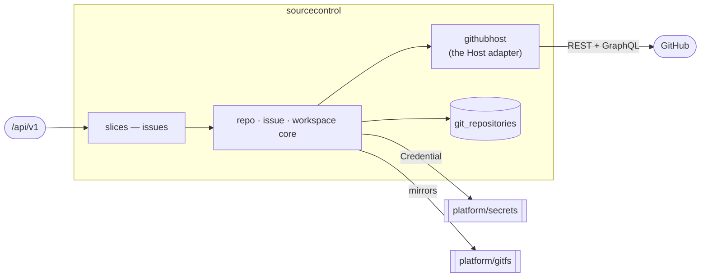

# sourcecontrol — Source Control & Webhooks

> **L2 · a domain.** Part of the [aep-api architecture](../../README.md).

The git-host integration substrate every other domain builds on: per-project
repo/issue/milestone/PR/webhook lifecycle over a provider-neutral `Host` port, and the bare-mirror
workspace behind `platform/gitfs`.

## Slices
| Slice | Use-case | Entry |
|---|---|---|
| `issues` | file / search a project's issues | `POST`+`GET /projects/{projectName}/issues` |

*Still in the domain root (not carved into slices): repo lifecycle, workspace, webhook register/receive,
and installation lifecycle.*

## Ports
| Port | Dir | Peer · contract |
|---|---|---|
| `Host` | needs | the git host — implemented by `githubhost` (the domain's own adapter; it lives here, not in `platform/clients`, because an adapter for a domain's port cannot sit in a domain-free kernel) |
| `secrets.Credential` | needs | `platform/secrets` — App-installation / per-org PAT |
| `IssueService`, `RepoService` | offers | every domain that needs repos, issues or milestones |

## Owns
- `git_repositories` (the repo coordinate registry) and `webhook_deliveries` — gorm + entities in this
  domain (`repository_repo.go` · `repository_webhook_delivery.go` over `repository_entity.go` /
  `webhook_delivery.go`), single write-authority. `GitRepository` is not `x-go-type`-aliased, so it needs
  no wire split.
- The bare-mirror workspace handle, and the GitHub host connection state.

## Invariants — don't break
- **`Host` is provider-neutral.** GitHub specifics live in `githubhost`; nothing above it names GitHub
  — including whether an op rides REST or GraphQL.
- **A milestone is addressed by NUMBER, never by title.** Titles are renamable, and the host enforces
  title uniqueness case-sensitively while filtering on it case-insensitively, so the adapter enforces
  case-insensitive uniqueness at create and callers key on the number. Issue counts come from the
  GraphQL predicate; a milestone's `open_issues` counts pull requests and is never read.
- **`MilestoneIssueCounts` is ONE call, and its exclusions are computed in ONE place.** The dispatch
  predicate runs at every cycle boundary, so the gate, working-set and overlap populations ride a
  single aliased GraphQL query; label intersections are expressible because `labels:` is AND-semantics.
  Callers read the working set through `OpenNonGateWork()` and never subtract fields themselves — the
  label kinds are not assumed disjoint, and the overlap arithmetic must not be duplicated.
- Ports here are **nil-tolerant**: an unwired service answers 503, never panics — the component harness
  wires only the feature under test, and `edge`'s `sourceControlOrEmpty` preserves that for an unwired
  domain.
- `IssueInfo`'s wire keys are **CAPITALIZED** — a historical shape the deployed MCP server parses.
- Platform-wide rules (tenant gate, secrets fence) → [../../README.md](../../README.md).
