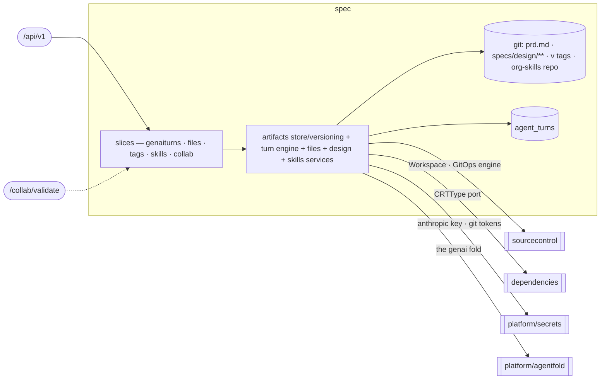

# spec — Spec Authoring & Versioning

> **L2 · a domain.** Part of the [aep-api architecture](../../README.md).

Turn a prompt into a versioned requirements+design Spec stored as committed truth in git, let humans and
agents co-edit it live, cut and read the `v<N>` Spec version, and steer authoring with the org's Skill
library. **Single write-authority over the git spec-content store and its version tags.**

## Slices
| Slice | Use-cases | Entry |
|---|---|---|
| `genaiturns` | create / get / active / stream turn + get-conversation (the AgentTurn lifecycle) + list/rotate the project's conversation threads (#430) | `.../agents/{cid}/messages`, `.../agents/conversations`, `.../turns/...` |
| `files` | list / read / apply files over the project workspace | `GET/POST .../files...` |
| `tags` | list the project's spec version tags, newest first by creation time | `GET .../tags` |
| `skills` | list / create / update / delete / import / sync / get the org Skill library | `/skills...` |
| `collab` | the collab session descriptor + the S2S room-access oracle | `.../spec/collab-session`, `GET /collab/validate` |
| `designdeps` | the two writes into an external dependency's directory: provide its contract (a URL the platform fetches, or the document itself), and record the user's authorization to build on the design agent's assumed contract — before the agent writes it (the resolve flow's card) or after (the definition's acceptance box) | `POST .../dependencies/{name}/contract`, `POST .../dependencies/{name}/assumption` |

*Still flat in the domain root (not carved into finer slices): the artifacts store/versioning machinery,
the genai turn engine (runner/broker/sweeper), and the files / design / skills services.*

## Ports
| Port | Dir | Peer · contract |
|---|---|---|
| `Workspace` · `GitOpsService` · `RepoService` | needs | `sourcecontrol` — the gitfs engine hosting all spec + skills git content |
| `resourceTypeCatalog` (returns `CRTType`) | needs | `dependencies` — the PE-authored CRT markers + declared outputs, projected at the root |
| `AnthropicKeyResolver` · git-token `Resolver` | needs | `platform/secrets` — per-org keys + sealed git tokens |
| `ArtifactService` · `ArtifactStore` · `SplitFrontmatter` | offers | `delivery` / `projects` / `dependencies` / `identity` — design reads, spec-save, status snapshots; `identity` reads `security.json` from the design bundle AT THE TAG being built, never at HEAD |
| `HardConfigEdges` | offers | `projects` (deploy order) — which sibling addresses a component cannot start without |
| `DescriptorWriter` | offers | `projects` — stamps `specs/.agentic-engineer.toml` into a repo at project create |
| `Kickoff` | offers | `projects` (create) · `spec/files` (references upload) — fires the project's opening `/start` turn |
| `TurnRepository.Newest` | offers | `projects` — the status poll's `spec.agent`: is an agent working on the spec right now |
| `CredentialsRefreshService`-adjacent turn/tag reads | offers | delivery/build (SpecTagger, validation criteria) |

## Owns
- git spec content (`prd.md`, `specs/design/**`), the annotated `v<N>` tag (the version store),
  the org-skills repo, `AgentTurn` (turn lifecycle) + the resumable-turn SSE broker (in-memory seam).
- **One external dependency, one definition** (ADR-0027). An external dependency lives in
  `specs/design/dependencies/<name>/` — `dependency.json` (provider, style, config keys, open
  suggestions, provenance, the user's `assumed` record) beside the committed contract it points at
  (an OpenAPI/GraphQL slice, an `sdk.json` manifest). A component's `design.json` references it by
  name only; `AssembleDesign` hydrates every reference from the directory (`dependency_json.go`), so
  downstream readers keep the flat `Dependency`, and `SplitDesign` writes both halves back. A design
  from before the directory existed is lifted into one at its next save (the legacy fields on the
  component are decoded, never re-encoded). `ComputeDependencyStatus` reads the state off the
  hydrated edge — org/registry → resolved+registered; no provider (the user has not chosen a
  service; `suggestions` may be open) → needs-input; a style with no contract or manifest on disk
  → needs-contract; an agent-written
  contract (`x-aep-assumed: true` in the file) with no acceptance → needs-acceptance; else resolved,
  flagged assumed / derived (`x-aep-derived: true` — written from the provider's own reference) /
  sdk-only — and the build gate blocks on nothing else. The write-gates (zod in
  `@aep/agent-stream`, `agentfold/dependencygate.go`, `designspec` at save) validate the file; the
  `assumed` record is the one field only the platform writes (`designdeps`).
- **The Skill library.** One flat authored library at repo-root `skills/`, COPY'd into the image and read
  at runtime from `config.SkillsDir` (default `/app/skills`) — not go:embed'd. A skill dir is `SKILL.md`
  plus the [Agent Skills standard structure](https://agentskills.io/specification) — `scripts/`,
  `references/`, `assets/`, and any other files or directories — carried byte-faithfully end to end
  (loader → reconcile → org-skills repo → design agent → coding runner); scanners walk the whole dir with
  no extension filter, skipping only `SKILL.md` itself and dotfile segments; `scripts/` files materialize
  with the exec bit on the coding runner. Model-context reads (the design agent's `loadSkillReference`)
  and JSON API responses inline UTF-8 text only; binary aux files are listed, never inlined
  (`binaryReferences` in the API; a corrective error naming the binary path in the tool) — they are
  delivery-only over the JSON API (their content never round-trips through a GET→edit→PUT cycle) and stay
  durable only via the embedded library or tarball import, which carry the bytes directly. The same
  aux-file contract governs user-facing create/update and tarball import, rejecting any `..`/absolute path
  outright rather than silently dropping it.
- **Kind, editability, and reconcile.** Kind (`platform | org | imported`) lives in frontmatter
  `metadata.aep.kind`, absent ⇒ `org` (a stored legacy `custom` also reads back as `org` — the `custom`
  kind is retired, folded into `org`). Kind is an ownership label, not the editability switch:
  `SkillEditable(kind)` is the single seam — org + imported are editable, platform is read-only — so a
  platform-seeded skill can be unlocked for editing without reclassifying it. `SkillDeletable(kind)`
  equals `SkillEditable(kind)`: an org skill (platform-seeded or user-authored) is always deletable; a
  platform-kind skill never is. Each org's flat `org-skills` repo is reconciled THREE-WAY against a
  `skills-manifest.json` baseline (`{name: {origin, source?, baseHash}}`, `origin` = `platform`) written in
  the same commit as any skill files: reconcile keys off manifest presence/origin, never off the skill's
  `kind` — clean copy + platform moved → refresh and advance the baseline; org moved → override, left
  alone; both moved → conflict, left alone and surfaced by `/updates` (states `update` / `overridden` /
  `conflict`); both moved but converged on identical content → auto-resolves clean. A pre-manifest repo
  copy is backfilled (baseline stamped; a divergent copy is treated as an override, never clobbered). Names
  with no manifest entry are org-authored and never touched — this is what lets a user-authored `org`-kind
  skill coexist with platform-seeded `org`-kind skills without reconcile confusing the two. Seeding an
  absent default is split by ownership: a `platform`-kind default is always (re-)seeded; an `org`-kind
  default is seeded only at first org creation — an ongoing sync leaves an absent org default out (opt-in)
  but still runs the full three-way, including auto-refresh, against any PRESENT org skill. Purge only
  retires manifest-tracked platform entries with a clean copy; an overridden retiree keeps its files and
  just loses the entry, becoming a plain org skill.
- **The project descriptor** (`specs/.agentic-engineer.toml`, `descriptor.go`) — the marker identifying a
  repo as an Agentic Engineer project, carrying the idea the user gave at creation. Written by `projects`
  at create through the `DescriptorWriter` port (best-effort: a failed write never fails the create) and
  read back here to put the idea on a `/start` turn. TOML rather than the YAML/JSON used elsewhere because its one
  load-bearing field is a paragraph of free text a user typed — a real encoder keeps quotes, backslashes
  and newlines intact.
- **Flow-command recognition** (`start_command.go`) — every `/<skill>` command arrives VERBATIM and the
  server classifies it into an `agentsvc.TurnSpec`: what the turn is FOR, never its wording. `/start`
  additionally carries the descriptor's idea, which only the server can read. The agents service composes
  the instruction and derives the flow's eager skills from the spec, so a console CTA, a typed command and
  a playground run produce identical turns (services/agents/design/ADR-0003). This domain holds NO prompt
  text; the flow token is kept here because it also gates web search and MCP minting for design turns.
- **The kickoff** (`kickoff.go`) — the project's opening `/start`, fired server-side at creation so the
  journey starts itself instead of waiting on a Generate-spec click. Room-scoped like every console turn,
  carrying the creating user's bearer (which is what lets the agent join the spec room), on the project's
  current thread. Idempotent on "has this project ever run a turn", because it has two triggers: project
  create, and the references upload a create with `referencesPending` held it for. Runs INLINE, so the
  create answers only once the turn row exists — that is what keeps `spec.agent == "never-started"`
  meaning "no turn has ever run" rather than also "starting right now", which no surface could tell
  apart. (`""` is a different fact: a turn HAS run and the newest one completed.) Bounded
  (20s) and error-swallowing: a kickoff that cannot start never fails the creation, and the spec
  view's empty state offers it instead.
- **Design staleness is derived, never stored** (#575). "Have the requirements moved since the
  design was written?" is answered by reading the requirements at the commit the newest successful
  `/design` turn recorded reading the project at, and comparing that reduction against today's —
  `RequirementsFingerprint` over a tree listing (path + blob sha, so no content is read). Nothing is
  stamped, so nothing falls out of sync, and the question is answerable for projects predating the
  check. A stored fingerprint was rejected because a turn NEVER commits: its file changes stream to
  the collab doc and the collab server commits them later, carrying no turn id and no author — there
  is no moment the platform controls, and no way to tell that flush from a hand edit. The build gate
  refuses on it (`DESIGN_OUTDATED`), which is what makes it a block rather than a display.
- **A running turn carries its own display record** (#562). `agent_turns` stores the transcript
  line the turn started from plus its author, and `TurnStatus` serves them. Not redundant with the
  journal that rides to the agents service: that store persists a turn's transcript only when the
  turn ENDS, so between dispatch and landing there is nowhere else to read them from — and that
  window is the whole of a kickoff, which no browser sent and none has a local copy of. Empty for
  an unattributable turn (an M2M token) and for every row written before the record existed, which
  the console renders as "paint nothing" rather than an empty bubble.
- **Persistence**: the `agent_turns` gorm lives in this domain (`repository_turn.go` over the
  `agent_turn.go` entity), single write-authority — as does `project_conversations`
  (`repository_conversation.go`): the project's CURRENT chat thread pointer (#430), server-minted,
  one current row per (org, project, use case) under a partial unique index; StartTurn refuses a
  non-current id with 409 `conversation_rotated` (the single-era rule — it relaxes to "belongs to
  this project" when multiple live threads land). Spec content itself is not gorm — it lives in git,
  reached through sourcecontrol's `Workspace`/gitfs engine.

## Invariants — don't break
- **Single write-authority** over the git spec-content store and its version tags — every save/tag/discard
  runs through this domain's gitfs Workspace engine; no other domain writes spec content.
- **A version carries the name the user gave it** (console ADR-0030, `version_naming.go`). The name is
  the tag, the milestone title and the `/builds/<name>` address; `v<N>` is only what the build dialog
  SUGGESTS (`v<count + 1>`, stepped past any taken name). Two consequences: a tag is recognised as a
  version by its `Spec <name>` annotation subject, never by its name — so a release tag, or a legacy
  `v<N>-<M>` design tag, is not one — and versions are ORDERED by `TagInfo.CreatedAt`, never by a
  number parsed out of a name. A supplied name is used verbatim: a collision is `ErrVersionNameTaken`
  (the build maps it to 409), never a quietly different tag. Only a name the platform itself suggested
  is recomputed past a racing pusher.
- **A name labels a snapshot; it does not make one.** `SaveSpec` still compares the whole `specs/` tree
  with the newest version's and reuses that version when they match — the requested name is ignored on
  that path, because cutting a second tag over an identical tree would spend a planning turn to change
  a word. `BuildVersionFacts` reads the same comparison out as the build dialog's change list.
- **A `/start` turn carries what the agent cannot read for itself, and nothing more.** Two channels,
  both best-effort and both silent when empty: the captured idea (from the dot-led descriptor, which
  every turn snapshot strips) and the reference documents attached at create (paths only). References
  are NOT git content and there is no base commit to read them from — they are stored off-git and
  overlaid into the turn's snapshot at `specs/requirements/references/` (console ADR-0017), which is
  the path listed. Text references land in the turn's text map; binary ones (PDF, images) never do —
  they reach the agents service as native file attachments instead, which is what keeps a PDF's bytes
  out of the text channel. Neither steer may fail a kickoff: an unreadable descriptor or an unlistable
  store degrades to "no steer". When both are empty the turn is byte-identical to one from before
  either channel existed — which is the path every pre-existing project takes.
- **The Files API is text-only.** `WriteOp.encoding` and `FileContent.encoding` are gone with the
  reference-document reversal (ADR-0017): the one binary this platform had to carry now travels the
  references endpoint, off git, so nothing binary reaches `files/apply` or `read-file` at all. The
  5 MiB cap measures the bytes as sent. A future binary-in-git need must argue for an encoding field
  on its own merits rather than inheriting one.
- **One authority for which wiring edges are HARD** (`wiring_edges.go`). A hard edge is an address the
  platform must have before a component can serve its first useful byte — today a web app's sibling
  *services*, whose cluster Service URLs are injected as pod env for nginx (`<DEP>_URL`). `projects`
  orders the deploy waves around that rule. Everything else is soft (it flows consumer→provider: an
  OIDC callback) and orders nothing. Deliberately NOT hard: service→service, which OpenChoreo resolves
  through its own connection mechanism — ordering it would refuse two services that call each other.
  ADR-0019.
- **`CRTType` is a projection, not a re-export.** design-save reads the dependencies resource-type catalog
  through the `resourceTypeCatalog` port in spec's OWN vocabulary (`CRTType`), mapped by a root
  adapter — the spec domain names the dependencies domain nowhere.
- **Design save DERIVES two platform facts, in one pass over one catalog call** (`derive.go`, ADR-0013):
  `exposesAPI.auth` off a resource type's role marker (`derive_auth.go`), and each `platform-resource` /
  `external` dependency's `wiring` — the OC ref plus output→env-var mapping the coding agent copies into
  `workload.yaml` (`derive_wiring.go`). Both mutate the design in place and commit only the components whose
  derived state actually changed, so an unchanged design commits nothing.
  - Derived, therefore **re-derived and overwritten every pass** — which is exactly what lets the write
    gates ACCEPT `wiring` instead of rejecting it as agent-authored: the design agent reads-edits-writes
    `design.json`, so a rejection rule would reject its own echo.
  - Both env-var and ref naming route through `platform/ocname`, the SAME helper the dependencies domain
    injects pod env vars with. The two must agree byte-for-byte or the agent's `workload.yaml` references a
    resource that does not exist; a bounded-name test pins it.
  - Fail-closed: a design declaring a platform-resource whose catalog is unreachable returns
    `ErrResourceCatalogUnavailable` (503) rather than silently skipping either derivation.
  - **Unknown `resourceType` is refused at build claim, not at design save.** After the catalog
    fetch, a membership pass (`rejectUnknownResourceTypes`) returns `ErrUnknownResourceType`
    when a `platform-resource` names a CRT that is not installed. Delivery maps that to HTTP 409
    and cuts no tag — a design/task-breakdown agent inventing a type must not start a Temporal
    run. An empty or nil catalog (`PLATFORM_RESOURCES_ENABLED=false`) skips membership so the
    disabled path does not reject every build. Membership is against the live catalog map, never
    a hardcoded type name (ADR-0007). Wiring derivation still treats an unknown type as "not
    derivable yet"; the membership pass is a separate gate before persist.
- **A component `openapi.yaml` is judged against its two siblings, at save AND at build**
  (`openapi_security_gate.go`). A component behind end-user sign-in declares the `oauth2` scheme and
  the document default `security: [{oauth2: []}]`; each operation's `security` is absent, `[]`
  (public), or ONE requirement object naming `oauth2` with at most one scope; every operation scope
  and every `flows.*.scopes` key is a handle `specs/design/security.json` declares AND whose resource
  THIS component owns; the five OIDC scopes (`openid profile email group ou`) are refused anywhere,
  because one emitted as an API scope admits every signed-in account while looking guarded; an
  `X-User-*` header parameter is `required: false` (the generated server binds parameters before the
  auth middleware, so `required: true` answers 400 where the design promises 401) and a public
  operation declares none at all. Code `INVALID_OPENAPI`, wording from the ONE vendored table
  (`platform/securityspec/openapi-security-messages.json`) the agent's write gate renders from, so
  the model never meets one rule in two wordings.
  - **Protected is read off committed truth, never a type name**: `exposesAPI.auth =
    end-user-required`, which design-save already derived from the CRT role marker (ADR-0007). No
    cluster round-trip, and a new sign-in flavour needs no app-factory release. The agent's bundle
    still keys on the literal `thunder-app` resourceType, so a renamed or aliased sign-in CRT is
    protected here and unprotected there — recorded in the file header.
  - **The gate and the gateway read the block ONCE** (`openapi_operations.go`). `OpenAPIOperations`
    turns a protected spec into `(method, path, public | signedIn | scope)` for the deployment
    projection (`projects.OperationsFromSpec`), and the gate's per-operation rules ARE that
    function's structural half plus the two catalog rules. Two readings of `security` that can
    disagree would be a silent authorization bug: the gate would pass a document the projection
    then renders as something else, visible only as a 401 nobody can explain. Nothing else in
    aep-api parses an OpenAPI `security` block.
  - **A missing sibling narrows the check, it never refuses.** No `design.json` → no security verdict
    (the premise is unknowable); no `security.json` → the structural rules still run and only catalog
    membership and ownership wait. The build gate is the backstop that sees every file at the tag.
- The `/collab/validate` oracle recovers the acting org from VERIFIED claims and refuses any room whose
  `spec-<org>-` prefix mismatches — never a hint of whether the room exists. Platform-wide rules (tenant
  gate, secrets fence) → [../../README.md](../../README.md).
- The genai turn is **committed-truth**: the fold (`platform/agentfold`) verifies hash-parity before the
  commit; a mismatch rejects the turn and leaves `main` untouched.
- **Skill read-only is enforced by the mutation guards, not by visibility.** `Resolve`/`List` return every
  kind — platform skills list read-only on the skills page; reserved names/prefixes block name collisions.
- **The descriptor is unreadable by the agent, structurally.** Its dot-led segment is stripped from every
  turn snapshot (`agentfold.InTurnSnapshot` and its TS mirror), and `.toml` is not an admitted extension
  either — so the captured idea reaches a turn ONLY via the `/start` expansion, never by the model opening
  the file. Do not "fix" this by widening the snapshot filter.
- **The kickoff is never signalled through `useCase`.** That field is part of the conversation identity
  (`namespacedID`), so keying `/start` on it would put the turn in a different conversation from the chat
  around it — and `/start` runs an interview whose answers arrive as ordinary chat turns.
